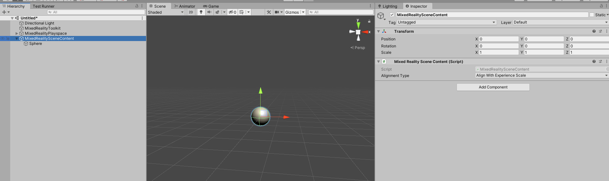

# Mixed Reality Scene Content

When adding MRTK to a scene, a `MixedRealitySceneContent` gameobject is created. This object serves as a dedicated place to place and instantiate Mixed Reality content to ensure that it scales
appropriately across many different experiences. The gameobject has an equivalent **MixedRealitySceneContent** monobehavior, which can be configured via the **Alignment Type** parameter. This 
parameter can take on the following values.

* *AlignWithExperienceScale* - Aligns the content based on the **Target Experience Scale** and **Content Offset** set in the configuration profile's [Experience Settings](experience-settings.md)
* *AlignWithHeadHeight* - Aligns the content to the y position of the user's head, which is the location of the main camera.

  