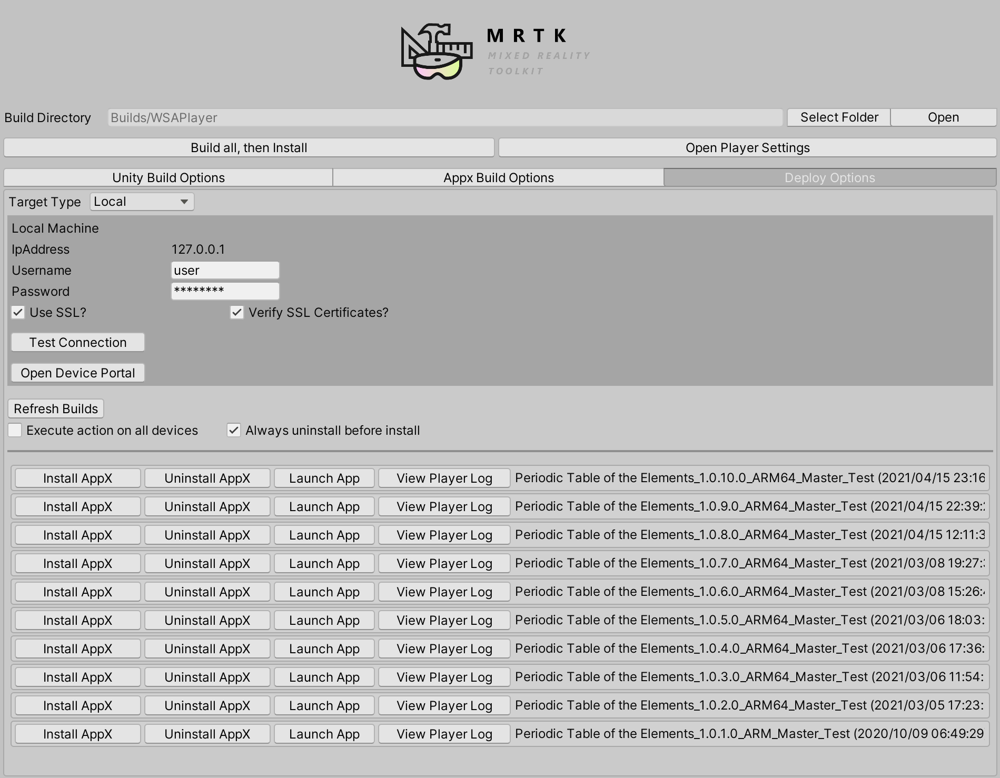

# Build window

MRTK's build window make it easy to build & deploy your MRTK-Unity projects. With a single button click, you can build Unity project and generate Visual Studio solution(.SLN), UWP App package(.APPX), and install the app package on the device. 

## Unity Build Options

## Appx Build Options

## Deploy Options

