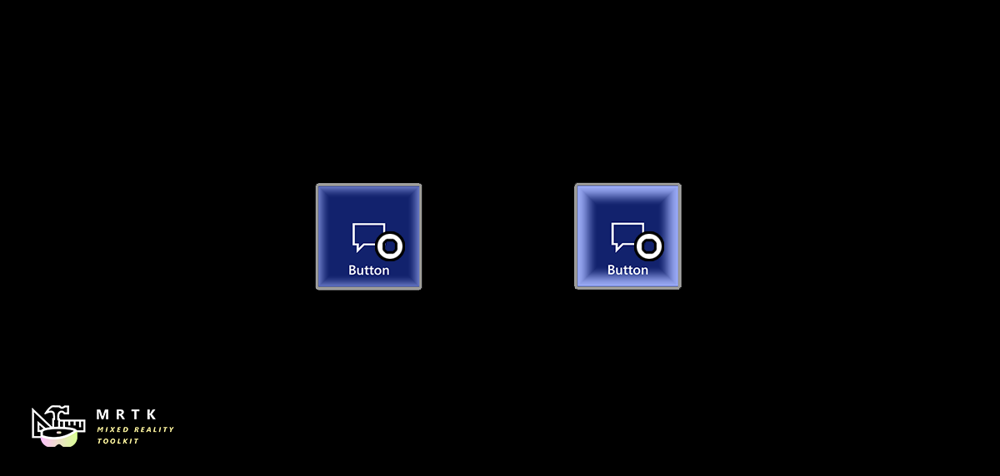

# Dwell

Head-gaze and dwell are great in scenarios where a person's hands are busy with other tasks. The feature is also useful when voice isn't 100% reliable or available because of environmental or social constraints.
MRTK's dwell examples demonstrate different types of UI components with configurable response time and visual feedback.

Please see [Head-gaze and dwell guideline](/windows/mixed-reality/design/gaze-and-dwell-head) page for the design recommendations.

## Dwell scripts

- **DwellHandler**: Adds a dwell modality to the UI target.
- **DwellStateType**: The states of the dwell handler.
- **DwellUnityEvent**: Unity event for a dwell event. Contains the pointer reference.
- **BaseDwellPressableButton.cs** : A script that triggers OnClick() event in `Interactable` of PressableButtonHoloLens2 prefabs.
- **ToggleDwellPressableButton.cs** : This script modifies `_BorderWidth` property of the `dwellVisualImage` which is using MRTK Standard Shader.

## Dwell profiles
Dwell profiles are used by the **Dwell Handler** to configure the various thresholds.
- **ButtonDwellProfile.asset**
- **InstandDwellProfile.asset**
- **DwellProfileWithDecay.asset**

## Prefabs

These prefabs are variants of the HoloLens 2 style pressable button prefabs that have additional components to support dwell interactions.

- **PressableButtonHoloLens2_Dwell.prefab**
- **PressableButtonHoloLens2_32x96_Dwell.prefab**
- **PressableButtonHoloLens2ToggleDwell.prefab**
- **PressableButtonHoloLens2Toggle_32x96_Dwell.prefab**

These prefabs have an additional backplate component **QuadDwellVisual** to visualize the dwell input state. It has **HolographicBackPlateDwellVisual.mat** material assigned. **ToggleDwellPressableButton.cs** updates the **_BorderWidth** property of MRTK Standard shader to visualize the dwell input.

## Example scene

You can find examples in the `DwellExample` scene. The example scene shows both volumetric UI examples and Unity UI examples.

## See also

- [**Buttons**](button.md)
- [**Interactable**](interactable.md)
