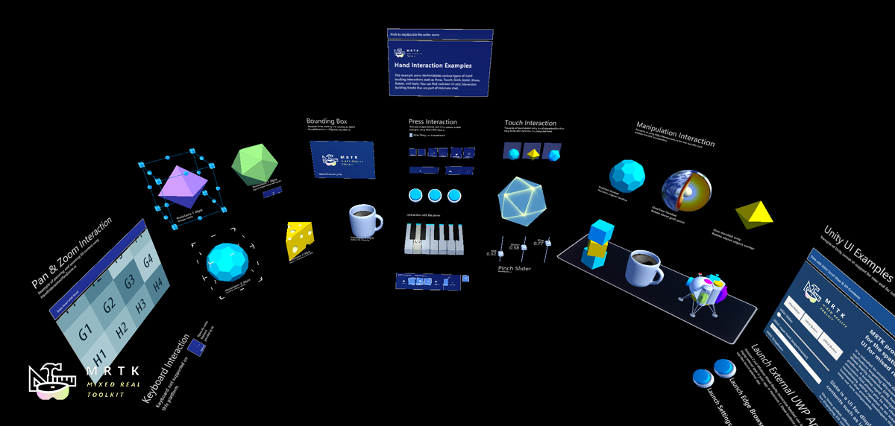

# Hand interaction examples &#8212; MRTK2

The **HandInteractionExamples** example scene contains various types of interactions and UI controls that highlight articulated hand input. With MRTK's input simulation, you can experience hand-tracking interactions in Unity editor. 

**HandInteractionExamples** scene is included in the MRTK's Examples package. You can download and import **Mixed Reality Toolkit Examples** package through [Mixed Reality Feature Tool](/windows/mixed-reality/develop/unity/welcome-to-mr-feature-tool)

 

In Unity, use the menu Window > Package Manager > In Project > Custom and select **Mixed Reality Toolkit Examples**. Click **Import into Project** button next to **Demos - HandTracking**. You will be able to find **HandInteractionExamples** scene under Assets > Samples folder.

 

 

 

* If you don't use Mixed Reality Feature Tool, you can directly download and import **Microsoft.MixedReality.Toolkit.Unity.Examples.unitypackage** from [MRTK GitHub's release page](https://github.com/microsoft/MixedRealityToolkit-Unity/releases)

> [!NOTE]
> This example scene uses *TextMesh Pro*. To open the scene, click *'Import TMP Essentials'* when the respective prompt is shown during the import of the scene. Unity will then import TextMesh Pro packages.

You can experience these components in **HandInteractionExamples** scene

- [Pressable button](../ux-building-blocks/button.md)
- [Bounds control](../ux-building-blocks/bounds-control.md)
- [Object manipulator](../ux-building-blocks/object-manipulator.md)
- [Slate](../ux-building-blocks/slate.md)
- [Slider](../ux-building-blocks/sliders.md)
- [System keyboard](../ux-building-blocks/system-keyboard.md)
