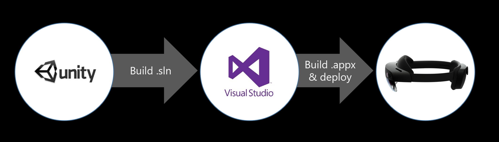

# Build window &#8212; MRTK2

MRTK's build window make it easy to build & deploy your MRTK-Unity projects. With a single button click, you can build Unity project and generate Visual Studio solution(.SLN), UWP App package(.APPX), and install the app package on the device. 

## Unity Build Options

These scenes are from the Unity Build Settings. You can change the target device type using the dropdown menu.

## Appx Build Options

This tab shows the configuration for the Visual Studio solution. To enabled HoloLens 2's eye-tracking input capability, check **Gaze Input Capability** option. 

You can assign .glb file in the **3D App Launcher Model** field for custom 3D app launcher icon. See [3D app launcher design guideline](/windows/mixed-reality/distribute/3d-app-launcher-design-guidance) for more information.

By default, **Auto Increment** is checked in the Versioning Options. AppX versions will be automatically incremented.

## Deploy Options

In this tab, you can connect to the device by entering username and password for the Device Portal. 

On the bottom of the page, you can find list of the app packages that has been created. 

