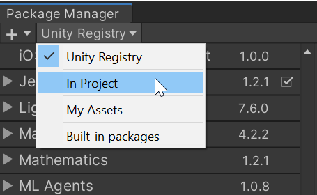
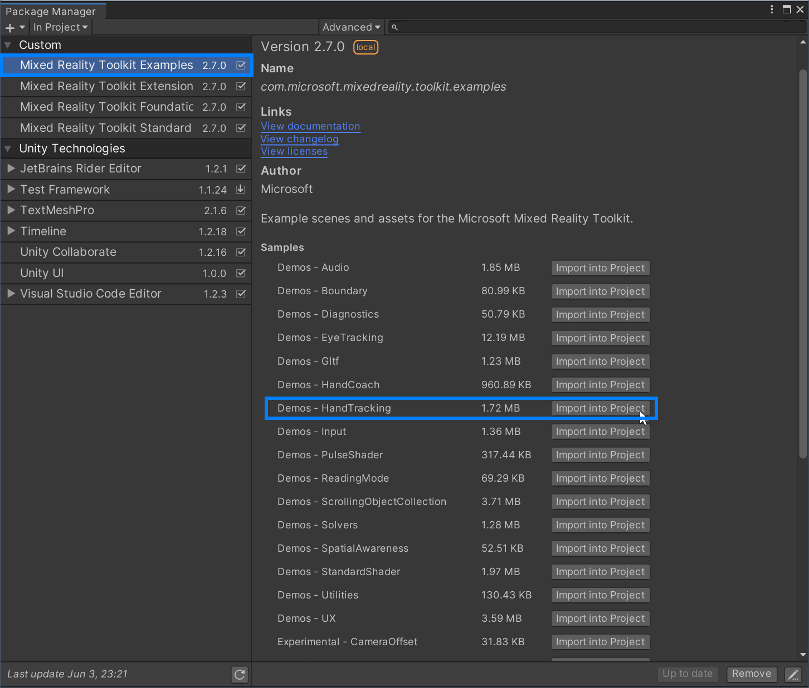
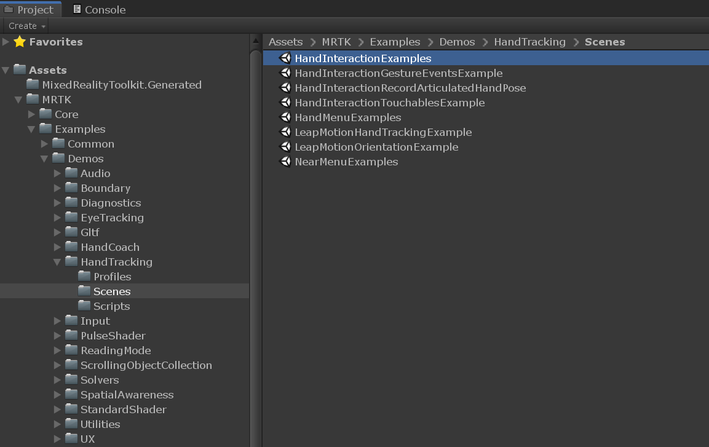

# Example scenes &#8212; MRTK2

MRTK provides various types of example scenes that demonstrate MRTK's features and building blocks for spatial user experience. Experiencing and dissecting example scenes could be helpful to understand the features and apply them to your projects. 

## How to acquire example scenes

### Using Mixed Reality Feature Tool and Unity package manager

You can download and import **Mixed Reality Toolkit Examples** package through [Mixed Reality Feature Tool](/windows/mixed-reality/develop/unity/welcome-to-mr-feature-tool)

 

In Unity, use the menu **Window > Package Manager > In Project > Custom** and select **Mixed Reality Toolkit Examples**. 

 

From the list on the right side of the panel, click **Import into Project** button next to the example scene names.  For example, you can click **Import into Project** button next to **Demos - HandTracking**. 

 

Once imported, you will be able to find them under **Assets > Samples** folder.
**HandInteractionExamples** scene is a great place to start experiencing MRTK's spatial interactions and UI building blocks.

 

### Directly downloading and importing packages from GitHub

If you don't use Mixed Reality Feature Tool, you can directly download and import **Microsoft.MixedReality.Toolkit.Unity.Examples.unitypackage** from [MRTK GitHub's release page](https://github.com/microsoft/MixedRealityToolkit-Unity/releases)

Use **Assets > Import Package > Custom Package** menu to import downloaded .unitypackage. Once it is imported, you will be able to find example scenes under **Assets > MRTK > Examples > Demos**.

 

 
