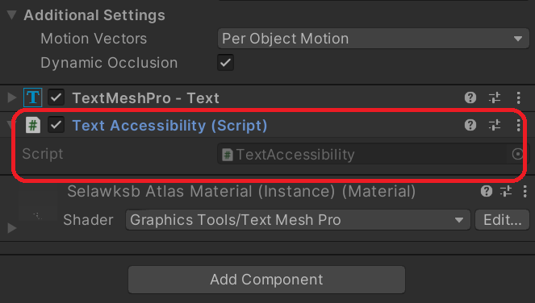

# Accessibility &#8212; MRTK3

The accessibility package contains features and components to enable developers to create mixed reality experiences for everyone.

> [!NOTE]
> The accessibility package is currently in early preview. Early preview packages might not contain all planned features and might undergo major architectural changes prior to release.

## Features

### Describable Object

To enable assistive technologies to describe, or read, objects in the mixed reality world, MRTK3 provides the `DescribableObject` script. By adding this script to visual components, a future reader component will be able to recognize
the object and read to the user the information needed to understand the object and its place in the world.

> [!NOTE]
> MRTK3 doesn't currently integrate with assistive readers.  `DescribableObject` is in the early stages of development and is included to allow advanced review and to gather developer feedback.

To enable a scene element to be described, attach the `DescribableObject` script and fill out the fields.

#### Contents

The **Contents** field should contain the text within the object--for example, a button label or the text within a slate.

#### Content Summary

**Content Summary** is an optional, short version, or abstract, of the text within the object. With a large slate of text, it can be helpful to users to provide a brief summarization of the comment. This allows users to rapidly understand the information and determine if they wish to hear the full contents.

#### Description

The **Description** places the object in the world. In the example shown, the description connects the button with a carousel model that it will animate.

#### Flags

The **Flags** field indicates key information to the assistive technologies about the object, such as if it's important to the current state of the experience.

#### Instructions

The **Instructions** field gives the user information on how to interact with the object. For example: "Click the button to animate a carousel."

#### Role

The **Role** is based on the W3C Accessible Rich Internet Application (ARIA) roles. There are plans to add additional non-user interface focused roles in a future update to MRTK3.

#### Semantic

The **Semantic** provides a brief description of the object. For example, typical semantics include:

- User name field
- Password field
- Login button

### Text Accessibility

#### Invert Text Color

To help text objects stand out from the background, it's common to use highly contrasting colors. Depending on the scenario, it may not always be possible to design text colors that are readable in all situations.

In virtual reality experiences, you may want to provide  free-floating text that can be viewed from any angle. To make this as easy as possible, MRTK3 provides the `TextAccessibility` script.

This script can be attached to any TextMesh Pro object and, provided that the font material uses the TextMesh Pro shader from the Mixed Reality Graphics Tools (all font assets in the Standard Assets package do so), the text will invert based on the configuration of the Accessibility subsystem.

