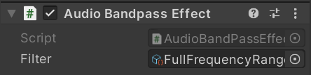
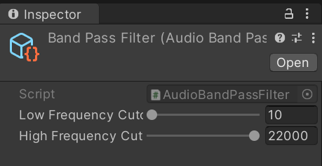
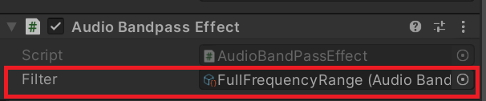
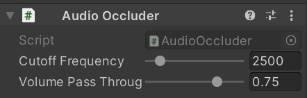
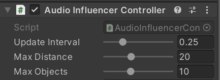

# Audio &#8212; MRTK3

The MRTK3 audio package is a collection of components and resources that enhance the realism of an immersive experience.

## Audio Effects

Audio effects (or influencers) are components that are attached to objects in the scene. Where the influencer script is attached will depend on the desired effect. The following sections describe the specific components which implement the effects.

### AudioBandPassEffect.cs

**Attach to** : Sound emitting object

The band pass effect is used to limit the frequencies contained in the sound as heard by the user.

A common use for band pass filtering is to simulate a low-fidelity (lo-fi) playback device, such as an AM radio or a telephony system.

> [!NOTE]
> When adding `Audio Band Pass Effect` to the sound source, it adds Unity's `Audio Low Pass Filter` and `Audio High Pass Filter` to implement the band pass effect. 

The [audio lo-fi example](https://github.com/microsoft/MixedRealityToolkit-Unity/blob/mrtk3/UnityProjects/MRTKDevTemplate/Assets/Scenes/Audio/AudioLoFiExample.unity), on GitHub, demonstrates how to use the band pass effect and how subtle it can often be.

#### Band pass filter assets

MRTK3 introduces band pass filter assets (see `Packages/MRTK Audio Effects/Effects/Filters`) that specify the desired frequency range to use for the effect.

To create a new band pass filter, use **Assets > Create > MRTK > Audio > Bandpass Filter**. This will create a new scriptable object asset in the project's current folder.

1. In the **Inspector** set `Low Frequeny Cutoff` to limit bass (low) frequencies
1. Set 'High Frequency Cutoff` to limit the treble (high) frequencies
1. Set the name of the filter in the **Project** panel

To apply your new filter, specify it in the `Filter` property of the `Audio Band Pass Effect` component in the **Inspector**.

### AudioOccluder.cs

**Attach to** : Non-sound emitting object

Audio occlusion is the sound equivalent of not being able to fully see an object. In the physical world, any object that comes between a listener and a sound source filters what the listener hears. This effect can be quite pronounced or virtually undetectable.

A common use of audio occlusion is to simulate being outside of a music venue. What the listener will hear (frequency and volume attenuation) will depend on the objects, and the materials comprising the object.

The audio influencer system ensures that effects will be intelligently stacked, including multiple occluders and result in a realistic simulation of what would be heard in the physical world.

The [audio occlusion example](https://github.com/microsoft/MixedRealityToolkit-Unity/blob/mrtk3/UnityProjects/MRTKDevTemplate/Assets/Scenes/Audio/AudioOcclusionExample.unity), on GitHub, provides an example of a simple occlusion scenario with a single occluder.

### AudioInfluencerController.cs

**Attach to** : Sound emitting object

The audio influencer controller manages the effects applied to the sound source. It is responsible for ensuring that the effects specified on the sound source or other objects are intelligently applied and realistically simulate the same scenario in the physical world.

> [!NOTE]
> In scenarios where the sound source is configured with directly attached effects (ex: `AudioBandPassEffect`) that are changed at runtime, `AudioInfluencerController` may not properly restore settings after applying and removing an external effect (ex: `AudioOcclusion`).

### IAudioInfluencer.cs

`IAudioInfluencer.cs` (see `Packages/MRTK Audio Effect/Effects`, in the Unity Project view) is the interface that defines an MRTK3 audio effect. It is of interest to developers wishing to add custom effects to their scenario or to contribute back to the Mixed Reality Toolkit.
