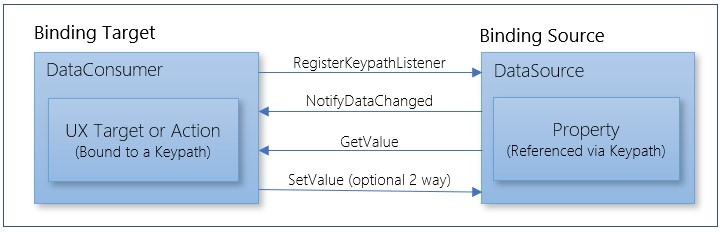
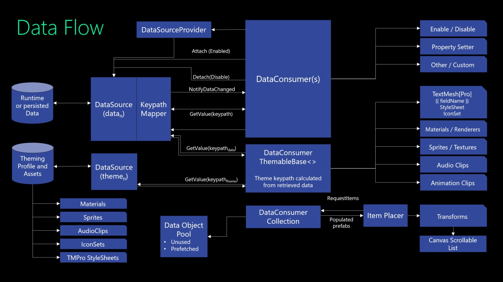
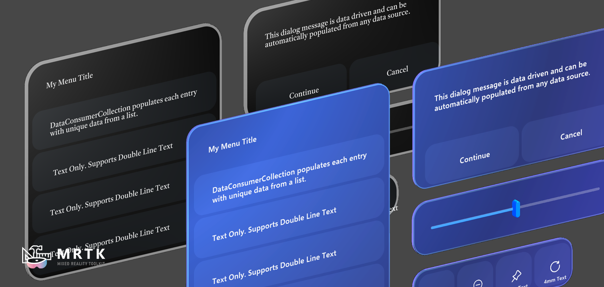

# Data Binding and Theming Framework

Welcome to the MRTK3 Data Binding and Theming framework. This framework is designed to make it easy to create visual elements that can be populated and updated dynamically at runtime by data provided from one or more data sources.

## What is data binding

Data binding is the process that establishes a connection between an application's UX (view) and the data being presented (model). Suppose the binding has the correct settings and the data provides the proper notifications; when the data changes its value, the elements bound to the data reflect changes automatically.

Popular data binding frameworks:

* Delphi
* Windows Presentation Framework (WPF .NET)
* Windows Forms
* Angular
* Backbond
* JavaFX Bindings
-----------------

### Windows Presentation Framework data binding block diagram:

For more information, see [data binding overview - WPF.NET](https://docs.microsoft.com/dotnet/desktop/wpf/data)

---
### MRTK equivalent block diagram:

---
### Design Objectives

* Cross platform - deploy anywhere
* Support any organizational structure and origin of data sources
* Easy to integrate into existing or greenfield code bases
* Designer and developer friendly
* Can be enabled / disabled at any time during application life cycle
* Support real-world, enterprise scenarios – backend DBs, complex UX prefab templates
* Easy to apply to existing non-MRTK UX components and novel visual elements
* Bind any data type including sprites, images, materials, animations, and audio clips
* Easy to enhance capabilities without touching existing code base
* Efficient use of CPU, RAM, GC and frame-time
* Integrate easily with a wide variety of local or back-end data sources
* Any simultaneous combination of embedded, run-time state, and back-end data sources
* Efficiently handle any size collection for list presentation
* Combined theming and data binding for themable dynamic data elements
* Validate and manipulate variable data in an open-ended way before presenting
* Minimal dependencies on other MRTK functionality
* Compatible with MRTK v2 and MRTK3
* Easy to white label and/or apply branding to stock assets with minimal effort

---
### Key Features

* Open-ended data sources support any persisted, remote or RAM data strategy.
* Open-ended data consumers support any UX binding and theming needs.
* Auto-discovery between data sources and consumers simplifies hookup.
* Optional auto-configuration from a binding profile
* Decoupled data model and view support MVC and MVVM patterns.
* Virtualized collections with navigation via paging and scrolling.
* Predictive prefetch of collection items for smooth list navigation.
* Collection objects can be pooled and reused to reduce GC.
* Can map between differences in data and view keypath namespaces.

---
### Current Functionality

#### 1. Visualize variable data via data consumers. Currently supported:
- TextMeshPro and TextMesh text
- Text stylesheets (for theming and accessibility)
- Sprite texture
- Boolean trigger
- Quad texture
- Font Icons
- Collections - arbitrary sized lists containing prefabs populated with variable data
- Any other consumer that supports the IDataConsumer interface (directly or via base classes derivations)
#### 2. Provide variable data via a variety of data sources:
  * JSON text (directly or via URL fetch)
  * Dictionary of variable data elements
  * Object - Node based structured data
  * Reflection of any C# object
  * Programmatically altered data
  * Any other method that supports the IDataSource interface
#### 3. List item placer to manage the visual manifestation of a list

#### 4. List paging, scrolling and virtualization
  * Data is only fetched when visible or in process
  * Supports arbitrarily large back-end data sets
  * Fetching is load balanced across multiple frames
#### 5. List prefab pooling
  * Prefabs are reused and repopulated to reduce GC and instantiation time.
#### 6. Apply themes dynamically to elements at runtime.

---
## Functionality on the roadmap:

In addition to what is already available, top priorities for additional capabilities include:

### 1. Data Manipulator pipelines
  * Conversion between data side and view side values
  * Localization (seemless integration with Unity localization)
  * Formatting
  * Validation
### 2. Predictive list item prefetch for faster/smoother scrolling/paging

### 3. More Data Consumers
  * Set any public property on a Component
  * Set checkbox on/off state
  * Set slider value
  * Set a radio button in a group
  * Individual Material properties such as set color
### 4. Theming
  * See themes applied in Editor even when not running application
  * Update prefabs to reflect an applied theme, so as to become the default theme
  * Theme / style inheritance

---
### Terminology

* **Data Source** - Any provider of data, whether it's runtime state, locally persisted, or fetched from a server.
* **Data Source Provider** - A simple MonoBehaviour that provides access to a Data Source that may not be exposed in the Unity scene graph.
* **Data Source Type** - A unique name assigned to Data Source such that Data Consumers can specify their desired Data Source(s) by name.
* **Data Consumer** - Any consumer of data that wishes to act upon data changes, typically a visual element, but not required. As an example, its purpose can be to trigger actions based on data value changes.
* **Data Controller** - A mechanism for invoking an action with the currently associated data-bound value provided as a parameter.
* **Keypath** - A data selector that references a specific object in a Data Source. As currently implemented, the keypath format is modelled after JSON data accessors for deciphering any nested combination of maps, lists and atomic elements.

* **Local Keypath** - A Data Consumer side keypath that can be permanently embedded in a reusable prefab. Via a combination of resolving collection entities and Keypath Mappers, this will automatically be converted to a fully resolved keypath for a specific item in a collection. When not associated with a collection, these can either map directly to a datum in the data source, or can first be modified via a Keypath Mapper.

* **Fully Resolved Keypath** - A full, absolute keypath that maps to one specific object in a Data Source. For items in a collection, this is a combination of the fully resolved keypath for one collection entity and a relative (local) keypath for one data element of that collection entity.

* **Keypath Mapper** - Optional namespace mapper between local keypaths and Data Source field names (for example "link" <-> "URL").

* **Theme** - A Data Source that provides a set of various assets and styles needed to achieve a specific visual aesthetic.

* **Item Placer** - A DataConsumerCollection companion responsible for placing visible items into a scene.

* **Data Object Pool** - Instantiated, standby prefabs ready to populate with data for low-GC list navigation.

* **List Virtualization** - Ability to populate, present and navigate lists of arbitrarily large size.

* **Predictive Prefetch** - Pre-fetching data and populating collection prefabs for items that may soon be seen via scrolling/paging.

### Key Concepts

#### Data Source

A data source is any managed set of data of arbitrary type(s) and complexity
that can be used to populate data views via data consumers. The data managed by a data source can be static or dynamic. Any changes to data items will be reported to any data consumers that have registered to receive change notifications.

#### Data Source Provider

A simple interface that has a single method to retrieve a data source. This is designed to allow a MonoBehavior scripting component to be auto-discovered in the game object hierarchy by data consumer components, but without the need to implement a data source directly on the game object itself.  This is useful when an existing MonoBehaviour must derive from another class and multiple inheritence prevents deriving from DataSourceGOBase. It also allows more code to have no Unity dependencies.

#### Data Source Provider Singleton

The ``DataSourceProviderSingleton`` MonoBehaviour makes it possible to specify a data source that can be automatically discovered even if it is not in the same GameObject hierarchy as the DataConsumers that wish to listen to it. Simply put the ``DataSourceProviderSingleton``anywhere in the scene and populate the ``Data Sources`` property with any data sources that are to be discovered by data consumers.  Alternatively, data consumers will walk their parents to find an appropriate data source, which implies that you can put a data source that provides the desired data anywhere in the parent chain of those data consumers. 

#### Key Path (string)

A key path is the mechanism to uniquely identify any piece of information in a data source.

Although a key path can be any unique identifier per data item, all
current impmlementations use the concept of a logical user readable
specifier that indicates the navigational position of the data of interest
relative to the entire structured data set. It is modelled on javascript's concept of
lists, dictionaries and primitives, such that key paths are syntactically correct javascript
statements for accessing data that can be represented in JSON. The advantage
of this approach is that it correlates very well with both JSON and XML,
which are the two most prevalent means of transfering information from back*end services.

Example key paths:

* temperature
* contacts[10].firstName
* contacts
* contacts[10].addresses[3].city
* [10].title
* kingdom.animal.mammal.aardvark.diet.foodtypes.termites

Given that a key path is an arbitrary string with no required taxonomy, the actual
data specifiers could be any method of describing what data to retrieve. XML's XPath is an
example of a viable key path schema that would work with data sources. As long as key paths provided by the data consumer
are consistent with the keypaths expected by the data source, everything will work.
Furthermore Key Path Mappers can be implemented to translate between different schemas.

#### Resolving a Key Path

Resolving a key path means combining two keypaths:
1. An absolute keypath that describes how to access a specific
subset of a larger dataset, such as one entry in a list of many entries.
2. A partial (relative) keypath that represents a specific datum within that list or map entry.

This makes it possible to treat a subset of the data in such a way that it does
not matter where in a larger data set hierarchy it actually exists. The most critical
use of this ability is to describe the data of a single entry in a list without worrying about which
entry in that list the current instance is referencing.

Since a "fully resolved" Key path is always generated and consumed by a DataSource and should never (or at least rarely) be modified by a DataConsumer or other external component, it can have any structure that makes sense to the DataSource.  For example, if a prefab to show a list entry for a photo and it's title, date taken and other attributes, the local key path in the prefab might look like this:

* "photo_url"
* "title"
* "date_taken"
* "description"

The fully resolved key paths for one prefab entry in a list might look like this:

* "f3cb1906-d8b3-489d-9f74-725e5542b55d/photo_url"
* "f3cb1906-d8b3-489d-9f74-725e5542b55d/title"
* "f3cb1906-d8b3-489d-9f74-725e5542b55d/date_taken"
* "f3cb1906-d8b3-489d-9f74-725e5542b55d/description"

#### Key Path Mapper (IDataKeyPathMapper)

A key path mapper allows data sources and data consumers to use different namespaces and conventions for key paths and still work together.

A prefab for a commonly used element, such as a slate to show a persons contact information, can cantain variable fields managed by data consumers. To make this possible , the identifier used for any variable aspect of the prefab needs a way to map to the identifier for the correct datum in the data source that will, in each use of the prefab, determine the contents of that variable element. The Key Path Mapper makes this possible.

The prefab may be used with different data sources where the data is stored in a different organizationl structure and uses field names. To use a
template prefab with each data source, a key path mapper can resolve any differences in how the data is organized.

#### Data Consumer (IDataConsumer)

An object that knows how to consume information being managed by
a data source and use that data to populate data views.

Data Consumers can register with a data source to be notified of any changes to a
data item that exists at a specified key path in a dataset. Whenever the data specified has changed (or suspected to have changed), the
Data Consumer(s) will be notified.

#### Data Consumer Collection

A collection data consumer has the added ability to manage a list of similar items. This list can be the entire data set
managed by a data source, or just a subset. Typically the data for each item in the list contains similar types of information, but this
is not a requirement. Data sources and data consumers can support nested lists, such as a list of keywords
associated with each photo in a list of photos associated with each person in a contact list. The keypath for the keywords would be relative to the photo,
and the keypath for the photos would be relative to the person, and the keypath of the person would be relative
to either the nearest parent list, or the root of the data set.

When processing collections, the correct resolved keypath for the specific entry in the collection is assigned to each data consumer found in the prefab
that is instantiaged for each collection item. That is then used to full resolve the key path for any relative (local) view data within that prefab.

#### Data Collection Item Placer

A collection data consumer needs a means to populate user experiences with lists of repeating visual elements, such as might be found in a scrollable
list of products, photos, or contacts.

This is accomplished by assigning an item placer to the collection data consumer. This item placer is the logic tha knows how to request list items, accept prefabs
that have been populated with variable data, and then present them to the user, typically by inserting them into a list managed by a ux layout component for lists.

## Theming

Theming uses all of the plumbing of data sources and data consumers.  It is possible to theme any hierarchy of GameObjects whether they are static or are dynamically data bound to other data sources.  This allows for both data binding and theming to be applied in combination. It is even possible to theme the data coming from another data source. 
## Block Diagram and Data flow

## MRTK Theming

Theming is the ability to wholesale change the visual aesthetic of many UX elements at once. Typically, all of the data needed to specify a theme is provided by a single Data Source, such as a Scriptable Object.  It is also possible for theming data to be provided as needed, or divided into logical groups based on its purpose.

## MRTK3 Theming combined with Data Binding

Data Binding and Theming can co-exist for a single UX element. Any individual UX element can be simultaneously themed and data bound. In this scenario, the typical flow is that the datum coming from a DataSource is used to derive the correct theme keypath. This keypath is then used to retrieve an object from the theme Data Source, typically a ScriptableObject profile, but potentially any source of data that can resolve a keypath.

To simplify configuration of theming and data binding, it's possible to create binding profiles that are processed by a BindingConfigurator at instantiation time.

* A `BindingConfigurator` processes a **Binding Profile** to determine the assets within a prefab that are to be themed and associates both bound data elements and themable elements with Keypaths.  It also then adds appropriate `DataConsumers` to bind these visual elements to the correct Keypaths selectors that will be used to reference specific data in one or more `DataSources`, which are typically external to the prefab itself.
* Theme data is provided by a `DataSource` that contains data for each Keypath identified in the Binding Profile. 
* A `ThemeProvider` helper script makes it easy to use a **ScriptableObject** as a `DataSource` for theming.
* The standard UX theme is provided by the `MRTK_UX_ThemeProfile` **ScriptableObject** that is bound to a `DataSourceReflection` in the `ThemeProvider`.

### Embedded Data Source

An embedded data source is appropriate in two situations:

1. When each instance of the prefab may have different theme settings and requires its own separate data source.
1. When all instances of this prefab are governed by one common persisted theme profile (for example, ScriptableObject) and that can be provided via the embedded data source so that there are no external dependencies to establish.

### DataSourceReflection

This can turn any C# struct or class into a `DataSource` by using reflection to map keypaths to fields and properties even nested classes, arrays, lists and dictionaries. It can be associated with a Unity **ScriptableObject**, or any other C# struct or class where theme data exists. The instantiated object containing the data can be dependency injected and changed at runtime.

1. Scriptable Object - useful for static themes shared across many prefabs.
2. Non-persisted C# struct or class - useful for dynamic run-time modifications of the theme.

### DataSourceJson

If the data exists as `json` text, then this manages mapping keypaths to the `json` DOM. Binary assets can be retrieved from Unity's Resources, **StreamingAssets** or even a fetched URL.

### DataSourceDictionary

This is a simple option when a purely flat list is good enough to meet the need, and for rapid prototyping. All theming assets are supported including text, Unity assets (for example, Materials, Sprites, Images), **Resources**, **StreamingAssets**, or even externally fetchable via a URL.

### Custom

Any custom data source that implements the straightforward `IDataSource` interface or derives from `DataSourceBase` or `DataSourceGOBase` can be used to meet custom needs.

## Theming UXComponents

The standard UXComponents controls provided in the UXComponents package are all configured to support theming.  It is turned OFF by default, but is easy to enable.

Each control, typically on the topmost GameObject of the root prefab, has a script called UXBindingConfigurator. This script, if enabled, will pull in the needed data binding scripts to turn on theming. Make sure to import the Data Binding and Theming package as well.

**Note on TextMeshPro StyleSheets**: It is not currently possible to use StyleSheets to style the TextMeshPro *Normal* style.  Any other style that is included in TextMeshPro's *Default Style Sheet* can be used. The examples use *Body* to work around this limitation.

### DataSourceThemeProvider

The ``DataSourceThemeProvider`` MonoBehaviour can be used to easily make a ScriptableObject containing all references to all theming assets function as a data source. This is demonstrated in the UXThemingExample scene.

### ThemeSelector

The ``ThemeSelector`` MonoBehaviour makes it possible to specify and easily swap between multiple ScriptableObject profiles. An example use of this would be to make it easy to switch between a 'Dark' and a 'Light' theme.  Add the ScriptableObjects to the ``Theme Profiles``, typically at Design Time.  Then at run-time change the ``Current Theme`` property to change the theme.

## Data Consumer Theming

Theming is accomplished by Data Consumers, particularly ones that inherit from DataConsumerThemeBase\<T\>, DataConsumerTextStyle and custom DataConsumer classes that any developer can implement to enhance the theming support.

The DataConsumerThemeBase\<T\> base class provides logic to use an integer or key datum from a primary data source to then look up the desired final value from a secondary theme database. This is accomplished by mapping the input data to a theme keypath, and then using that theme keypath to retrieve the final value. This allows for any element to be both data bound and themed at the same time.  As an example, imagine a status field in a database with statuses of New, Started, and Done represented by values 0, 1 and 2.  Each of these can be represented by a Sprite icon.  For data binding, a value from 0 to 2 is used to lookup the desired sprite.  With theming and data binding, the theme profile points to the correct list of 3 sprites in the theme profile and then the value from 0 to 2 is used to select the correct sprite from that list.  This allows the styling of these icons to differ per theme. 

When both runtime theming and dynamic data binding are used together, a DataConsumerThemeHelper class can be specified in any DataConsumerThemeBase derived class to notify when a theme has changed.

Swapping themes at runtime is accomplished by replacing the data at the theme data source with a new data set laid out in the same data object model topology. DataSourceReflection can be used with ScriptableObjects where each profile represents a theme. For all MRTK Core UX controls, the theme profile is a ScriptableObject named MRTK_UXComponents_ThemeProfile. The ThemeProvider.cs helper script makes it easy to use this or any ScriptableObject profile as a Data Source.

The method of applying a theme to dynamic data can be automatically detect in most cases, or it can be explicitly specified.

When the datum is used to select the correct item from the theme data source, the process is:
- a datum from the primary data source is used to select or construct the correct _theme keypath_
- the theme keypath is used to retrieve a value from the theme data source specified on the DataConsumerThemeHelper
- the retrieved theme value is analyzed to auto-detect correct retrieval method
- the final data item of correct type (eg. Material, Sprite, Image) is then retrieved using the auto-detected method.

### Data Types

The expected data type of the datum used to retrieve the desired object can be one of the following:

Data Type | Description
:---: | ---
AutoDetect | The datum is analyzed and the correct interpretation is automatically detected. See "Auto-detect Data Type" below for more information.
DirectValue | The datum is expected to be of desired type T (eg. Material, Sprite, Image) and used directly.
DirectLookup | An integral index or string key used to look up the desired value from a local lookup table.
StaticThemedValue | Static themed object of the correct type is retrieved from the theme data source at specified theme keypath.
ThemeKeypathLookup |  An integral index or string key is used to look up the desired theme keypath.
ThemeKeypathProperty | A string property name that will be appended to the theme base keypath provided in the Theme .
ResourcePath | A resource path for retrieving the value from a Unity resource. (May begin with "reesource://")
FilePath | A file path for retrieving a Unity streaming asset. (May begin with "file://")

### Auto-detect Data Type
Autodetect analyzes the data received and decides the retrieval method automatically. In the table below, T represeents the desired type such as Material, Sprite, Image. Autodetect can occur at two places in the process:

- On the primary datum value itself.
- On the themed value retrieved via the primary datum.

Datum Type | Considerations | Has Theme Helper | Behavior
:---:|---|:---:|---
T | n/a | Y/N | Used directly with no theming
int | any integral primitive or Int32 parsable string | No | Passed as index to derived GetObjectByIndex(n) to retrieve Nth object of type T.
int | any integral primitive or Int32 parsable string | Yes | Index to fetch Nth theme keypath from local lookup and then retrieve themed object via auto-detect.
string | Format: "resource://{resourcePath}" | Y/N | resourcePath is used to retrieve Unity Resource
string | Format: "file://{filePath} | Y/N | filePath is used to retrieve a streaming asset
string | Other | No | Passed as key to derived GetObjectByKey() to retrieve matching object of type T.
string | Other | Yes | Key to fetch matching theme keypath from local lookup and then retrieve themed object via auto-detect.

An example for retrieving a themed status icon from a database containing a numeric status value:

1. The keypath for a status icon in the database is status.sprite_index.
2. The retrieved value for status.sprite_index is 2 which means "cancelled" status.
3. The N=2 (ie. 3rd) entry in DataConsumerSprite lookup is set to "Status.Icons.Cancelled".
4. This is the keypath used to retrieve a value from the "theme" data source.
5. The value for the "Status.Icons.Cancelled" keypath is "resource://Sprites/sprite_cancelled".
6. Auto-detect determines that it should retrieve the icon via a resource located at "Resources/Sprites/sprite_cancelled"

### TextMeshPro StyleSheets

Theming is able to activate TMPro stylesheets.  "TMP Settings" ScriptableObject dictates where stylesheets are expected to be in the Resources.  It's the "Default Font Asset => Path" property. 

Make sure to place any app specific StyleSheets in the same sub-path off of Resources. If you wish to organize them differently, make sure to update "TMP Settings" to match.

### Making New UX Controls Themable

If you are developing new UX controls, it is relatively easy to make them themable. To the extent that the control uses Materials, Sprites, and other assets already in use by other UX controls, it is generally a matter of naming the various game objects in a discoverable way. 

It's possible to inherit from the MRTK_UXCore_ThemeProfile and add more themable fields, or point your controls to your own ScriptableObject.  There is nothing magical about the ones provided other than the organization of the ScriptableObject will determine the keypaths need to access individual data items, via C# Reflection. 

By adding a BindingConfigurator.cs script to the top level of the new control, you can then specify your own serialized BindingProfile ScriptableObject to provide the necessary GameObject name to KeyPath mappings needed to associate your themable elements with the data provided in the theme profile. This script will automatically add any needed DataConsumerXXX components at runtime to support the theming you wish to use.

## Getting Started

### Requirements

- Unity 2020.3 LTS or later
- TextMeshPro 2.1.4 or later

### Sample Scenes

For a first step, take a close look at the various data binding example scenes in the MRTK Examples package and look at how the various data source MonoBehaviours are configured. In general, data binding scripts only need to be placed on the highest level GameObject of a prefab or a related set of UX elements.  

Also, for most use cases, the default values work out-of-the-box, but the exposed properties provide a lot of flexibility for the more advanced cases.

>**Note: To enable theming for the standard MRTK UX components, the ``MRTK_UX_DATABINDING_THEMING_ENABLED`` symbol must be defined in Player Settings. This symbol ensures zero performance impact when theming is not needed.**

#### Assets/DataBinding Example/Scenes/DataBindingExamples.scene

This scene that demonstrates a variety of variable data scenarios.  Simply load the scene and play. A few things to notice:

- The Text Input field of TextMeshPro components contain variables that look like this: {{ firstName }}. These markers are used directly as local keypaths.

- Game objects for sprites and text have some form of Data Consumer component that manages receiving data and updating views.

- A single Data Consumer may be shared by multiple components of the same type by being placed higher in the GO hierarchy.

- A Data Consumer can find its own Data Source so long as it is on the same game object or higher in the GO hierarchy.

- A parent game object has a Data Source component that provides data for all child game objects that present a related set of variable information.

- A collection Data Consumer specifies a prefab which itself contains data consumers that will be used to populate that prefab with variable data.

#### Assets/UX Theming Example/Scenes/AudioTheming

This example uses theming to switch AudioClips between a set for Piano and one for Xylophone.

#### Assets/UX Theming Example/Scenes/BatteryLevelExample

This example combines theming and data binding to show a battery level both as a numeric value and as an icon. Theming is used to select between a charging them and a not charging theme.

It is designed to meet the following objectives:
* All visual assets can exist in a single `ScriptableObject` acting as a theme profile.
* The number of sprites for charging states can differ from the number for not charging state.
* The algorithm for mapping reported battery level to which sprite can be non-linear and differ between charging and not charging states.

To change the charging level and state, find the ``BatteryLevelDataSource`` script on the ``Battery Level Slate`` GameObject.  Change the values for ``Battery Level 0 to 1`` and ``Is Charging``.

>**Note: How this demo is structured is not a good example of combining theming and data binding. In a production application for proper separation of model and view, the actual battery state (level and charging) would be provided in a separate data source than the resource locators for the sprites themselves.**

#### Assets/UX Theming Example/Scenes/UXThemingExample

This example demonstrates changing the theme of an entire application and also demonstrates using a ``DataSourceGODictionary`` as a data source for managing a variety of textual content to be displayed in the UX. In a more comprehensive scenario, the other more flexible data source types are likely to provide the needed flexibility, such as ``DataSourceReflection`` or ``DataSourceGOJson``.

### First Data Binding project

Here's a simple example to help you get started quickly:

Create a new scene. On the Mixed Reality Toolkit menu, select "Add to Scene and Configure" option.

Create an empty game object and rename it to "Data Binding". Add a DataSourceJsonTest component.

In the inspector, change the Url to: https://www.boredapi.com/api/activity

Add a UI -> Text - TextMeshPro object to the Data Binding game object.  It will add a canvas and then a "Text (TMP)" object.

Select the Text (TMP) object, and in the inspector change the Text Input to:

`{{ activity }}. It's {{ type }}.`

Select the canvas object and add a Data Consumer Text component to it.

Run the project.  Every 15 seconds, a different activity will be shown.

Congratulations. You've created your first Data Binding project with MRTK!

### Writing a new Data Source

A data source provides data to one or more data consumers.  It's data can be anything: algorithmically generated, in RAM, on disk, or fetched from a central database.

All Data sources must provide the IDataSource interface. Some of the basic functionality is offered in a base class called DataSourceBase. You most likely want to derive from this class to add the specific data management funcationality specific to your need.

To make it possible to drop a data source as a component onto a game object, another base object exists called DataSourceGOBase where GO stands for GameObject. This is a MonoBehavior that can be dropped onto a GameObject as a Component. It is a thin proxy that is designed to delegate work to a non-Unity specific core data source.

A data source may expose the ability to manipulate data within Unity Editor. If this is the case, the derived class can contain all of the data source logic, or it can leverage a "stock" data source, but also add inspector fields or other means of configuring the data.

### Writing a new Data Consumer

A data consumer gets notifications when data has changed and then updates some aspect of the user experience, such as the text shown in a TextMeshPro Component.

All data consumers must provide the IDataConsumer interface. Some of the basic functionality is offered in a base class called DataConsumerGOBase, where GO stands for GameObject.

The majority of the work of a data consumer is to accept new data and then prepare it for presentation.  This may be as simple as selecting the right prefab, or it could mean fetching more data from a cloud service such as a content management system.

### Writing a data collection item placer

A data collection item placer is responsible for managing which parts of a collection are currently visible and how to present that visible collection, whether the collection is a small static list, or a giant million record database.

All item placers must provide the IDataCollectionItemPlacer interface.  Some of the basic funcationality is offered in a base class called DataColletionItemPlacerGOBase.  All item placers should derive from this class.

## Known Limitations and Missing Features

- Not yet integrated with Unity's canvas based controls and scrollable lists.
- Integration of .NET INotifyPropertyChanged is not yet implemented.
- Example scene that fetches images from Flickr and trymrtk.com do not work on HoloLens due to an Https SSL bug in later versions of Unity.
- Additional performance tuning.
- This release focuses on data presentation, not data capture. MRTK UX controls are not yet wired to set state in a `DataSource`.
- Dynamic changes to list data completely refreshes entire list instead of incrementally updating.
- Data manipulation pipeline has not yet been implemented
- Populating all UX components on a slate is not yet fully supported.
- DataSourceJson nodes should implement IDataNode interface to be interoperable with DataSourceObjects.
