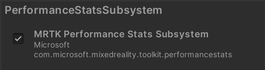

# MRTK3 Diagnostics &#8212; MRTK3

The MRTK3 diagnostics package is a collection of subsystems and components to help developers measure and diagnose their mixed reality experiences.

## Performance Statistics

One of the most important aspects of a mixed reality experience is performance. Achieving a comfortable frame rate is crucial to the wellbeing of your customer and the success of your experience.

In the past, MRTK combined frame rate and memory utilization statistics in a visual profiler. With MRTK3, the statistics logic and the visualization are separate. Developers now have control over the visualization (if any) that's displayed in their experience. In fact, some developers may wish to forgo the visualization in favor of a log file or custom visual feedback as thresholds are encountered.

MRTK3 ships with a basic performance statistics visualization `SimpleProfiler` in `MRTK Diagnostics` > `Visualizations`.

## Other diagnostics

As MRTK3 evolves, we anticipate that additional diagnostic tools will be written. 

If you have feedback on tools you would like to see or would like to contribute a tool, please feel free to file an issue or pull request at https://github.com/Microsoft/MixedRealityToolkit-Unity.

## Visual Profiler

The MRTK2 provides a [VisualProfiler](/windows/mixed-reality/mrtk-unity/mrtk2/features/diagnostics/using-visual-profiler) that renders a graphical representation of application performance. This component is not available in MRTK3. If such a component is desired, an updated version of the VisualProfiler can be found at the [VisualProfiler for Unity project](https://github.com/microsoft/VisualProfiler-Unity) on GitHub. The VisualProfiler for Unity project is being maintained by Microsoft, and any future updates to the VisualProfiler can be found at this project.

