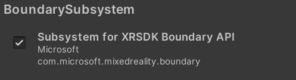

# MRTK3 Environment

The MRTK3 Environment package provides features and components to make working with spatial awareness and virtual reality boundaries easy and to enable compelling visual representations.

> [!NOTE]
> The Environment package is currently in early preview. Early preview packages may not contain all planned features and may undergo major architectural changes prior to release.

## Boundary Subsystem

MRTK3 includes a boundary subsystem that can be enabled by developers if they want to understand the user's safe playspace. Much of this data is sourced from Unity-provided APIs such as the XR Input Subsystem.

> [!NOTE]
> The MRTK team is looking for developer feedback regarding the boundary subsystem. Is there value in aggregating Unity-exposed data into a single API? Is it better to focus on utility scripts for determining, for example, if the user has exited the playspace/boundary? Please join the conversation at https://github.com/Microsoft/MixedRealityToolkit-Unity.

## Spatial Mesh Visualizations

Informative and visually compelling spatial mesh representations can enhance the user's experience. MRTK3 includes classes that can be used to display a basic visualization that can be extended to implement an appealing custom representation. Please see `MRTK3 Environment` > `Visualizers`> `SpatialMesh`.
