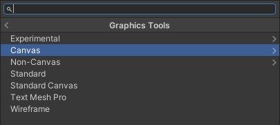
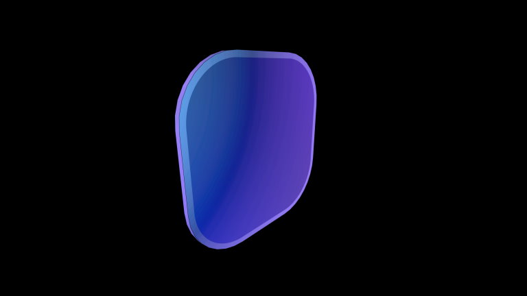
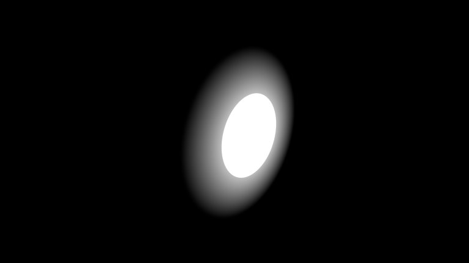

# Connection between the Mixed Reality Design Language (MRDL) to Graphics Tools -- MRTK3

The Mixed Reality Design Language (MRDL) is a design language similar to [Fluent](https://www.microsoft.com/design/fluent/#/), but it has considerations made for Mixed Reality. Over the years MRDL has evolved with each iteration of HoloLens and within products such as the [Mesh app](https://techcommunity.microsoft.com/t5/mixed-reality-blog/mixed-reality-design-language-and-microsoft-mesh-app/ba-p/2746980).

Graphics Tools is built to better share the tools and processes used to build MRDL user interface components. The Graphics Tools package is designed to bubble up MRDL concepts to all Mixed Reality apps via shaders, textures, materials, models, scripts, and tooling.

## Where can MRDL components be found?

> [!TIP]
> Looking for complete MRDL designed components? Take a look at higher level UX packages within the [MRTK](https://aka.ms/mrtk3).

The shaders and assets that power the MRDL can be found in the following locations:

### Shaders

The first option of every material inspector contains a shader dropdown. All Graphics Tools shaders are within the `Graphics Tools` namespace. Most bespoke MRDL shaders are in the `Graphics Tools/Canvas` and `Graphics Tools/Non-Canvas` shader namespace. As the name suggests, shaders in the `Canvas` namespace should be used with UnityUI canvases and shaders in the `Non-Canvas` namespace should be used within normal Unity contexts.

> [!TIP]
> If you peer into the source code of these shaders you might notice they are more difficult to read than even a traditional shader. This is because they are generated from a tool.

### Materials

Within the *Runtime/Materials* folder, you will find a material that represents each shader above. These materials are used for common user interface components. Some materials reference textures that are required for certain effects, like iridescence.

### Models

Some models live in the *Runtime/Models* folder. These models are used for non-canvas materials.

> [!TIP]
> Most canvas models are generated programmatically in code.

## When should I use one MRDL component versus another?

Graphics Tools supports two user interface creation methods, UnityUI and traditional game objects. It's recommended to look at the [sample assets](../features/samples/unity-ui.md), however, the list below can used as a reference.

### Back plate

Provides an opaque backing for user interface elements to be placed on.

| Asset              | Canvas                          | Non-Canvas                          |
|--------------------|---------------------------------|-------------------------------------|
| Shader             | Graphics Tools/Canvas/Backplate | Graphics Tools/Non-Canvas/Backplate |
| Material           | CanvasBackplate                 | Non-CanvasBackplate                 |
| Script(s)/Model(s) | CanvasElementRoundedRect.cs     | Backplate8                          |

### Front plate

Displays a translucent surface above the back plate to show volume and proximity lighting.

| Asset              | Canvas                           | Non-Canvas                           |
|--------------------|----------------------------------|--------------------------------------|
| Shader             | Graphics Tools/Canvas/Frontplate | Graphics Tools/Non-Canvas/Frontplate |
| Material           | CanvasFrontplate                 | Non-CanvasFrontplate                 |
| Script(s)/Model(s) | RawImage.cs/ScaleMeshEffect.cs   | Frontplate8                          |

### Glow

A small highlight when an affordance is interacted with.

| Asset              | Canvas                         | Non-Canvas                     |
|--------------------|--------------------------------|--------------------------------|
| Shader             | Graphics Tools/Canvas/Glow     | Graphics Tools/Non-Canvas/Glow |
| Material           | CanvasFrontplate               | Non-CanvasFrontplate           |
| Script(s)/Model(s) | RawImage.cs/ScaleMeshEffect.cs | Quad (Unity Default)           |

### Quad glow

A larger glow when an affordance is indirectly interacted with.

| Asset              | Canvas                          | Non-Canvas                          |
|--------------------|---------------------------------|-------------------------------------|
| Shader             | Graphics Tools/Canvas/Quad Glow | Graphics Tools/Non-Canvas/Quad Glow |
| Material           | CanvasQuadGlow                  | Non-CanvasQuadGlow                  |
| Script(s)/Model(s) | RawImage.cs/ScaleMeshEffect.cs  | Quad (Unity Default)                |

### Beveled rect

Similar to the back plate, but provides a rect with beveled edges.

| Asset              | Canvas                        | Non-Canvas                                     |
|--------------------|-------------------------------|------------------------------------------------|
| Shader             | Graphics Tools/Canvas/Beveled | Graphics Tools/Non-Canvas/Beveled              |
| Material           | BevCanvasBeveled              | Non-CanvasBeveled                              |
| Script(s)/Model(s) | CanvasElementBeveledRect.cs   | Beveled4x4, Beveled6x6, Beveled8x4, Beveled8x8 |

## See also

* [Graphics Tools overview](overview.md)
