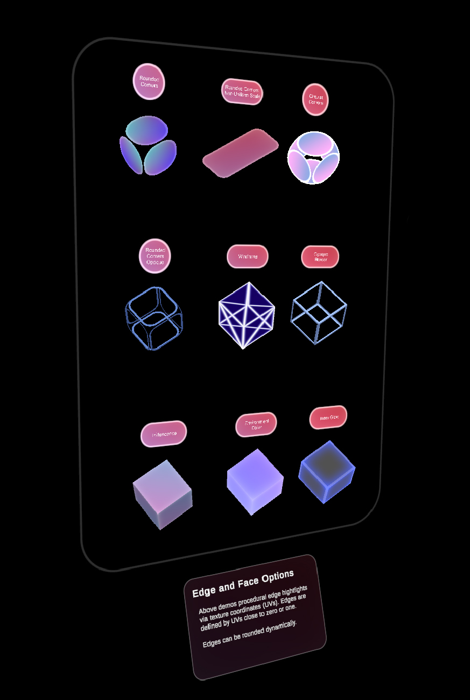

# The Material Gallery

The Graphics Tools Standard shading system utilizes a single, flexible shader that can achieve visuals similar to Unity's Standard Shader, implement [Fluent Design System](https://www.microsoft.com/design/fluent/) principles, and remain performant on Mixed Reality devices.
In this sample scene you'll find a detailed display of the the capabilities of the Graphics Tools standard shader.

## Edge and Vertex effects

These examples showcase various effects that make use of an object's texture coordinates (UVs), e.g. procedural edge hightlights, dynamically rounded edges, wireframe rendering and glow effects.

## Surface Effects

This section showcases the surface rendering effects you can achieve with the Graphics Tools standard shader.
These examples display only a hnadful of possible variations, as stencil and clipping effects or PBR capability.

## Hover Lights

Placing point lights in a scene can end up very expensive on performance.
Hover Lights are normally used for UI lighting but can also be used as a faster alternative to point lights.
Up to 4 hover lights may be active in a scene at once.

## Rendering Modes

Rendering Mode determines when and how a material will be rendered.
This allows for effects like holes, faded transparency and color calculation effects, which can be further refined using the Custom Rendering mode.

### See also

* [Graphics Tools Standard Shader](./features/standard-shader.md)

