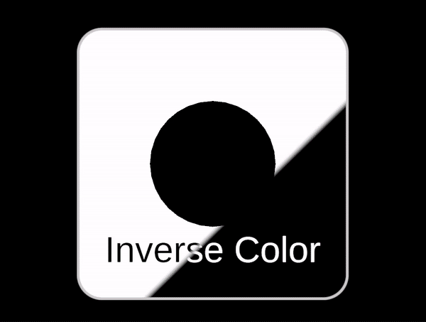
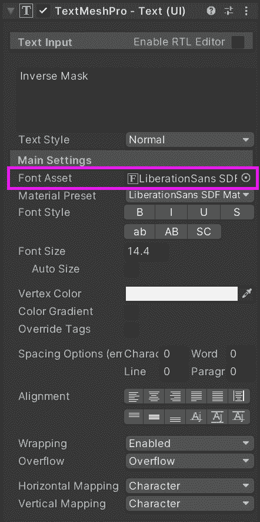
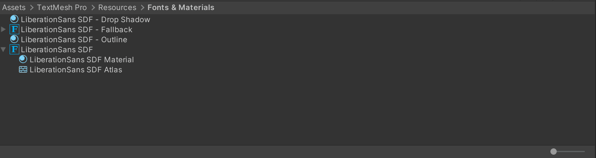
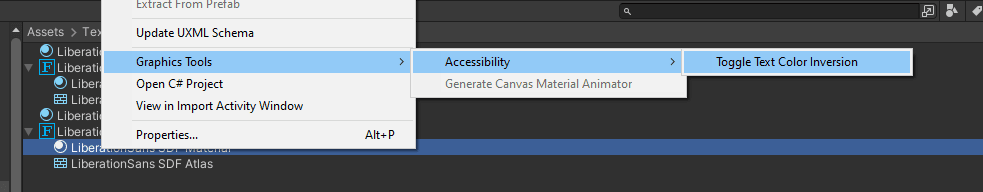

# Accessibility utilities

The `Accessibility utilities` provide support for some basic accessibility features when developing Mixed Reality applications in Unity.

The following features are supported:

## Toggle text color inversion

This feature instructs a "Graphics Tools/Text Mesh Pro" based material to display a face color which is an inversion of its background color.

> [!NOTE]
> This feature can only be applied to text that is created with TextMesh Pro which is the recommended text component for Graphic Tools. Also note that for color inversion to work on a font material, the *Graphics Tools/Text Mesh Pro* shader must be applied instead of the default shaders packaged with TextMesh Pro.

### Usage
To turn on this feature without writing any code, you need to do the following first:

1. Select the TextMesh Pro text you would like to invert and locate the font asset used to create it.

2. Click on the font asset. This should take you to the location of the font material which applies a TextMesh Pro shader by default.

> [!NOTE]
> You may have difficulties finding the material of the font if you are in an icon view in the panel. To reveal the material as seen above, view the panel as a hierarchical list instead by moving the slider at the bottom of the panel to the extreme left.

3. Select the font material that is associated with the asset.

4. Change the shader of the selected material in the inspector panel from *TextMeshPro/Mobile/Distance Field* (or whatever your current shader is) to *Graphics Tools/Text Mesh Pro*

5. You can now turn on color inversion for the text. Right click on the font material and select **Graphics Tools > Accessibility > Toggle Text Color Inversion**

Your text will now be inverted. To turn off this feature, follow the same step in number 4 above.

### Advanced usage
This feature works on a material per material basis. If you need this feature applied to a range of materials, your app logic would have to call the `SetTextColorInversion` method for all text materials it wishes to perform this behavior.

## See also

* [Standard Shader](standard-shader.md)
