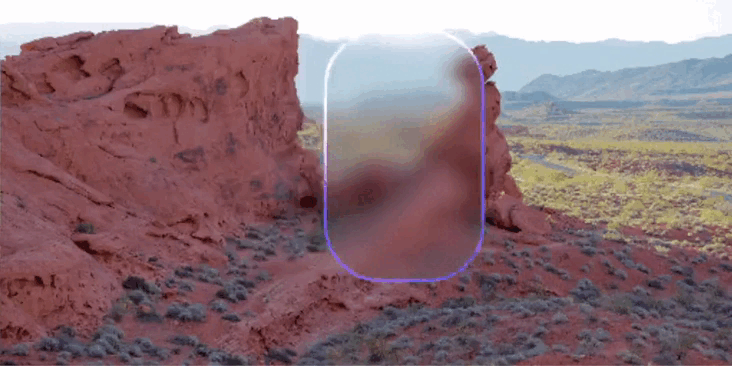

# Acrylic layer system

> [!CAUTION]
> Some features the MRTK team works on appear to have a lot of initial value even if we haven’t fully fleshed out the details. For these types of features, we want the community to get a chance to see them early. Because they are early in the cycle, we label them as experimental to indicate that they are still evolving, and subject to change over time.

This experimental feature allows surfaces to appear translucent (like frosted glass). The acrylic assets can be used to create a blurred background effect on backplates similar to the [acrylic material in Windows](https://docs.microsoft.com/en-us/windows/apps/design/style/acrylic). These assets require use of the Universal Render Pipeline.

> [!IMPORTANT]
> This feature requires com.unity.render-pipelines.universal 10.6.0 or above and may be expensive on mobile devices.

## Usage

A given acrylic layer should have its own render layer (or set of layers) containing the backplate and all UI objects for that layer. Assign the render layer(s) to the *Render Layers* property of the acrylic layer in the acrylic layer manager. The layers are used to exclude foreground elements from the blurred background map.

The acrylic layer systen is made up of the following components:

### Acrylic helper

Assign this component (script) to every backplate that uses an acrylic material. This component notifies the acrylic layer manager whenever the object is enabled or disabled. The acrylic shader currently supports 2 layers (0 and 1).

### Acrylic layer manager

Manages creating and updating the blurred background maps used by acrylic materials. The manager works with the Acrylic Helper component to limit the additional processing performed to those acrylic layers that are currently being used in the scene.
A scene should have one copy of the manager.

The manager supports two methods of capturing a background image:

1. Copy framebuffer: records a downsampled copy of the current framebuffer during URP rendering using a set of renderer feature passes
2. Render to texture: renders a separate reduced-resolution image of the background objects

The captured image is then blurred based on the per-layer blur settings. If the blur map is not updated every frame, the blur process is applied during the next frame after the capture.

There's also an option to gradually blend in an updated map over several frames (if the map is not updated every frame).

## Advanced usage
### Editor options

Use the `Retain in Editor` option in the Acrylic Layer Manager component to leave the acrylic layers enabled when the app is not playing.
> [!Note]
> This option only works with the Copy Framebuffer capture method.

### Platform-specific settings

When building for Quest with Multiview stereo, use the following in the Acrylic Layer Manager component:

Capture Method = Copy Framebuffer
Filter Method = Kawase
Update Period = 1

## Sample

See the *Acrylic (Experimental)* sample for demonstrations of the acrylic layer system.

## Additional reading

[Acrylic material in Windows 11](https://docs.microsoft.com/en-us/windows/apps/design/style/acrylic)
[An investigation of fast real-time GPU-based image blur algorithms](https://www.intel.com/content/www/us/en/developer/articles/technical/an-investigation-of-fast-real-time-gpu-based-image-blur-algorithms.html)