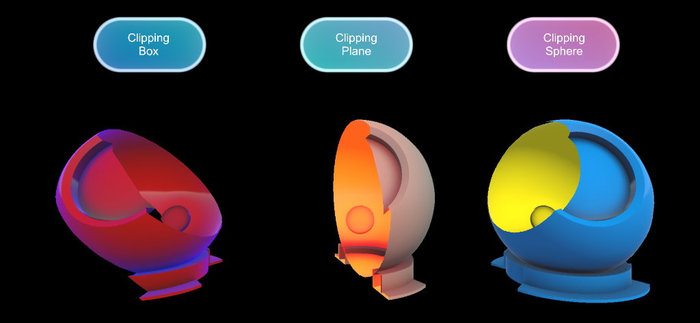

# Clipping primitive overview -- MRTK3

The `ClippingPrimitive` behaviors allow for performant `plane`, `sphere`, and `box` shape clipping with the ability to specify which side of the primitive to clip against (inside or outside) when used with Graphics Tools shaders.



> [!NOTE]
> `ClippingPrimitive`s utilize [clip/discard](https://developer.download.nvidia.com/cg/clip.html) instructions within shaders and disable Unity's ability to batch clipped renderers. Take these performance implications in mind when utilizing clipping primitives.

*ClippingPlane.cs*, *ClippingSphere.cs*, and *ClippingBox.cs* can be used to easily control clipping primitive properties. Use these components with the following shaders to use clipping scenarios.

- *Graphics Tools/Standard*
- *Graphics Tools/Text Mesh Pro*
- *Graphics Tools/Wireframe*
- *Graphics Tools/Wireframe*
- *Graphics Tools/Non-Canvas/Backplate*
- *Graphics Tools/Non-Canvas/Frontplate*
- *Graphics Tools/Non-Canvas/Glow*
- *Graphics Tools/Non-Canvas/Quad Glow*
- *Graphics Tools/Non-Canvas/Beveled*

## Advanced usage

By default, only one `ClippingPrimitive` can clip a [renderer](https://docs.unity3d.com/ScriptReference/Renderer.html) at a time. If your project requires more than one `ClippingPrimitive` to influence a [renderer](https://docs.unity3d.com/ScriptReference/Renderer.html) the sample code below demonstrates how to this can be achieved.

> [!NOTE]
> Having multiple `ClippingPrimitive`s clip a [renderer](https://docs.unity3d.com/ScriptReference/Renderer.html) will increase pixel shader instructions and will impact performance. Profile these changes within your project.

*How to have two different `ClippingPrimitive`s clip a render. For example, a `ClippingSphere` and `ClippingBox` at the same time:*

```C#
// Within GraphicsToolsStandard.shader (or another Graphics Tools shader that supports clipping primitives) change:

#pragma multi_compile_local _ _CLIPPING_PLANE _CLIPPING_SPHERE _CLIPPING_BOX

// to:

#pragma multi_compile_local _ _CLIPPING_PLANE
#pragma multi_compile_local _ _CLIPPING_SPHERE
#pragma multi_compile_local _ _CLIPPING_BOX
```

> [!NOTE]
> The above change will incur additional shader compilation time.

*How to have two of the same `ClippingPrimitive`s clip a render. For example two `ClippingBoxes`at the same time:*

```C#
// 1) Add the below MonoBehaviour to your project:

using UnityEngine;
using Microsoft.MixedReality.GraphicsTools;

[ExecuteInEditMode]
public class SecondClippingBox : ClippingBox
{
    /// <inheritdoc />
    protected override string Keyword
    {
        get { return "_CLIPPING_BOX2"; }
    }

    /// <inheritdoc />
    protected override string ClippingSideProperty
    {
        get { return "_ClipBoxSide2"; }
    }

    /// <inheritdoc />
    protected override void Initialize()
    {
        base.Initialize();

        clipBoxInverseTransformID = Shader.PropertyToID("_ClipBoxInverseTransform2");
    }
}


// 2) Within GraphicsToolsStandard.shader add the following multi_compile pragma:

#pragma multi_compile_local _ _CLIPPING_BOX2

// 3) In GraphicsToolsStandardInput.hlsl add the following shader variables:

#if defined(_CLIPPING_BOX2)
    half _ClipBoxSide2;
    float4x4 _ClipBoxInverseTransform2;
#endif

// 4) In GraphicsToolsStandardProgram.hlsl change:

#if defined(_CLIPPING_PLANE) || defined(_CLIPPING_SPHERE) || defined(_CLIPPING_BOX)

// to:

#if defined(_CLIPPING_PLANE) || defined(_CLIPPING_SPHERE) || defined(_CLIPPING_BOX) || defined(_CLIPPING_BOX2)

// 5) In the same shader change:

#if defined(_CLIPPING_BOX)
    primitiveDistance = min(primitiveDistance, GTPointVsBox(input.worldPosition.xyz, _ClipBoxInverseTransform) * _ClipBoxSide);
#endif

// to:

#if defined(_CLIPPING_BOX)
    primitiveDistance = min(primitiveDistance, GTPointVsBox(input.worldPosition.xyz, _ClipBoxInverseTransform) * _ClipBoxSide);
#endif
#if defined(_CLIPPING_BOX2)
    primitiveDistance = min(primitiveDistance, GTPointVsBox(input.worldPosition.xyz, _ClipBoxInverseTransform2) * _ClipBoxSide2);
#endif
```

Finally, add a `ClippingBox` and `SecondClippingBox` component to your scene and specify the same renderer for both boxes. The renderer should now be clipped by both boxes simultaneously.

## See also

* [Standard Shader](standard-shader.md)
* [Material Instance](material-instance.md)
