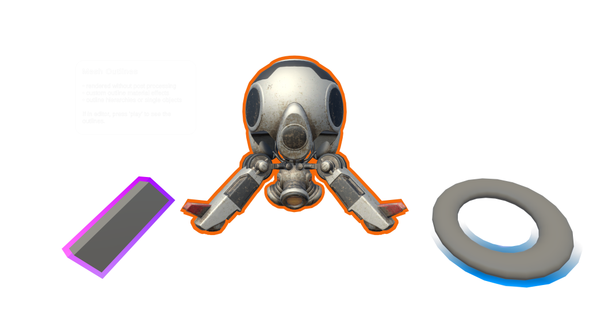
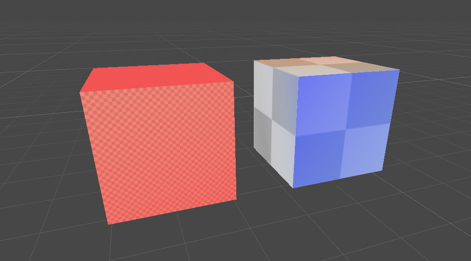

# Editor tooling &#8212; MRTK3

Graphics Tools contains a plethora of Unity editor tooling to help with mixed reality development. A handful of items are described below. The rest can be found in their respective subject areas, such as [accessibility utilities](accessibility-utilities.md) and the [measure tool](measure-tool.md).

## Menu items

Description of menu items found in the **Window > Graphics Tools** menu section.

### Take screenshots

Often taking screenshots in Unity for documentation and promotional imagery can be burdensome and the output often looks less than desirable. The `ScreenshotUtilities` class aides in taking screenshots via menu items and public APIs within the Unity editor. Screenshots can be captured at various resolutions and with transparent clear colors for use in easy post compositing of images.

> [!NOTE]
> Taking screenshots from a standalone build is not supported by this tool.

Screenshots can be easily captured while in the editor by selecting **Window > Graphics Tools > Take Screenshot** and then selecting your desired option.

> [!TIP]
> Make sure to have the game window tab visible if capturing while not playing, or a screenshot may not be saved.

By default, all screenshots are saved to your [temporary cache path](https://docs.unity3d.com/ScriptReference/Application-temporaryCachePath.html), the path to the screenshot will be displayed in the Unity console.

The above screenshot was captured with the *"4x Resolution (Transparent Background)"* option. (Scaled down to reduce download size.) This outputs a high-resolution image with whatever pixels normally represented by the clear color saved as transparent pixels. This technique helps developers showcase their application for the store, or other media outlets, by overlaying this image on top of other imagery.

### Canvas material animators

Canvas material animators allow developers to animate material properties on UnityUI Graphic components (more information can be found in the [animation](animation.md) documentation). These animator scripts are auto generated from shader files. If a shader file changes, so does the animator script. This is normally performed by right clicking on a shader and selecting **Graphics Tools > Generate Canvas Material Animator**.

The **Window > Graphics Tools > Canvas Material Animators > Generate All** menu item will regenerate all animator scripts for shaders with these conditions met:

- Exists in the *Runtime/Shaders* directory of the Graphics Tools package
- Does not contain "Non-Canvas" it the shader name.

> [!TIP]
> Developers should invoke this menu item when they alter shaders within the Graphics Tools package. Custom shaders can have animators generated individually or via the `ShaderUtilities.GenerateCanvasMaterialAnimator` method.

### Mip map debug

The mip map debug feature included with the built-in renderer pipeline's scene view debug draw modes [doesn't exist](https://github.com/Unity-Technologies/Graphics/pull/4089) in the Universal Render Pipeline (URP). This feature is a useful to have when trying to reduce texture sizes.

In Graphics Tools, a similar tool was reintroduced for the URP. The tool can be toggled on via the **Window > Graphics Tools > Draw Modes > Mipmaps - Enable** and off via the **Window > Graphics Tools > Draw Modes > Mipmaps - Disable** menu items. When enabled the scene view will be tinted based on texel to pixel ratio.

| Color          | Meaning                                                                                   |
|----------------|-------------------------------------------------------------------------------------------|
| Original Color | It’s a perfect match (1:1 texels to pixels ratio at the current distance and resolution). |
| Red            | Indicates that the texture is larger than necessary.                                      |
| Blue           | Indicates that the texture could be larger.                                               |

> [!NOTE]
> The ideal texture sizes depend on the resolution at which your application will run and how close the camera can get to a surface.

For example, texel density is too high on the left cube and a bit too low on the right cube at this viewing distance:

### Show and hide samples

When opening the `MRGTUnityProject` in Unity. The *Samples* folder won't be visible in the `MRTK Graphics Tools` package by default. To show the samples select **Window > Graphics Tools > Show Samples** from the file menu bar.

If you would like to hide samples, for example, before committing a contribution to the Graphics Tools package samples, select **Window > Graphics Tools > Hide Samples** from the file menu bar.

> [!NOTE]
> These menu items will be greyed out when Graphics Tools is an immutable package.

## See also

* [Measure Tool](measure-tool.md)
* [Animation](animation.md)
* [UnityUI Support](unityui-tooling.md)
* [Accessibility Utilities](accessibility-utilities.md)
