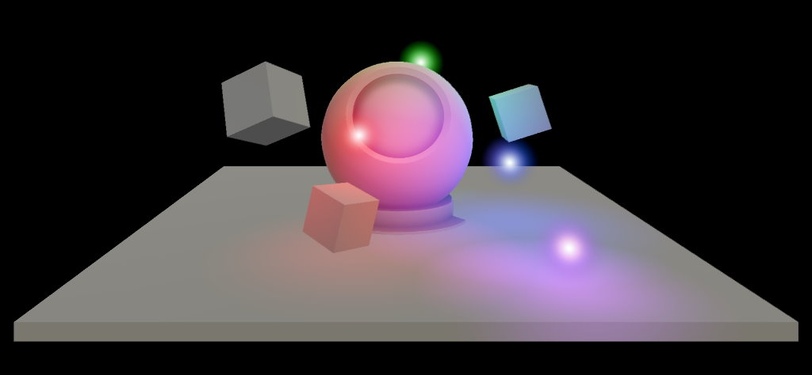

# Hover light overview

A `HoverLight` is a [Fluent Design System](https://www.microsoft.com/design/fluent/) paradigm that mimics a [point light](https://docs.unity3d.com/Manual/Lighting.html) hovering near the surface of an object. Often used for far away interactions, the application can control the properties of a Hover Light via the `HoverLight` component.



For a material to be influenced by a `HoverLight`, the *Graphics Tools/Standard* or the *Graphics Tools/Standard Canvas* shader must be used and the *Hover Light* property must be enabled.

>[!NOTE]
> The *Graphics Tools/Standard* and *Graphics Tools/Standard Canvas* shaders support up to two `HoverLight`s by default but will scale to support four as more lights are added to the scene.

## Advanced usage

Only four `HoverLight`s can illuminate a [material](https://docs.unity3d.com/ScriptReference/Material.html) at a time. If your project requires more than four `HoverLight`s to influence a [material](https://docs.unity3d.com/ScriptReference/Material.html), the sample code below demonstrates how to achieve this.

>[!NOTE]
> Having many `HoverLight`s illuminate a [material](https://docs.unity3d.com/ScriptReference/Material.html) will increase pixel shader instructions and will impact performance. **Profile these changes within your project.**

### How to increase the number of available `HoverLight`s from four to ten.

```C#
// 1) Within GraphicsToolsStandardInput.hlsl change:

#define HOVER_LIGHT_COUNT 4

// to:

#define HOVER_LIGHT_COUNT 10

// 2) Within HoverLight.cs change:

private const int hoverLightCount = 4;

// to:

private const int hoverLightCount = 10;
```

> [!NOTE]
> If Unity logs a warning similar to below then you must restart Unity before your changes will take effect.
>
> `Property (_HoverLightData) exceeds previous array size (24 vs 20). Cap to previous > size.`

## See also

* [Standard Shader](standard-shader.md)
