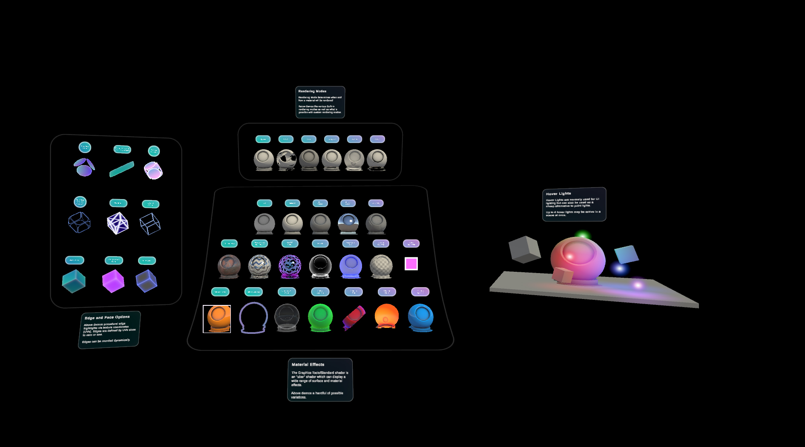

title: Material Gallery Sample Scene
description: Illustrated walkthrough of the Material Gallery scene
author: Species521
ms.author: wettigmarti
ms.date: 06/01/2022
ms.localizationpriority: medium
keywords: Unity, HoloLens, HoloLens 2, Mixed Reality, development, MRTK, Graphics Tools, MRGT, MR Graphics Tools, Standard Shader, Animation
---

# The Material Gallery

In this sample scene, you'll find a display of the capabilities of the Graphics Tools standard shader.

    

## Edge and Vertex effects

These examples showcase various effects that make use of an object's texture coordinates (UVs). For example, procedural edge highlights, dynamically rounded edges, wireframe rendering and glow effects.

## Surface Effects

This section showcases the surface rendering effects you can achieve with the Graphics Tools standard shader.
These examples display only a handful of possible variations, as stencil and clipping effects or PBR capability.

## Hover Lights

Placing point lights in a scene can be expensive on performance.
Hover Lights are normally used for UI lighting but can also be used as a faster alternative to point lights.
Up to four hover lights may be active in a scene at once.

## Rendering Modes

Rendering Mode determines when and how a material will be rendered.
This allows for effects like holes, faded transparency and color calculation effects, which can be further refined using the Custom Rendering mode.

### For a detailed introduction to the Graphics Tools Standard Shader, see also

* [Graphics Tools Standard Shader](standard-shader.md)