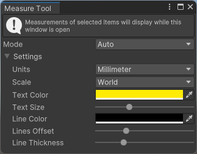
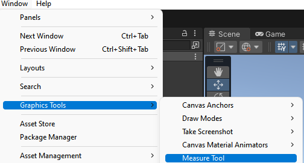

# Getting started with the Measure Tool &#8212; MRTK3
The _Measure Tool_ is a tool to view the local sizes of objects to graphics tools.

It currently supports four operational modes [RectTransforms](https://docs.unity3d.com/ScriptReference/RectTransform.html), [3d Colliders](https://docs.unity3d.com/ScriptReference/Collider.html), [Mesh Renderers](https://docs.unity3d.com/ScriptReference/MeshRenderer.html), and Distance Between Objects.

> [!NOTE]
> To get started with the Measure Tool, you need to have followed the [Graphics Tools setup process](../index.md). 

Navigate to Window/Graphics Tools and Measure Tool should be available if Graphics Tools is properly setup.

Select a GameObject in the heirarchy and open the Measure Tool from the Graphics Tools menu or select Measure Tool from the Editor Toolbar

 

With the tool open/selected, measurements of the selected object(s) will be drawn around them. The measurement can be customized in the tool's settings.

## Shortcuts
- Toggle Tool (M)
- Toggle Tool Window (Shift+M)

## Modes
The tool has multiple modes that can be selected via a dropdown menu in the settings.

| Mode            | Description |
|-----------------|-------------|
| Auto            | Default mode, the tool detects components and draws the appropriate measurement. Prioritizing Rects over Renderers over Colliders |
| Rect            | Draws a rectangle and measurements around each selected GameObject with a RectTransform component attached |
| Renderer        | Draws a box and measurements around each selected GameObject with a MeshRenderer component attached. |
| Collider        | Draws a box and measurements around each selected GameObject with a 3D Collider component attached. |
| Between Objects | Draws a line and measurement between gameObjects in the order selected |
> [!Note] 
> A MeshFilter is also required for Renderer measurements in Unity 2020 and older  

## Settings
| Units | Description |
|-------|-------------|
| Millimeter | Displays the measurement in millimeters |
| Centimeter | Displays the measurement in centimeters |
| Meter | Displays the measurement in meters |

| Scale | Description |
|-------|-------------|
| Local | Displays the measurement in local scale with the orientation of the selected object(s) accounted for |
| World | Displays the measurement in world scale using an Axis Aligned Bounding Box (AABB) |

| Customization options | Description |
|----------------------|-------------|
| Text color|Set the color of the text|
| Text size |Set the size of the displayed text using a slider|
| Line color |Set the color of the bounding box/rectangle |
| Line offset |Offsets the measurements from the selected object(s) |
| Line thickness |Sets the thickness of the lines |

## See also

* [Architecture Overview](..\architecture\overview.md)

