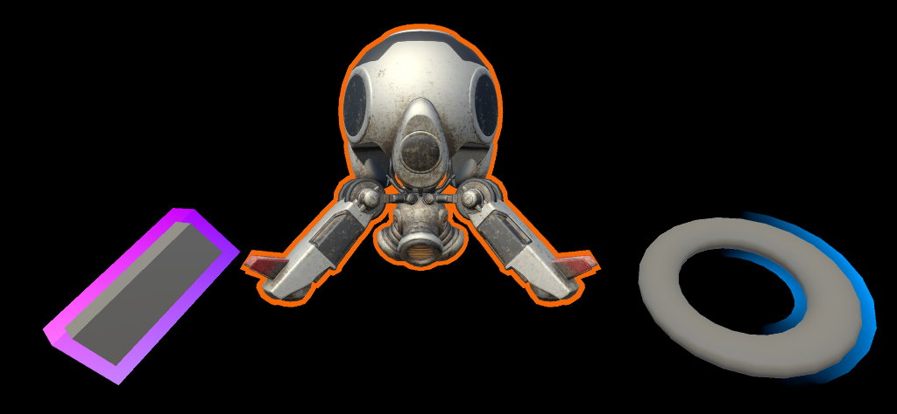
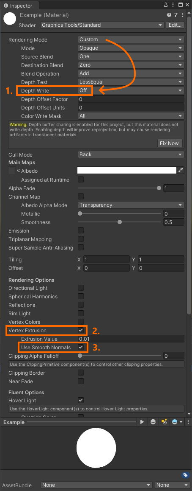

# Mesh outlines overview

Many mesh outline techniques are done using a [post processing](https://docs.unity3d.com/Manual/PostProcessingOverview.html) technique. Post processing provides great quality outlines, but can be prohibitively expensive on many mixed reality devices.

_MeshOutline.cs_ and _MeshOutlineHierarchy.cs_ can be used to render an outline around a mesh renderer. Enabling this component introduces another render pass of the object being outlined, but it's designed to run optimally on mobile mixed reality devices and doesn't utilize any post processes.

> [!NOTE]
> Limitations of this effect include it not working well on objects which are not watertight (or required to be two sided) and depth sorting issues can occur on overlapping objects.

## Sample

See the *Mesh Outlines* sample for demonstrations of the outline system.

## Material setup

The outline behaviors are used with the *Graphics Tools/Standard* shader. Outline materials are usually a solid unlit color but can be configured to achieve a wide array of effects. The default configuration of an outline material is as follows:

1. Depth Write - should be disabled for outline materials to make sure the outline doesn't prevent other objects from rendering.
2. Vertex Extrusion - needs to be enabled to render the outline.
3. Use Smooth Normals - this setting is optional for some meshes. Extrusion occurs by moving a vertex along a vertex normal, on some meshes extruding along the default normals will cause discontinuities in the outline. To fix these discontinuities, you can check this box to use another set of smoothed normals that get generated by _MeshSmoother.cs_.

## Mesh smoothing

`MeshSmoother.cs` is a component which can be used to automatically generate smoothed normals on a mesh. This method groups vertices in a mesh that share the same location in space then averages the normals of those vertices. This process creates a copy of the underlying mesh and should be used only when required.

In the above image, cube one is utilizing mesh smoothing while cube two is not. Notice the discontinuities at the corners of the cube without mesh smoothing.

> [!TIP]
> Certain meshes (like spheres) don't display these discontinuities. So, it's best to test for meshes that need mesh smoothing.

## See also

* [Standard Shader](standard-shader.md)
