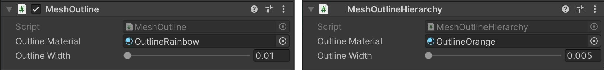
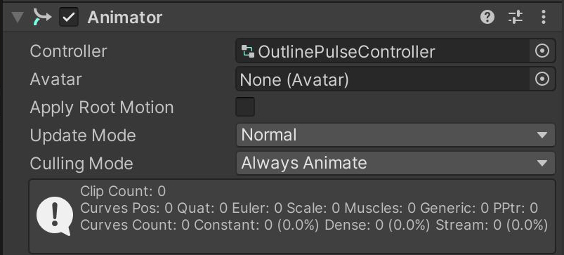

# MeshOutline Examples

This scene illustrates the outline feature and its variation possibilities.
Outlines are a quick and appealing feature you can use to highlight objects in a scene.
In addition to color and thickness, we can define the highlighting by adding animations and gradient effects.

To achieve the outline effect, add the MeshOutline script for single objects or the MeshOutlineHierarchy script for entire mesh hierarchies. Adjust the Outline Width to your needs and apply an outline material.

For guides on how to set up an outline material, see [MeshOutline Material Setup](https://github.com/Species521/mixed-reality-pr_mawettig/blob/main/mrtk-unity/mrtk3-graphicstools/features/mesh-outlines.md#material-setup)

## Outline Pulse Example

In this example, the Outline Width value is animated and applied to the object itself as Animator 'OutlinePulseController'.

> [NOTE]
> Depending on the model's edge hardness, you might experience jagged and disrupted results. For the Outline effect to work properly, the model's vertex normals need to be smooth. If the model itself doesn't provide this, try an in-editor solution: apply the MeshSmoother script to the model.
> [Learn more about the MeshSmoother](mesh-outlines.md#mesh-smoothing).

## Hierachies and multiple and skinned meshes

Some imported 3D objects come in multiple parts in hierarchical structures. In this case, the model has several sub-nodes, such as skeletal joints and unattached additional meshes. In order to avoid searching and applying through the entire hierarchy, you can add the MeshOutlineHierarchy script to the root object and then all meshes inside that structure will have the effect applied as well.
As seen in this example, the outline works very well on skinned and animated meshes, too.

## Illumination effects

In this example, the outlines are illuminated by an orbiting Proximity Light, which is part of both the MRTK and the MRGT. Highlight size, color, gradients and intensity are configurable. 
To learn more about the Proximity Light, see the [Proximity Light Overview](proximity-light.md) and [Proximity Lighting Example](https://github.com/Species521/mixed-reality-pr_mawettig/blob/graphics-tools-docs/mrtk-unity/mrtk3-graphicstools/features/samples/material-gallery.md#hover-lights)

## See also

* [Standard Shader](https://github.com/MicrosoftDocs/mixed-reality-pr/blob/main/mrtk-unity/mrtk3-graphicstools/features/standard-shader.md)
* [Material Gallery](https://github.com/MicrosoftDocs/mixed-reality-pr/blob/main/mrtk-unity/mrtk3-graphicstools/features/samples/material-gallery.md)
