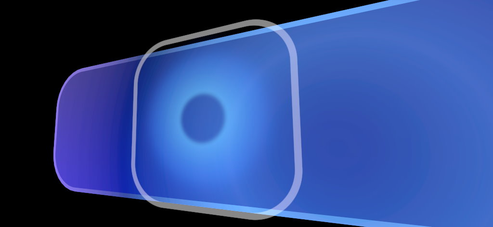

# Proximity light

A `ProximityLight` is a [Fluent Design System](https://www.microsoft.com/design/fluent/) paradigm that mimics a "gradient inverse point light" hovering near the surface of an object. It's often used for near interactions, the application can control the properties of a Proximity Light via the `ProximityLight` component.



For a material to be influenced by a `ProximityLight`, the `Graphics Tools/Standard` or `Graphics Tools/Standard Canvas` shaders must be used and the *Proximity Light* property must be enabled. The `Graphics Tools/Non-Canvas/Frontplate` and `Graphics Tools/Canvas/Frontplate` are also influenced by `ProximityLight`s but in a slightly different fashion.

> [!NOTE]
> Up to two `ProximityLight`s are supported by default.

## Advanced usage

By default only two `ProximityLight`s can illuminate a [material](https://docs.unity3d.com/ScriptReference/Material.html) at a time. If your project requires more than two `ProximityLight`s to influence a [material](https://docs.unity3d.com/ScriptReference/Material.html), the sample code below demonstrates how to achieve this on the `Graphics Tools/Standard` or `Graphics Tools/Standard Canvas` shaders.

> [!NOTE]
> Having many `ProximityLight`s illuminate a [material](https://docs.unity3d.com/ScriptReference/Material.html) will increase pixel shader instructions and will impact performance. Profile these changes within your project.

*How to increase the number of available `ProximityLight`s from two to four.*

```C#
// 1) Within GraphicsToolsStandardInput.hlsl change:

#define PROXIMITY_LIGHT_COUNT 2

// to:

#define PROXIMITY_LIGHT_COUNT 4

// 2) Within ProximityLight.cs change:

private const int proximityLightCount = 2;

// to:

private const int proximityLightCount = 4;
```

> [!NOTE]
> If Unity logs a warning similar to below then you must restart Unity before your changes will take effect.
>
>`Property (_ProximityLightData) exceeds previous array size (24 vs 12). Cap to previous size.`

## See also

* [Standard Shader](standard-shader.md)
