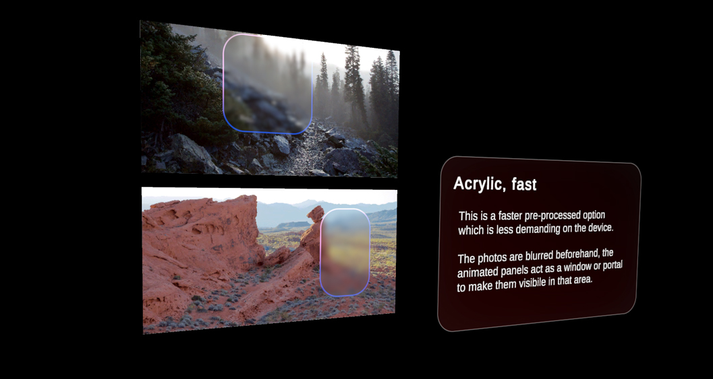

# Acrylic

The experimental Acrylic feature adds a translucency effect to a surface.
Objects behind that surface will appear blurred as seen through frosted glass.

The feature is enabled by adding the _AcrylicHelpr.cs_ script to your object and in Unity's shader menu under `Graphics Tools/Experimental/Acrylic`, pick one of the shader options.
For more details have a look at the [Acrylic layer system](acrylic.md).

## Acrylic in real-time

In this example, the shader reacts in real-time to the moving objects in the background.
> [!NOTE]
> While this is a powerful visual, it's real-time use is rather expensive in terms of performance.

## Acrylic pre-baked

As a different option, Acrylic blurs a static background like the photos above beforehand.
The rounded plates on top of the photos act as stencil windows to make the pre-blurred image visible in that area.

## See also

* [Standard Shader](https://github.com/Species521/mixed-reality-pr_mawettig/blob/graphics-tools-docs/mrtk-unity/mrtk3-graphicstools/features/standard-shader.md)
* [Material Gallery](https://github.com/Species521/mixed-reality-pr_mawettig/blob/graphics-tools-docs/mrtk-unity/mrtk3-graphicstools/features/samples/material-gallery.md)

