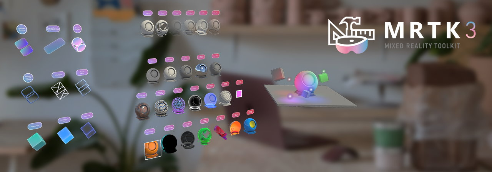
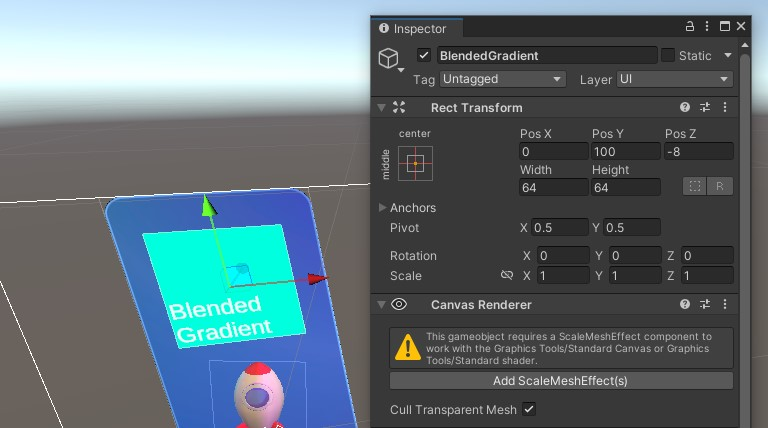
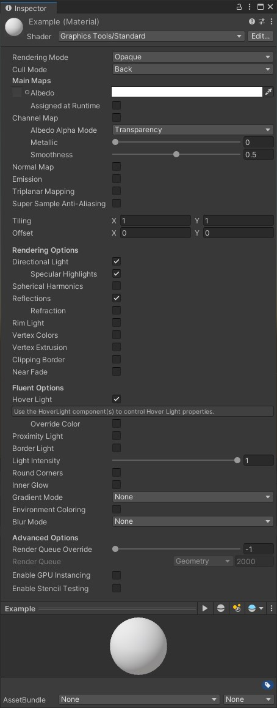
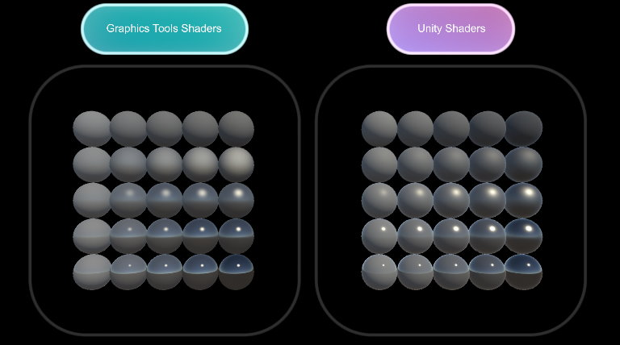
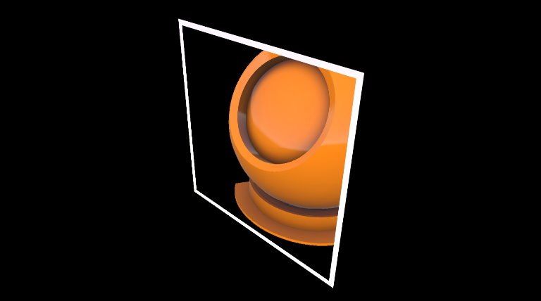

# Graphics tools standard shader

The Graphics Tools Standard shading system utilizes a flexible shader that can achieve visuals similar to Unity's Standard (or Lit) shader. It implements [Fluent Design System](https://www.microsoft.com/design/fluent/) principles and remains performant on mixed reality devices.

## Sample

See the *Material Gallery* sample for multiple demonstrations of *Graphics Tools/Standard* shader variants. For examples of *Graphics Tools/Standard Canvas*, see the *UnityUI* sample

## Architecture

The Graphics Tools/Standard shading system is an "uber shader" that uses [Unity's shader program variant feature](https://docs.unity3d.com/Manual/SL-MultipleProgramVariants.html) to auto-generate optimal shader code based on material properties. When a user selects material properties in the material inspector, they only incur performance cost for features they've enabled.

To better support traditional Unity workflows and [UnityUI](https://docs.unity3d.com/Packages/com.unity.ugui@1.0/manual/index.html) (canvas) workflows, the Graphics Tools/Standard shading system has two shader entry points:

| Context| Default                 | UnityUI                        |
|--------|-------------------------|--------------------------------|
| Name   | *Graphics Tools/Standard* | *Graphics Tools/Standard Canvas* |
| Shader | GraphicsToolsStandard   | GraphicsToolsStandardCanvas    |

Both shaders are mostly identical because they share common shader code includes. The *Graphics Tools/Standard Canvas* contains some extra logic specific to UnityUI.

The following shader includes power the Graphics Tools/Standard shading system:

| Include                          | Purpose                                                                                                                                               |
|----------------------------------|-------------------------------------------------------------------------------------------------------------------------------------------------------|
| GraphicsToolsStandardProgram     | Contains the vertex and fragment shader entry point methods (the core implementation).                                                                |
| GraphicsToolsStandardMetaProgram | Contains the vertex and fragment shader entry point methods used by Unity for static lighting (not used at runtime).                                  |
| GraphicsToolsStandardInput       | Definitions for vertex attributes, vertex interpolators, textures, texture samplers, per material constant buffers, global properties, and constants. |
| GraphicsToolsCommon              | Reusable methods and defines.                                                                                                                         |

## Render pipeline support

Unity has a handful of [render pipelines](https://docs.unity3d.com/Manual/render-pipelines-overview.html) for developers to pick from. The Graphics Tools Standard shading system is designed to work automatically with Unity's built-in render pipeline or [Universal Render Pipeline](https://docs.unity3d.com/Packages/com.unity.render-pipelines.universal@11.0/manual/)(URP). There's no need to switch shaders based on pipeline. Below is a support matrix:

| Pipeline                               | Supported | Exceptions                                    |
|----------------------------------------|-----------|-----------------------------------------------|
| Built-in Render Pipeline               | ✅         | Acrylic "Blur Modes" aren't supported.       |
| Universal Render Pipeline (URP)        | ✅         |                                               |
| High Definition Render Pipeline (HDRP) | ❌         |                                               |
| Custom Render Pipeline                 | ❔         | Support depends on how the pipeline is built. |

## UnityUI support

The Graphics Tools Standard shading system works with Unity's built-in UI system called [UnityUI](https://docs.unity3d.com/Packages/com.unity.ugui@1.0/manual/index.html). The *Graphics Tools/Standard Canvas* should be used for all materials within UnityUI canvases.

A [Canvas](https://docs.unity3d.com/ScriptReference/Canvas.html) or [CanvasRenderer](https://docs.unity3d.com/ScriptReference/CanvasRenderer.html) within Graphics Tools will prompt for the addition of a `ScaleMeshEffect.cs` when one is required:

On UnityUI components, the `unity_ObjectToWorld` matrix (or `UNITY_MATRIX_M`  in URP) isn`t the transformation matrix of the local transform the Graphic component lives on but that of its parent Canvas. Many *Graphics Tools/Standard Canvas* shader effects require object scale to be known. To solve this issue, the `ScaleMeshEffect.cs` will store scaling information into UV channel attributes during UI mesh construction.

> [!TIP]
> When using a Unity Image component, it is recommended to specify "None (Sprite)" for the Source Image to prevent Unity UI from generating extra vertices.

## Material inspector

A custom material inspector exists for the *Graphics Tools/Standard* and *Graphics Tools/Standard Canvas* shaders called `StandardShaderGUI.cs`. The inspector automatically enables/disables shader features, based on user selection and aides in setting up render state. For more information about each feature **hover over each property in the Unity Editor for a tooltip.**

> [!NOTE]
> The inspector UI is dynamic. Portions of the UI will change as features are enabled and disabled.

The inspector can be broken into a handful of features areas as described below.

### Rendering mode

The first portion of the inspector controls the material's render state. *Rendering Mode* determines when and how a material will be rendered. The aim of the *Graphics Tools/Standard* and *Graphics Tools/Standard Canvas* shaders is to mirror the [rendering modes found in the Unity/Standard shader](https://docs.unity3d.com/Manual/StandardShaderMaterialParameterRenderingMode.html). The *Graphics Tools/Standard* and *Graphics Tools/Standard Canvas* shaders also include an *Additive* rendering mode and *Custom* rendering mode for complete user control.

| Rendering Mode |         Description                                                       |
|----------------|---------------------------------------------------------------------------|
| Opaque         | (Default) Suitable for normal solid objects with no transparent areas.    |
| Cutout         | Allows creation of transparent effects that have hard edges between the opaque and transparent areas. In this mode, there are no semi-transparent areas, the texture is either 100% opaque, or invisible. This is useful when using transparency to create the shape of materials, such as vegetation. |
| Fade           | Allows the transparency values to entirely fade out an object, including any specular highlights or reflections it may have. This mode is useful if you want to animate an object fading in or out. It isn't suitable for rendering realistic transparent materials such as clear plastic or glass because the reflections and highlights will also be faded out. |
| Transparent    | Suitable for rendering realistic transparent materials such as clear plastic or glass. In this mode, the material itself will take on transparency values (based on the texture’s alpha channel and the alpha of the tint color). However, reflections and lighting highlights will remain visible at full clarity as is the case with real transparent materials. |
| Additive       | Enables an additive blending mode, which sums the previous pixel color with the current pixel color. This is the preferred transparency mode to avoid transparency sorting issues.     |
| Custom         | Allows for every aspect of the rendering mode to be controlled manually. For advanced usage only.   |

### Cull mode

| Cull Mode |             Description                                                                                                                                                                       |
|-----------|------------------------------------------------------------------------------------------------------------------------------------------------------------------------------------|
| Off       | Disables face culling. Culling should only be set to Off when a two sided mesh is required.                                                                                        |
| Front     | Enables front face culling.                                                                                                                                                        |
| Back      | (Default) Enables [back face culling](https://en.wikipedia.org/wiki/Back-face_culling). Back face culling should be enabled as often as possible to improve rendering performance. |

### Main maps

This section's primary function is to control the material's albedo color and [physically based rendering](https://en.wikipedia.org/wiki/Physically_based_rendering) options.

To improve parity with the Unity Standard shader per pixel metallic, smoothness, emissive, and occlusion values can all be controlled via [channel packing](http://wiki.polycount.com/wiki/ChannelPacking).

When you use channel packing, you only have to sample and load one texture into memory instead of four separate ones. When you write your texture maps in a program like Substance or Photoshop, you can hand pack them like the following:

| Channel | Property             |
|---------|----------------------|
| Red     | Metallic             |
| Green   | Occlusion            |
| Blue    | Emission (Greyscale) |
| Alpha   | Smoothness           |

The main map section also has an option for triplanar mapping and super-sample anti-aliasing.

Triplanar mapping is a technique to programmatically texture a mesh. It's often used in terrain, meshes without UVs, or difficult to unwrap shapes. This implementation supports world or local space projection, the specification of blending smoothness, and normal map support. Note, each texture used requires three texture samples, so use sparingly in performance critical situations.

[Super-sample anti-aliasing](https://bgolus.medium.com/sharper-mipmapping-using-shader-based-supersampling-ed7aadb47bec) should be used on any materials that display an icon or image where details are critical from a distance.

### Rendering options

Rendering options mostly control the lighting settings for a material. This material section also contains a handful of other features that control a surface's color, translucency, or position. For more details about lighting, see [below](#lighting).

### Fluent options

[Fluent](https://www.microsoft.com/design/fluent/#/) is a design framework used across UI components in Microsoft products. This section contains a handful of features that help emulate Fluent design system principles on arbitrary surfaces. If you're looking for bespoke Fluent shaders, they can be found in the `Graphics Tools/Canvas` and  `Graphics Tools/Non-Canvas` shader namespace.

### Advanced options

Similar to the advanced section in Unity's built-in shaders. This section controls rendering order and if GPU instancing variants should be built. Additionally, there are configurable stencil test supports to achieve a wide array of effects. Such as portals:

## Lighting

The *Graphics Tools/Standard* and *Graphics Tools/Standard Canvas* shaders use a simple approximation for lighting. Because the shaders don't calculate for physical correctness and energy conservation, they render quickly and efficiently. [Blinn-Phong](https://en.wikipedia.org/wiki/Blinn%E2%80%93Phong_reflection_model) is the primary lighting technique used and is blended with Fresnel and image-based lighting to approximate physically based lighting. The shaders support the following lighting techniques:

### Directional light

The shader will respect the direction, color, and intensity of the first Unity Directional Light in the scene (if enabled).

> [!IMPORTANT]
> Dynamic point lights, spot lights, or any other Unity light will not be considered in real time lighting.

### Spherical harmonics

The shader uses light probes to approximate lights in the scene using [spherical harmonics](https://docs.unity3d.com/Manual/LightProbes-TechnicalInformation.html), if enabled.

> [!IMPORTANT]
> Spherical harmonics calculations are performed per vertex and light probes are not blended to reduce calculation costs.

### Lightmapping

For static lighting, the shader will respect lightmaps built by Unity's [lightmapping system](https://docs.unity3d.com/Manual/Lightmapping.html). Mark the renderer as static (or lightmap static) to use lightmaps.

## Performance

One of the primary advantages to using the Graphics Tools Standard shader over the Unity standard shader is performance. The Graphics Tools Standard Shader is extensible to only utilize the features enabled. However, the Graphics Tools Standard shader has also been written to deliver comparable aesthetic results as the Unity Standard shader, but at a much lower cost. One simple way to compare shader performance is via the number of operations that needs to be performed on the GPU. The magnitude of calculations may fluctuate by features enabled and other rendering configurations.

> [!TIP]
> As a rule of thumb, you should use the Graphics Tools Standard shader over built-in shaders on mobile mixed reality devices. But, it is always wise to profile your scenario with tools like [RenderDoc](https://docs.unity3d.com/Manual/RenderDocIntegration.html).

## See also

* [Hover Light](hover-light.md)
* [Proximity Light](proximity-light.md)
* [Clipping Primitive](clipping-primitive.md)
* [Mesh Outlines](mesh-outlines.md)
