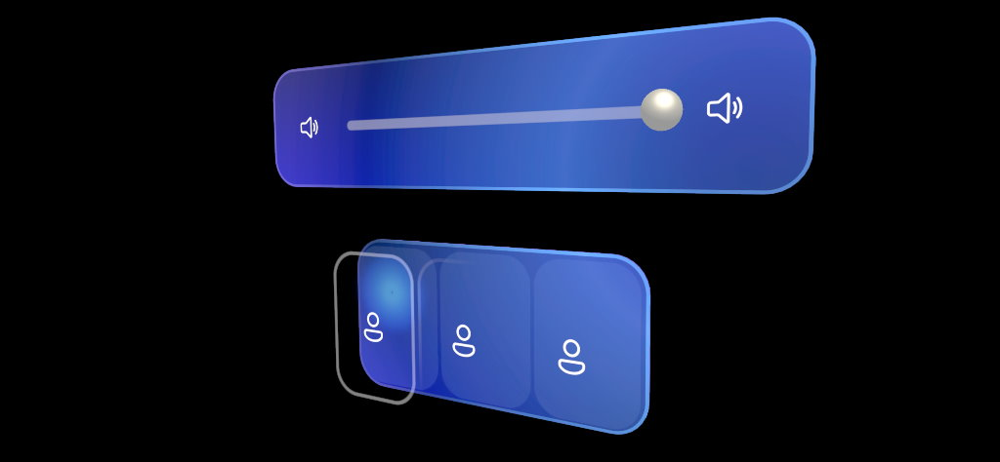
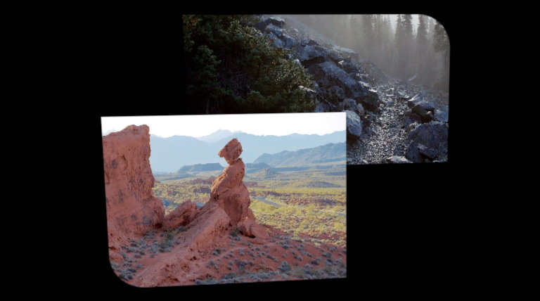
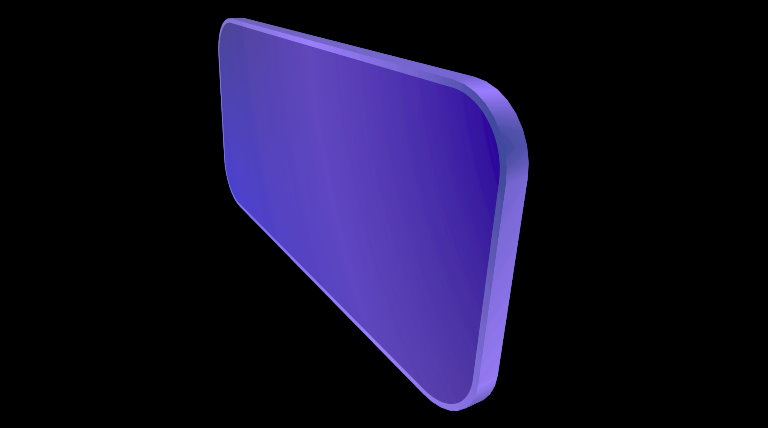
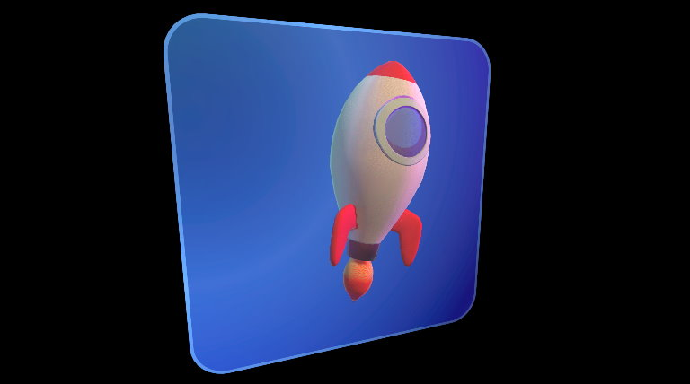

# UnityUI tooling

[UnityUI](https://docs.unity3d.com/Packages/com.unity.ugui@1.0/manual/index.html) may not be the first tool mixed reality developers think of when creating 3D user interfaces. But with a few helper components and utilities, it's possible to make beautiful and flexible 3D user interfaces in UnityUI.



>[!TIP]
> It is easy to create performance bottlenecks when authoring UnityUI. Before creating complex UnityUI layouts, it's recommended you read this [tutorial](https://learn.unity.com/tutorial/optimizing-unity-ui).

## Sample

See the [*UnityUI* sample](samples/unity-ui.md) for demonstrations of various components built for UnityUI.

## UI behavior components

The components below help with rendering UI, but they aren't visible [Graphic](https://docs.unity3d.com/Packages/com.unity.ugui@1.0/api/UnityEngine.UI.Graphic.html) components.

### ScaleMeshEffect

On UnityUI components, the `unity_ObjectToWorld` matrix (or `UNITY_MATRIX_M`  in URP) isn't the transformation matrix of the local transform the Graphic component lives on but that of its parent Canvas. Many shader effects within Graphics Tools require object scale to be known. To solve this issue, the *ScaleMeshEffect.cs* will store scaling information into UV channel attributes during UI mesh construction.

>[!TIP]
> A [Canvas](https://docs.unity3d.com/ScriptReference/Canvas.html) or [CanvasRenderer](https://docs.unity3d.com/ScriptReference/CanvasRenderer.html) within Graphics Tools will prompt for the addition of a *ScaleMeshEffect.cs* when one is required.

### RectMask2DFast

UnityUI has a built-in component called [RectMask2D](https://docs.unity3d.com/Packages/com.unity.ugui@1.0/manual/script-RectMask2D.html). Normally this component is used to mask out a small section of a larger area. When masking many objects, this process can take considerable time to cull objects on the CPU. To avoid this bottleneck, Graphics Tools includes a `RectMask2DFast` component.

`RectMask2DFast` works in the same way as `RectMask2D` and is a recommended replacement. If you encounter an issue where masking doesn't update after adding or removing objects from `RectMask2DFast` then you may need to manually invoke an update like below:

```C#
myRectMask2DFast.ForceClip = true;
```

All *Graphics Tools/Canvas/* shaders and the *Graphics Tools/Standard Canvas* shader support `RectMask2D`, `RectMask2DFast`, and `RoundedRectMask2D`.

>[!NOTE]
> The *Graphics Tools/Canvas/* shaders and the *Graphics Tools/Standard Canvas* shader **do not** support the *Softness* property on `RectMask2D` or `RectMask2DFast.`

### RoundedRectMask2D

`RoundedRectMask2D` derive from `RectMask2DFast` and acts similarly. The only difference is that `RoundedRectMask2D` contains a corner radius value for rounded corners. This radius can be selected for all corners or each corner individually.



>[!NOTE]
> Material instancing must be controlled by the user. i.e shared materials may be effected by `RoundedRectMask2D`.

## UI graphic components

The below [Graphic](https://docs.unity3d.com/Packages/com.unity.ugui@1.0/api/UnityEngine.UI.Graphic.html) components help add 3D dimensionality to a Canvas.

### CanvasElementRoundedRect

This component procedurally generates a 3D rounded rect mesh that is then assigned to the Canvas's vertex stream. Normally this component is used to generate backplate meshes using the *Graphics Tools/Canvas/Backplate* shader.



### CanvasElementBeveledRect

Just like `CanvasElementRoundedRect`, this component procedurally generates a 3D rounded rect but with beveled edges. Normally this component is used to generate back plate meshes using the *Graphics Tools/Canvas/Beveled* shader.


### CanvasElementMesh

Unity's [MeshRenderer](https://docs.unity3d.com/ScriptReference/MeshRenderer.html) component can be used to display 3D meshes within UnityUI, but it doesn't respect some of the layout features UnityUI provides. To solve these layout issues, there's the `CanvasElementMesh` component.

 The `CanvasElementMesh` component takes an input mesh and translates it into a `Graphic` component.



>[!IMPORTANT]
> The input mesh must have its *Read/Write* property enabled so that vertices can be read within script.

## Animation

To animate UnityUI material properties, you can use the *CanvasMaterialAnimator...* classes. For more information, see the [animation](animation.md) documentation.

## Menu items

To help with UI layout a handful of menu items exist within Graphics Tools.

### Anchors to corners and corners to anchors

**Window > Graphics Tools > Canvas Anchors > Anchors to Corners** and **Window > Graphics Tools > Canvas Anchors > Corners to Anchors** let you move back and forth between expressing layout in the pinning system and the anchor (constraint) system inherent in [RectTransform](https://docs.unity3d.com/ScriptReference/RectTransform.html). This can be useful when moving between responsive and fixed scale layouts.

## See also

* [Standard Shader](standard-shader.md)
* [Animation](animation.md)
