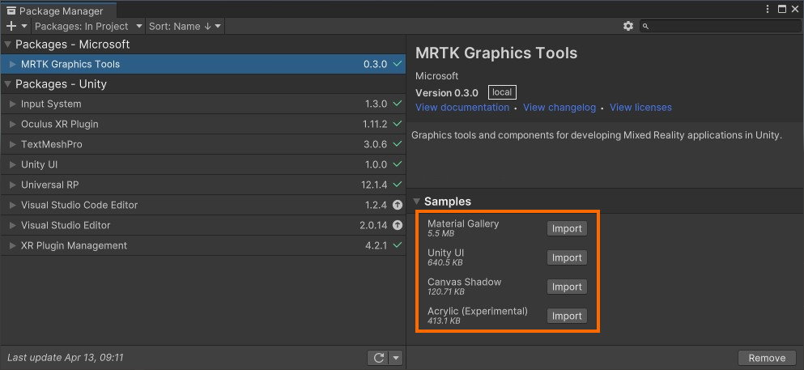

# What is Graphics Tools?

MRTK Graphics Tools for Unity is a Unity engine package with code, shaders, assets, and samples. It's created to help improve the visual fidelity of Mixed Reality applications while staying within performance budgets.

## Getting started with Graphic Tools

If using MRTK, follow the getting started docs found [here](https://docs.microsoft.com/windows/mixed-reality/mrtk-unity/mrtk2/#getting-started-with-mrtk). If you wish to use the Graphics Tools plugin on its own, read the instructions in the Graphics Tools [GitHub repository](https://github.com/microsoft/MixedReality-GraphicsTools-Unity).

> [!NOTE]
> The Graphics Tools package requires Unity 2020.x and above.

## Importing samples

To view [the samples](features/samples/acrylic.md) contained within Graphics Tools, select **Window > Package Manager** from the Unity file menu bar. Select on the **MRTK Graphics Tools** package and expand the **Samples** list. Finally, select the **Import** button for any samples you would like to try:

Samples will import into your project's *Assets* folder so they may be opened and modified.

## Highlighted feature areas

Select an article below to learn more about specific features.

| [Standard shader](features/standard-shader.md) 🎨 | [UnityUI tooling](features/clipping-primitive.md) 🛠 | [Editor tooling](features/editor-tooling.md) ✨         | [Animation](features/animation.md) 🚶‍♀️        |
|--------------------------------------------------|-----------------------------------------------------|--------------------------------------------------------|----------------------------------------------|
| [Proximity light](features/proximity-light.md) 💡 | [Hover light](features/hover-light.md) 👆            | [Clipping primitive](features/clipping-primitive.md) ✂ | [Mesh outlines](features/mesh-outlines.md) 💥 |
