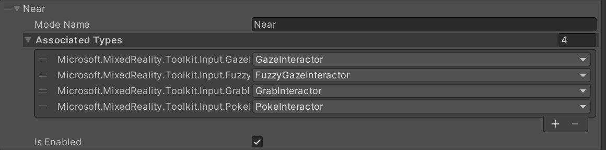
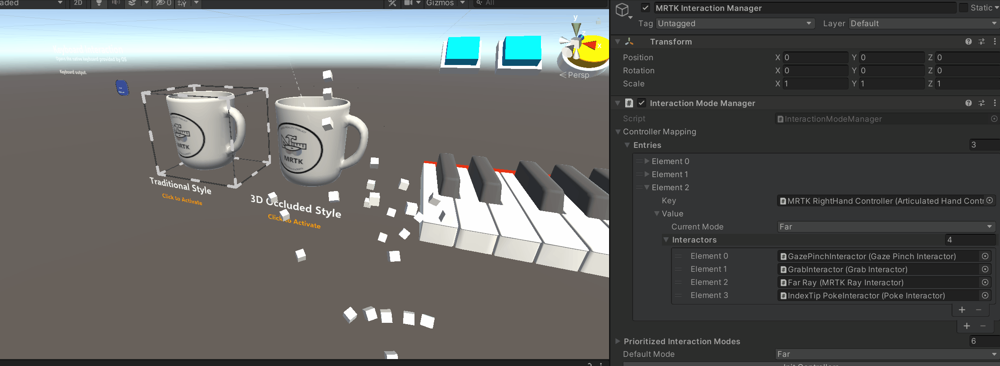
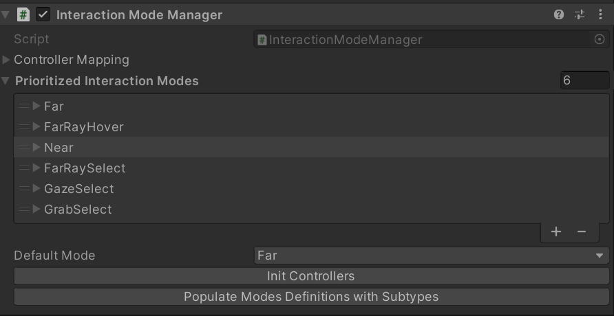

# Interaction Mode Manager

An **interaction mode** represents a subset of [interactors](https://docs.unity3d.com/Packages/com.unity.xr.interaction.toolkit@2.1/api/UnityEngine.XR.Interaction.Toolkit.IXRInteractor.html) that should be enabled based on contextual information about what the user is doing. For example, a **near interaction mode** may disable all ray interactors while permitting the use of grab and poke interactors. Conversely, when the user is grabbing an object, you may want to enter a **near grab interaction mode**, which disables the touch interactor, preventing any accidental touch activations while grabbing the object.

    

The **interaction Mode Manager** mediates between these interaction contexts. It relies on mode **Interaction Mode Detector** to determine the best mode for the current context.
Mode detectors, such as the the `ProximityModeDetector`, dictate which mode should be active for a given [Controller](https://docs.unity3d.com/Packages/com.unity.xr.interaction.toolkit@2.1/api/UnityEngine.XR.Interaction.Toolkit.XRController.html) based on any arbitrary condition. Developers can create new ways to disambiguate between interaction contexts by implementing `IInteractionModeDetector`.

    

The priority of each mode is determined by the order they are listed within the **Interaction Mode Manager**. Modes listed later in the list have higher priority, making them the dominant mode in cases where multiple interaction contexts may be valid. The interaction mode manager also allows the user to specify a default interaction mode. 

    
