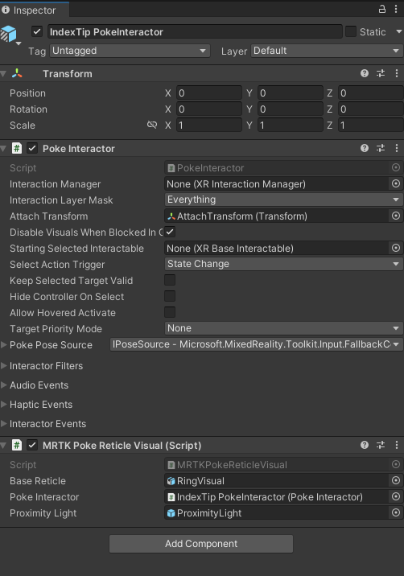
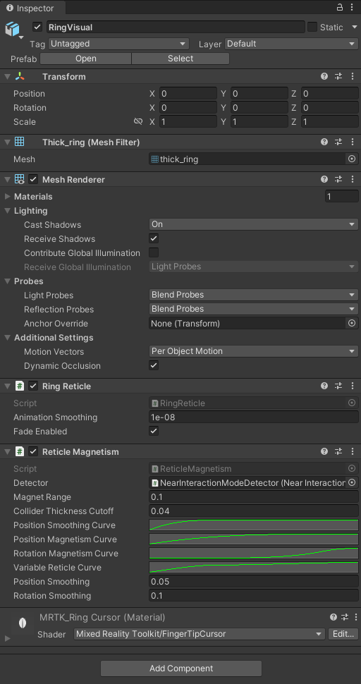
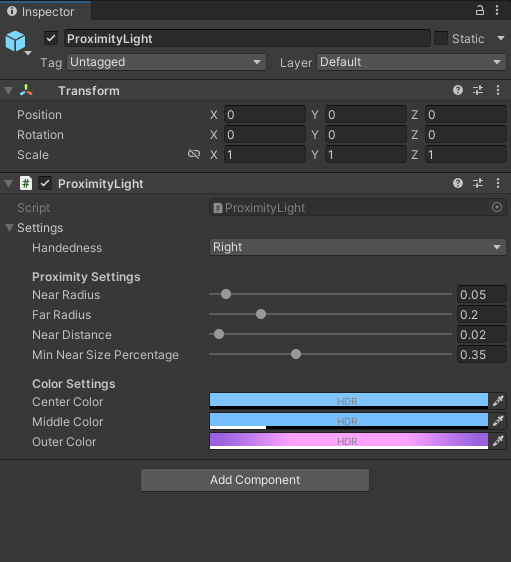

# Fingertip Visualization &#8212; MRTK3

The fingertip affordance helps the user recognize the distance from the target object. The ring shape visual adjusts its size based on the distance from the fingertip to the object. Fingertip visualization is primarily controlled by the `RingReticle` and `RingMagnetism` scripts, which can be found used in the `MRTK XR Rig` under Camera Offset > MRTK Hand Controller > IndexTip PokeInteractor > PokeReticle > RingVisual. Other components of the visualization include the `MRTKRokeReticleVisual` and `ProximityLight` scripts. 

## How to use the fingertip visualization

By default the fingertip visualization will work in any Unity scene that is configured with the `MRTK XR Rig`. Enabling of the ring visual occurs in the `MRTKPokeReticleVisual`, which inherits from `BaseReticleVisual`. The proximity light and dynamically sized ring visual will be enabled when the [PokeInteractor](/dotnet/api/microsoft.mixedreality.toolkit.input.pokeinteractor) is actively hovering an interactable.

At a high level the fingertip visualization works by using a `ProximityLight` to project a colored gradient on nearby surfaces. The `RingMagnetism` script then looks for any nearby interactable surfaces, using the [ProximityDetector](/dotnet/api/microsoft.mixedreality.toolkit.input.proximitydetector), to align the finger ring with a surface as the finger moves towards a surface. As a finger approaches a surface the finger ring is also dynamically resized by the `RingReticle` script.

You can find fingertip visualization examples in almost any scene that works with articulated hands, but it is prominent in the `HandInteractionExample` scene.

## Inspector Properties

On the `MRTK XR Rig`, you can find the `IndexTip PokeInteractor`, with both the [PokeInteractor](/dotnet/api/microsoft.mixedreality.toolkit.input.pokeinteractor) and `MRTKPokeReticleVisual` components. The `MRTKPokeReticleVisual` is responsible for enabling the proximity light and reticle, based on whether the `PokeIntreactor` is active and hovering an interactable. 

The `RingVisual` itself is controlled by `RingReticle`, which resizes the reticle, and `RingMagnetism` which magnetizes to the surface of nearby objects detected by a [ProximityDetector](/dotnet/api/microsoft.mixedreality.toolkit.input.proximitydetector).

The proximity light settings control how the light looks when near and far from a surface. The center, middle, and outer colors control the gradient look of the light and can be custom tailored for the color palette of your application. 

