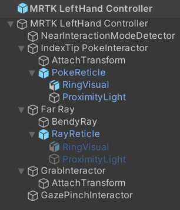

# Hand tracking &#8212; MRTK3

## Overview

Articulated hand joint data is one of the only pieces of input data that's not yet handled natively by the Unity Input System--it's handled by our subsystems.

> [!NOTE]
> If you're unfamiliar with MRTK3 subsystems and their differences from MRTK 2.x services, see the [MRTK3 Subsystems architecture](../../../mrtk3-overview/architecture/subsystems.md) documentation for a deep dive into our philosophy and design.

Our subsystems ingest hand joint data from several sources and aggregate them into a central API that works across devices and simulation contexts. The subsystems below are implementations of  `HandsSubsystem`:

- `OpenXRHandsSubsystem` receives hand data directly from the OpenXR plugin.
- `XRSDKHandsSubsystem` receives hand data from Unity's XR SDK abstraction layer (which, in turn, may be sourcing its data from OpenXR, or some other source).
- `SyntheticHandsSubsystem` synthesizes fake hand joints based on the input actions coming from the system (such as `devicePosition`, `deviceRotation`, etc). This subsystem provides the joints you see when using input simulation in-editor.

The `HandsAggregatorSubsystem` is a subsystem that combines all of the sources of hand data into a central API. It pulls skeletal joint data from all actively running `HandsSubsystems`. The MRTK implementation of a `HandsAggregatorSubsystem` is `MRTKHandsAggregatorSubsystem`, which supports lazy loading and reuse of hand data per-frame.

> [!IMPORTANT]
> Whenever you query directly for hand joint data, always query from the Aggregator, not from any of the individual hand subsystems. This way, your code will work for any source of hand data, including simulated data.

The aggregator and the hands subsystems lazily evaluate incoming hand data requests. Hand data won't be queried until a "client" script requests it. If the app only requests an individual joint, the hands subsystems will lazily evaluate and only query a single joint from the underlying APIs. In addition, if a "client" requests a full hand's worth of joint data, subsequent calls within the same frame will reuse the same data, reducing the cost of querying many joints within the same frame. On each new frame, the cache will be dirtied and flushed, and subsequent calls will begin refilling the cache.

As a result, when profiling your application, you may see the first joint query in a frame take more time than subsequent queries. This is due to the amortized cost associated with the first query, and the relative performance of subsequent "cache hits".

## Pinch characteristics

The Aggregator computes several measurements regarding the pinching gesture based on the joint data it queries from each specific hands subsystem. These measurements are configured in the Aggregator subsystem configuration.


The <b>Pinch Open Threshold</b> and <b>Pinch Closed Threshold</b> control the absolute world distance between the thumb and forefinger that's used to normalize the pinch progress. When the distance equals the closed threshold, the pinch progress will be 1.0, and when the distance equals the open threshold, it will be 0.0. (These thresholds are currently in world units, but will soon be normalized to the user's hand size.)<br><br>The <b>Hand Raise Camera FOV</b> controls how close to the center of the user's view the hand must be to be considered valid for pinching. <b>Hand Facing Away Tolerance</b> controls the tolerance for measuring the user's hand rotation; it determines when the user's hand is facing away.

## Hands Aggregator Examples

```C#
// Get a reference to the aggregator.
var aggregator = XRSubsystemHelpers.GetFirstRunningSubsystem<HandsAggregatorSubsystem>();
```

```C#
// Wait until an aggregator is available.
IEnumerator EnableWhenSubsystemAvailable()
{
    yield return new WaitUntil(() => XRSubsystemHelpers.GetFirstRunningSubsystem<HandsAggregatorSubsystem>() != null);
    GoAhead();
}
```

```C#
// Get a single joint (Index tip, on left hand, for example)
bool jointIsValid = aggregator.TryGetJoint(TrackedHandJoint.IndexTip, XRNode.LeftHand, out HandJointPose jointPose);
```

```C#
// Get an entire hand's worth of joints from the left hand.
bool allJointsAreValid = aggregator.TryGetEntireHand(XRNode.LeftHand, out IReadOnlyList<HandJointPose> joints)
```

```C#
// Check whether the user's left hand is facing away (commonly used to check "aim" intent)
// This is adjustable with the HandFacingAwayTolerance option in the Aggregator configuration.
// "handIsValid" represents whether there was valid hand data in the first place!
bool handIsValid = aggregator.TryGetPalmFacingAway(XRNode.LeftHand, out bool isLeftPalmFacingAway)
```

```C#
// Query pinch characteristics from the left hand.
// pinchAmount is [0,1], normalized to the open/closed thresholds specified in the Aggregator configuration.
// "isReadyToPinch" is adjusted with the HandRaiseCameraFOV and HandFacingAwayTolerance settings in the configuration.
bool handIsValid = aggregator.TryGetPinchProgress(XRNode.LeftHand, out bool isReadyToPinch, out bool isPinching, out float pinchAmount)
```

## Hand Controller Prefabs

 :::row:::
    :::column:::
The `MRTK LeftHand Controller` and `MRTK RightHand Controller` prefabs enable you to use hand controllers in your project. These prefabs can work with both articulated and non-articulated hand controllers. They have interactors for poke, grab, far ray, and gaze pinch actions. Also, these prefabs show the appropriate visuals and handle the input actions from the device using controller and interactor components attached to them. These components in turn consume Unity's input action mappings, which declare input bindings. The prefabs, by default, use the input action mappings defined in the included `MRTK Default Input Actions` asset.

Note, the hand controller prefabs are already included in the `MRTK XR Rig` prefab, see [creating a new scene](../../../mrtk3-overview/getting-started/setting-up/setup-new-scene.md) for more details. If MRTK3's XR rig is already being used, no further action is needed to support hand controllers.
    :::column-end:::
    :::column:::

    :::column-end:::
:::row-end:::

> [!IMPORTANT]
> If the input actions on the MRTK3's XR rig are modified and to use actions defined outside of the `MRTK Default Input Actions` asset, be sure to update MRT3's input action manager so that it points to the new input action asset. Not doing this can result in undefined behavior.

MRTK3's left and right hand controller prefabs contain all the components necessary to support hand input. One such component is MRTK's `ArticulatedHandController`, which is a specialized version of Unity XR input's `ActionBasedController`. This MRTK3 controller script uses MRTK3's hand aggregator subsystem in order expose various hand input events. For example, the controller exposes the pinch select event.

The hand prefabs also have scripts to enable hand controller visualization. The `HandJointVisualizer` component is intended for debugging, and draws an instanced mesh on each hand joint. While the `ControllerVisualizer` component is intended for production scenarios and, when a controller is detected, renders the corresponding controller model. The platform's controller mesh is used when available, otherwise a generic controller model, the one specified on the `fallbackControllerModel` field, is used.

Non-HoloLens platforms can use the `RiggedHandMeshVisualizer` to visualize the hand. As indicated by the name, this visualizer uses a rigged mesh to render high-quality hand models, and is not recommended for AR platforms like HoloLens, both for performance and design reasons. Note, this visualizer is not configured on the default hand controller prefabs.

> [!NOTE]
> For augmented reality platforms such as HoloLens, we recommend not using any hand visualizations. The conflict between the user's real hand and the slightly delayed holographic visualization can be more distracting than it's worth. However, for opaque platforms, this is a great solution.

The default hand controller prefabs also host a set of interactor components. These include `PokeInteractor`, `MRTKRayInteractor`, `GrabInteractor`, and `GrabInteractor`. For more information on these interactors visit [Interactor Architecture &#8212; MRTK3](../../../mrtk3-overview/architecture/interactors.md).

Finally, the controller prefabs contain detector components as well, `IInteractionModeDetector`, `NearInteractionModeDetector` and `InteractionDetector`. These components inform the application's interaction mode manager of which interactors should be enabled. For more information on MRTK3's detectors visit [Interaction Mode Manager &#8212; MRTK3](interaction-mode-manager.md#detectors).

## Pose Sources

All of MRTK3's hand interactors require a controller pose (or hand pose). The type of hand pose can vary from interactor to interactor. For example, some use Unity input actions to obtain position and rotation, while others use the index finger pose, amd some use the palm pose. Each interactor's hand pose source is defined by a class implementing MRTK3's `IPoseSource` interface. This interface declares the following:

- `TryGetPose`. This method tries to get a hand pose in world space. For example, the returned pose may correspond to a hand joint pose obtained from MRTK3's hand aggregator subsystem. This method returns return if retrieving the pose was successful. Some implementation of this method, like retrieving the pose from hand joint data, can fail if the data is not available.

An interactor's `IPoseSource` type is specified via the Unity inspector, and can be one of the following types:

- `FallbackCompositePoseSource`. A pose source composed computed from an ordered list of pose sources. Returns the result of the first pose source which successfully returns a pose.
- `HandBasedPoseSource`. An abstract class that helps define a pose source that's based on a specific handedness with access to MRTK3's hand aggregator subsystem.
- `HandJointPoseSource`. A posed source which extends `HandBasedPoseSource` and tracks a specific hand joint on a specific hand.
- `InputActionPoseSource`. A pose source which obtains a pose composed of a tracked position and rotation from the specified Unity input actions. Default input actions can be found on the `MRTK Default Input Actions` Unity asset.
- `PinchPoseSource`. A pose source which extends `HandBasedPoseSource` and obtains the pinch pose of a specific hand from MRTK3's hand aggregator subsystem.
- `PolyfillHandRayPoseSource`. A pose source which extends `HandBasedPoseSource` and represents a hand ray. This hand ray is constructed by deriving from the palm and knuckle positions from MRTK3's hand aggregator subsystem.

The pose source types for hand interactors are already specified on MRTK3's default controller prefabs. Modifying the prefab's default pose source settings is not recommended.
