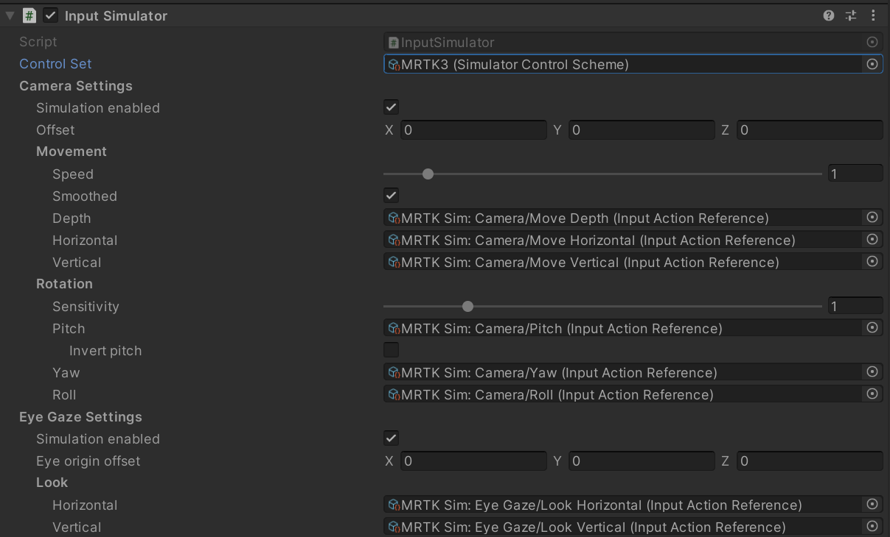

# Input simulation &#8212; MRTK3

With MRTK's input simulation, you can test various types of interactions in the Unity editor without building and deploying them to a device. The input simulation allows you to quickly iterate your ideas in the design and development process. Use keyboard and mouse combinations to control simulated inputs.

The Input Simulation Service emulates the behavior of devices and platforms that may not be available in the Unity editor. Examples include:

- HoloLens or VR device head tracking
- HoloLens hand gestures
- HoloLens 2 articulated hand tracking
- HoloLens 2 eye-tracking

> [!WARNING]
> Input simulation doesn't work when using Unity's XR Holographic Emulation > Emulation Mode = "Simulate in Editor." Unity's in-editor simulation will take control away from MRTK's input simulation. To use MRTK's input simulation, you'll need to set XR Holographic Emulation to:
>
> Emulation Mode = _"None"_.

## How to setup MRTK3 Input simulation

Before adding input simulation to your scene, ensure that you have enabled the "Subsystem for Hand Synthesis" under MRTK3's project settings. For more information about configuring MRTK3's settings, see [Subsystems &#8212; MRTK3](../../../mrtk3-overview/architecture/subsystems.md#configuration). If the "Subsystem for Hand Synthesis" is not enabled, MRTK3's hand simulation will not work.

Next, add the `MRTKInputSimulator` to your scene. This prefab will enable MRTK3's input simulation via the input simulator component. This component uses Unity Input System's `Input Action` assets to define keybindings for moving the simulator's camera, eye gaze, and hands. MRTK3's input simulator prefab specifies default keybindings, as described in [How to use MRTK3 Input simulation](#how-to-use-mrtk3-input-simulation-mrtk3-input-simulator-default-controls). These keybindings are configured in the default input action asset, `MRTKInputSimulatorControl`, which contains two control schemes (or control sets). One control set uses the legacy MRTK2 keybindings, and the other uses the newer MRTK3 keybindings. By default, the `MRTKInputSimulator` prefab uses the MRTK3 control set, but this can be altered by setting the simulator's `Control Set` property.

The input simulator's keybindings and available control sets can be modified by changing the `Input Action Reference` properties on the input simulator component. It is recommended that you create a new asset by selecting "Create > Input Actions" from the project window's right-click menu instead of changing `MRTKInputSimulatorControls`.

## How to use MRTK3 Input simulation (MRTK3 Input Simulator Default Controls)

### Camera

#### Movement

| Action            | Device(s) | Controls                | Control Set | Notes |
| ----------------- | --------- | ----------------------- | ----------- | ----- |
| Move horizontally | Keyboard  | A / D                   | All         |       |
|                   | Keyboard  | Left / Right Arrows     | All         |       |
| Move vertically   | Keyboard  | Q / E or Page Up / Down | All         |       |
|                   | Keyboard  | Page Up / Page Down     | All         |       |
| Move in depth     | Keyboard  | W / S                   | All         |       |
|                   | Keyboard  | Up / Down Arrows        | All         |       |

#### Rotation

| Action | Device(s) | Controls                       | Control Set | Notes |
| ------ | --------- | ------------------------------ | ----------- | ----- |
| Pitch  | Mouse     | Right Button + Forward / Back  | All         |       |
| Yaw    | Mouse     | Right Button + Left / Right    | All         |       |
| Roll   | Mouse     | Right Button + Wheel Up / Down | All         |       |

### Eye Gaze

> [!NOTE]
> To better match the behavior of hardware that provides eye tracking support, when enabled, simulated eye gaze is always tracked.

#### Look

| Action            | Device(s)        | Controls                 | Control Set | Notes |
| ----------------- | ---------------- | ------------------------ | ----------- | ----- |
| Look horizontally | Keyboard + Mouse | Tab + Mouse Left / Right | All         |       |
| Look vertically   | Keyboard + Mouse | Tab + Mouse Up / Down    | All         |       |

### Left Hand / Controller

#### Tracking

| Action             | Device(s) | Controls   | Control Set | Notes                                                      |
| ------------------ | --------- | ---------- | ----------- | ---------------------------------------------------------- |
| Latched tracking   | Keyboard  | T          | All         | Toggles the left hand on/off at a pre-determined location  |
| Momentary tracking | Keyboard  | Left Shift | All         | Toggles the left hand on/off at the current mouse location |
|                    | Keyboard  | Left Alt   | MRTK v3     |                                                            |
|                    | Keyboard  | Left Ctrl  | MRTK v2     |                                                            |

#### Movement

| Action            | Device(s)        | Controls                           | Control Set | Notes |
| ----------------- | ---------------- | ---------------------------------- | ----------- | ----- |
| Move horizontally | Keyboard + Mouse | Left Shift + Mouse Left / Right    | All         |       |
| Move vertically   | Keyboard + Mouse | Left Shift + Mouse Up / Down       | All         |       |
| Move in depth     | Keyboard + Mouse | Left Shift + Mouse Wheel Up / Down | All         |       |

#### Rotation

| Action | Device(s)        | Controls                          | Control Set | Notes |
| ------ | ---------------- | --------------------------------- | ----------- | ----- |
| Pitch  | Keyboard + Mouse | Left Alt + Mouse Forward / Back   | MRTK v3     |       |
|        | Keyboard + Mouse | Left Ctrl + Mouse Forward / Back  | MRTK v2     |       |
| Yaw    | Keyboard + Mouse | Left Ctrl + Mouse Left / Right    | MRTK v3     |       |
|        | Keyboard + Mouse | Left Ctrl + Mouse Left / Right    | MRTK v2     |       |
| Roll   | Keyboard + Mouse | Left Alt + Mouse Wheel Up / Down  | MRTK v3     |       |
|        | Keyboard + Mouse | Left Ctrl + Mouse Wheel Up / Down | MRTK v2     |       |

#### Interaction

| Action           | Device(s)        | Controls                       | Control Set | Notes |
| ---------------- | ---------------- | ------------------------------ | ----------- | ----- |
| Grip (button)    | Keyboard         | Left Shift + G                 | All         |       |
|                  | Keyboard         | Left Alt + G                   | MRTK v3     |       |
|                  | Keyboard         | Left Ctrl + G                  | MRTK v2     |       |
| Trigger (button) | Keyboard + Mouse | Left Shift + Left Mouse Button | All         |       |
|                  | Keyboard + Mouse | Left Alt + Left Mouse Button   | MRTK v3     |       |
|                  | Keyboard + Mouse | Left Ctrl + Left Mouse Button  | MRTK v2     |       |

#### Poses

| Action              | Device(s) | Controls       | Control Set | Notes                                                                                                         |
| ------------------- | --------- | -------------- | ----------- | ------------------------------------------------------------------------------------------------------------- |
| Change Neutral Pose | Keyboard  | Left Shift + P | All         | Switches the neutral (at rest) hand pose between flat and the ready position.                                 |
| Face the Camera     | Keyboard  | Left Shift + F | All         | Toggles the controller rotation between facing the camera and being aligned with the camera's forward vector. |

### Right Hand / Controller

#### Tracking

| Action             | Device(s) | Controls   | Control Set | Notes                                                      |
| ------------------ | --------- | ---------- | ----------- | ---------------------------------------------------------- |
| Latched tracking   | Keyboard  | Y          | All         | Toggles the left hand on/off at a pre-determined location  |
| Momentary tracking | Keyboard  | Space      | All         | Toggles the left hand on/off at the current mouse location |
|                    | Keyboard  | Left Ctrl  | MRTK v3     |                                                            |
|                    | Keyboard  | Right Ctrl | MRTK v2     |                                                            |

#### Movement

| Action            | Device(s)        | Controls                      | Control Set | Notes |
| ----------------- | ---------------- | ----------------------------- | ----------- | ----- |
| Move horizontally | Keyboard + Mouse | Space + Mouse Left / Right    | All         |       |
| Move vertically   | Keyboard + Mouse | Space + Mouse Up / Down       | All         |       |
| Move in depth     | Keyboard + Mouse | Space + Mouse Wheel Up / Down | All         |       |

#### Rotation

| Action | Device(s)        | Controls                           | Control Set | Notes |
| ------ | ---------------- | ---------------------------------- | ----------- | ----- |
| Pitch  | Keyboard + Mouse | Left Ctrl + Mouse Forward / Back   | MRTK v3     |       |
|        | Keyboard + Mouse | Right Ctrl + Mouse Forward / Back  | MRTK v2     |       |
| Yaw    | Keyboard + Mouse | Left Ctrl + Mouse Left / Right     | MRTK v3     |       |
|        | Keyboard + Mouse | Right Ctrl + Mouse Left / Right    | MRTK v2     |       |
| Roll   | Keyboard + Mouse | Left Ctrl + Mouse Wheel Up / Down  | MRTK v3     |       |
|        | Keyboard + Mouse | Right Ctrl + Mouse Wheel Up / Down | MRTK v2     |       |

#### Interaction

| Action           | Device(s)        | Controls                       | Control Set | Notes |
| ---------------- | ---------------- | ------------------------------ | ----------- | ----- |
| Grip (button)    | Space + G        | All                            |             |
|                  | Keyboard         | Left Ctrl + G                  | MRTK v3     |       |
|                  | Keyboard         | Right Ctrl + G                 | MRTK v2     |       |
| Trigger (button) | Keyboard + Mouse | Space + Left Mouse Button      | All         |       |
|                  | Keyboard + Mouse | Left Ctrl + Left Mouse Button  | MRTK v3     |       |
|                  | Keyboard + Mouse | Right Ctrl + Left Mouse Button | MRTK v2     |       |

#### Poses

| Action              | Device(s) | Controls  | Control Set | Notes                                                                                                         |
| ------------------- | --------- | --------- | ----------- | ------------------------------------------------------------------------------------------------------------- |
| Change Neutral Pose | Keyboard  | Space + P | All         | Switches the neutral (at rest) hand pose between flat and the ready position.                                 |
| Face the Camera     | Keyboard  | Space + F | All         | Toggles the controller rotation between facing the camera and being aligned with the camera's forward vector. |
