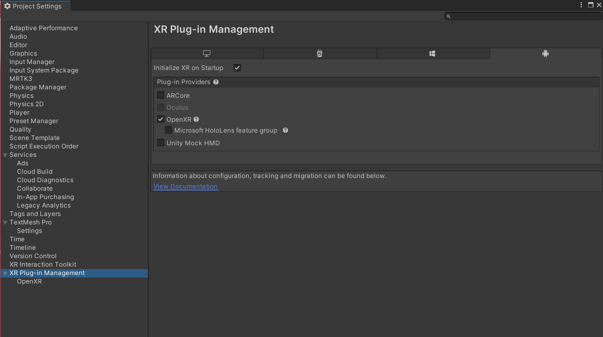
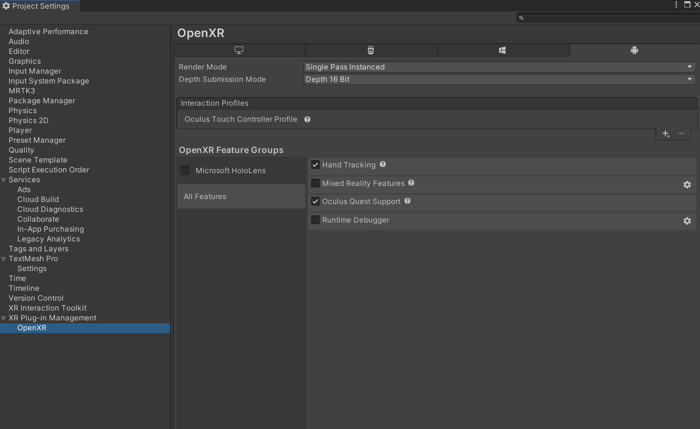

# Deploy an MRTK3 project to a Quest device

This page describes how to deploy your Unity Project with MRTK onto a Quest device after initial setup is complete.

To add MRTK to your project, please refer to the [setup page](../setup.md) and ensure your [project settings](../setup.md#5-configure-openxr-related-settings) are configured correctly to use the OpenXR pipeline and MRTK's feature set. **These features are required to deploy your project onto your Quest device**.

## Deployment Prerequisites

1. Ensure that your project is ready to deploy on the Quest Device by following [these steps](https://developer.oculus.com/documentation/unity/book-unity-gsg/) 

1. Ensure that [developer mode](https://developer.oculus.com/documentation/native/android/mobile-device-setup/#enable-developer-mode) is enabled on your device. Installing the Oculus ADB Drivers is optional.

1. Navigate to **File > Build Settings**.

1. Under **Platform**, select **Android**. Switch the platform to **Android**. (This can take some time)

1. Navigate to **Edit > Project Settings**.

1. Under **Project Settings**, navigate to **XR Plug-in Management** and enable **OpenXR** under the **Android** tab. Ensure that **Initialize XR on Startup** is selected and that no feature groups are enabled. (This can take some time)

    

1. Under **Project Settings**, navigate to **XR Plug-in Management > OpenXR > Interaction Profiles** and change it so only **Oculus Touch Controller Profile** is present.

1. Under **Project Settings**, navigate to **XR Plug-in Management > OpenXR > OpenXR Feature Groups** and ensure the following are checked under **All Features**.

    

1. Navigate to Project Validation, and fix any Red or yellow error/warning icons might appear during this process. Click the icon to open the **OpenXR Project Validation** tool and select **Fix All** to address the issues. There may be several items to address

    > [!NOTE]
    > If you don't see **Hand Tracking** or **Motion Controller Model** under the **OpenXR Feature Groups** panel, please refer to Configure OpenXR-related settings section of [project settings](../setup.md#5-configure-openxr-related-settings)

1. If you plan on using the native keyboard, please refer to the [keyboard documentation](../../mrtk3-input/packages/input/System-keyboard.md#meta-quest-specific-setup) for a required `AndroidManifest.xml` modification.

## Deploying to Device

1. **Do not** follow the Configure Settings instructions on Oculus's documentation page. Their instructions require the use of the Oculus Integration SDK, and uses the Oculus XR Plug-in rather than the OpenXR Plug-in.

1. We recommend that you select **Build and Run** to build and run your project. This will cause it to deploy directly to your Meta Quest.

1. After you have the project configured, proceed to [Generate Build](https://developer.oculus.com/documentation/unity/unity-build/#generate-build)
