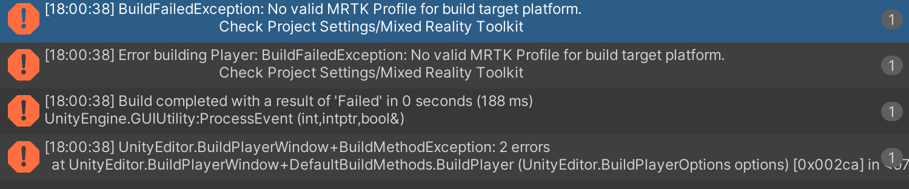

# Known issues | MRTK3

## General

- Several deprecated warnings thrown by Dialog and ArticulatedHandController

## UX

- The buttons on the HandMenu present in the Hand Interaction Examples scene do not function (2096)
- DataBindingExamples scene throws many warnings related to missing Unicode codepoints and "setting UX element to null" (2186, 2187)
- Various URLs in DataBindingExamples scene 404 (2188)
- ObjectBar breaks when rotated (2169)
    - This affects HandMenu, as buttons may clip into the backplate of the HandMenu (2189)
    - Consider using RectTransform automatic layout groups instead with the unified UX systems. ObjectBar may be deprecated in a future release
- Using `UGUIInputAdapter` without a `CanvasProxyInteractor` in the scene fails un-gracefully
- InteractionModeManager allocates a small amount of memory each frame. This is already fixed internally and will be part of a future release (2184)
- Masking collider-based UI is still undergoing development
- Using UGUI input to drag/move `ObjectManipulator` and `Slider` can be inconsistent without a backing raycast target to "catch" outgoing rays

## Interaction and input

- Quest is early in development
    - Switching between hands and controllers can cause loss of input functionality
    - Hands
        - Grab interaction with hands is not yet supported
        - Hand rays on Quest are not yet supported
        - Gaze-pinch on Quest is not yet supported (no head-driven gaze fallback)
    - Controllers
        - Poke is unreliable on controllers
- "Select" voice command does not work when using MRTK speech interaction over OpenXR (2149)
- SurfaceMagnetism solver does not behave correctly (2170)
- Cursors
    - Grab tethers have not yet been implemented
    - Poke cursor does not magnetize and animate yet
    - Ray cursors clip + behave poorly when manipulating `ISnapInteractable`s (slider knobs, BoundsControl handles, etc)
    - Proximity lights are not in lockstep with the input update, causing them to drift behind the cursor
    - Grab cursor (blue sphere) is programmer-art and will be removed or replaced
    - Manipulation hint cursors have not yet been set up
- Hand/controller visualization
    - Hand mesh visualizer is not yet implemented
    - Controller model visualizer is not yet implemented
- `Smoothing.SmoothTo` requires extremely small parameters for reasonable smoothing behavior

## Environment
- Exception thrown when exiting remoting play mode after using spatial mapping
    - There is a known Unity issue where an exception from Unity code is shown when the user attempts to quit a remoting session when spatial mapping is used in the scene. Unity has fixed the issue and will release the fix soon.

## Build and tooling
- Custom subsystems may be stripped during build, and they will silently fail to load
    - If you write custom subsystems, ensure your link.xml specifies that they are not to be stripped.
    - We will make the subsystem lifecycle manager complain more loudly when this occurs in the future.
- StateVisualizer's inspector can become distorted after play mode ends
    - Collapse/expand the inspector and the issue should resolve.
- **BuildFailedException**: No valid MRTK Profile for build target platform.
    - Check the **Player Settings > Mixed Reality Toolkit > MRTK Settings** to see if the profile (the top one above the subsystems) is present. If not, assign the default profile or your own profile.

