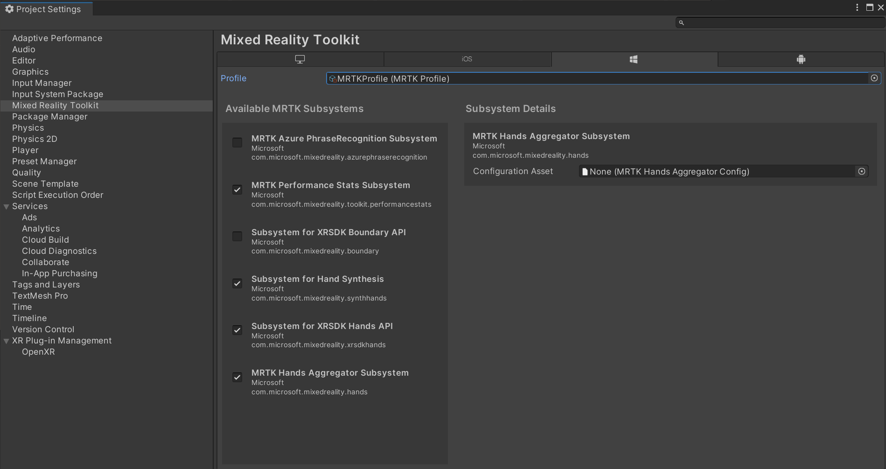
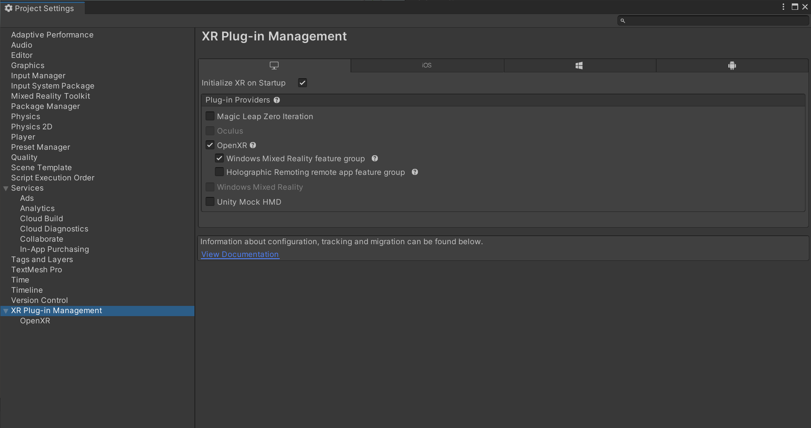
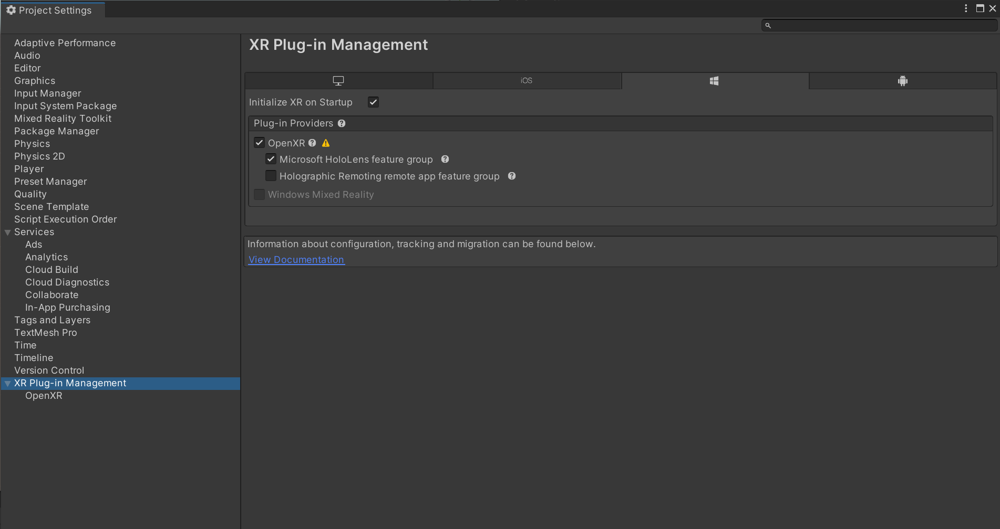

# Initial Setup for MRTK3

Welcome to the MRTK3 public preview! As MRTK3 is a collection of loosely coupled packages, consuming MRTK3 is different from that of MRTK 2.x. We don't ship MRTK as a Unity project, so you're expected to either use our example template project, which is pre-configured to consume all MRTK packages (easier to get started), or start fresh with a new project (gives you more control, recommended).

You're not expected to consume every MRTK package. See [which features are useful to you](packages/packages-overview.md) and add only the dependencies that matter.

## Install the tools
Make sure you have all the tools in this link before starting:

> [!div class="nextstepaction"]
> [Install the tools](/windows/mixed-reality/develop/install-the-tools?tabs=unity)

## Path 1: Clone the repository and try out the sample Unity Project

The easiest way of acquiring and trying out MRTK3 is to do so via our pre-configured project with references to all of the current MRTK3 packages. Please clone our project at [our GitHub repo](https://github.com/microsoft/MixedRealityToolkit-Unity/tree/mrtk3) and checkout the `mrtk3` branch. After that you can simply launch Unity (2020.3.35f1 or newer) on the `MRTKDevTemplate` project under `UnityProjects` and start playing with the [sample scenes](scenes.md) in Editor, via remoting or deployed to devices.

For information on the sample scenes included in the preview, please see [Using and creating scenes](scenes.md).

## Path 2: Adding MRTK3 to a new Unity project

### 1. Create a new Unity project

Create a new Unity project with Unity 2020.3.34f1 or newer / Unity 2021.3.2f1 or newer. Close the Unity project before proceeding to the next step.

### 2. Import required dependencies and MRTK3 packages with Mixed Reality Feature Tool

There are a handful of packages that MRTK3 uses which are not part of this preview. To obtain these, please use the [`Mixed Reality Feature Tool`](/windows/mixed-reality/develop/unity/welcome-to-mr-feature-tool) and select the latest versions of the following in the Discover Features step:

- **Platform Support → Mixed Reality OpenXR Plugin**
- [Optional] **Spatial Audio → Microsoft Spatializer**

For MRTK3 packages, refer to the [package overview page](packages/packages-overview.md) for information on packages and then select the ones that fit your needs.

When finished selecting packages, click on Get features and follow the Mixed Reality Feature Tool to import the selected packages into your Unity project.

### 3. Open the Unity project

Open the Unity project and wait for Unity to finish importing the newly added packages. There may be two pop ups in this process:

1. The first pop up asks whether you want to enable the new input backend. Make sure you press yes.
1. The second pop up asks whether you want to update XR InteractionLayerMask. Make sure you press No Thanks.

Unity may restart a few times in this process and please wait it to finish before proceeding.

### 4. Configure MRTK profile after import

Once imported, MRTK3 requires a profile to be set for standalone and each additional target platform.

1. Navigate to **Edit > Project Settings**
1. Under **Project Settings**, navigate to **MRTK3** and switch to the standalone tab. Note the profile is initially unspecified.
1. Populate the field with the default MRTK profile that ships wih the core package. You can type in the keyword "MRTKprofile" in the search bar of the project window and make sure you search in `All`. Alternatively you can find the profile under `Packages/com.microsoft.mrtk.core/Configuration/Default Profiles/MRTKProfile.asset`.
   >[!NOTE]
   > Not all of the MRTK subsystems are shown in the screenshot below. The MRTK subsystems that you see may be different, depending on the MRTK3 packages you have added to your project.

   
1. Switch to the tabs of other build target(s) you want to use (e.g. UWP, Android) and check whether the profile is assigned. If not, repeat the previous step on the current tab.

### 5. Configure OpenXR-related settings

Once imported, MRTK3 requires some configuration on OpenXR if you are targeting an XR device such as HoloLens 2 or Quest.

>[!NOTE]
>The following instructions applies to HoloLens 2 or WMR headsets. If you are targeting Quest, please refer to the instructions on the [Quest deployment page](deployment/quest-deployment.md#deployment-prerequisites).

1. Navigate to **Edit > Project Settings**

1. Under **Project Settings**, navigate to **XR Plug-in Management** and enable **OpenXR** under both the Standalone and UWP tabs. Under each tab, ensure that **Initialize XR on Startup** is selected and that the **Windows Mixed Reality feature group under Standalone** and the **Microsoft HoloLens feature group under UWP** are enabled.

    >[!NOTE]
    >A yellow warning icon may appear after checking the **OpenXR** option. Click on that icon to open the **OpenXR Project Validation** tool. Click fix all and ignore the interaction profile issue that cannot be auto fixed. The profiles will be added in the step below.

    For standalone:

    

    For UWP:

    

1. Under **Project Settings**, navigate to **XR Plug-in Management > OpenXR > Interaction Profiles** and add the following three profiles for UWP and Standalone:
    * **Eye Gaze Interaction Profile**
    * **Microsoft Hand Interaction Profile**
    * **Microsoft Motion Controller Profile**

    >[!NOTE]
    >You may need to use the **OpenXR Project Validation** tool to eliminate the yellow triangle.

    For standalone:

    

    For UWP:

    

1. For HoloLens 2, we recommend using 16-bit depth submission in the settings above. For immersive headsets, you can use 24-bit depth submission. See the [Microsoft development docs for Unity](/windows/mixed-reality/develop/unity/recommended-settings-for-unity#enable-depth-buffer-sharing) for more info.

### 6. Congratulations, the project setup is now finished!

Please proceed to [create a new MRTK3 scene](scenes.md#creating-a-new-scene-with-mrtk3).

## Next steps

* [Try out our sample scenes or create your own one](scenes.md)
