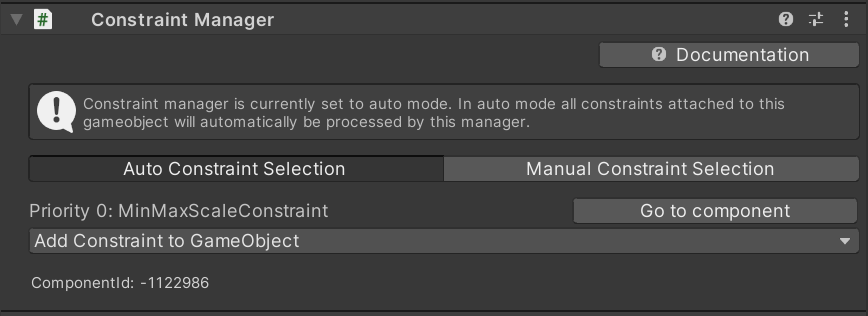
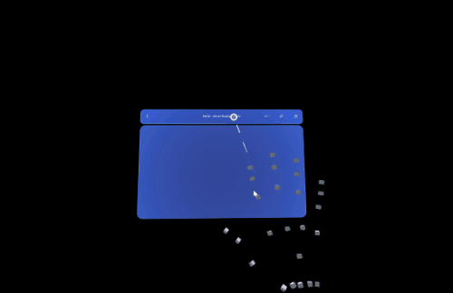
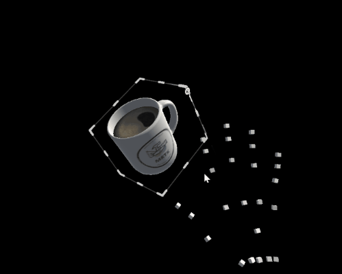

# Constraint manager

The constraint manager allows you to apply a set of constraint components to a transform. Components of type `TransformConstraint` that are attached to the game object can be taken into consideration.
Per default, the constraint manager will automatically collect all [constraint components](#transform-constraints) attached to the game object and apply them to processed transforms. However, users can also opt for configuring the list of applied constraints manually and allowing only a subset of attached constraints to be used.

> [!NOTE]
> MRTK3 currently offers a limited subset of the constraints from MRTK 2.x. We are currently investigating a refactor of the Constraints system to unify the developer workflow with Solvers and Elastics. Stay tuned!

Currently, the following MRTK UX elements support constraints:

- [Bounds control](bounds-control.md)
- [Object manipulator](object-manipulator.md)

Constraint manager can operate in two modes:

- Auto constraint selection
- Manual constraint selection

### Auto constraint selection

The default **Auto** mode will list all attached constraint components. You can jump straight to the component in the inspector using the **Go to component** buttons, or add a new constraint from the dropdown.

### Manual constraint selection

If the constraint manager is set to manual mode, only constraints linked in the constraint list are processed and applied to the transform. When enabling manual mode for the first time, the manager will auto-populate the list with all currently attached constraints.

> [!NOTE]
> The **Remove Entry** action will only remove the constraint from the manual selection list. The component will still be present on the GameObject.

## Execution order

The execution order of each constraint can be defined in the **Execution Order** option on the constraint itself. The order will be reflected in the list displayed in the constraint manager. Some constraints will behave differently when they are combined in different orders, so bear in mind the priorities of each constraint and adjust their order accordingly.

## Transform constraints

You can use constraints to limit manipulation in some way. For example, some applications may require rotation and that the object remain upright. In this case, a `RotationAxisConstraint` can be added to the object and used to limit rotation to y-axis rotation. MRTK provides several constraints, all of which are described below.

It's also possible to define new constraints and use them to create unique manipulation behavior that may be needed for some applications. To do this, create a script that inherits from [`TransformConstraint`](xref:Microsoft.MixedReality.Toolkit.UI.TransformConstraint) and implement the abstract `ConstraintType` property and the abstract `ApplyConstraint` method. Your new constraint should appear in the dropdown, and should be registered in the Constraint Manager automatically when added to the object.

All of the constraints provided by MRTK share the following properties:

**Hand Type** specifies whether the constraint is used for one-handed, two-handed, or both kinds of manipulation. Because this property is a flag, both options can be selected.

- *One-handed*: Constraint will be used during one-handed manipulation if selected.
- *Two-handed*: Constraint will be used during two-handed manipulation if selected.

**ProximityType** specifies whether the constraint is used for near, far, or both kinds of manipulation. Because this property is a flag, both options can be selected.

- *Near*: Constraint will be used during near manipulation if selected.
- *Far*: Constraint will be used during far manipulation if selected.

:::row:::
    :::column:::
        ### FaceUserConstraint 
        This constraint limits the rotation of an object such that it will always face the user. The **Face Away** option controls whether the positive or negative Z axis is used. 
    :::column-end:::
        :::column:::
        
    :::column-end:::
:::row-end:::
:::row:::
    :::column:::
        ### MinMaxScaleConstraint 
        This constraint limits the scale of an object, useful for preventing users from scaling objects to unusably small or large sizes. It works for both handle-based scaling (with [BoundsControl](bounds-control.md)) and with two-handed direct scaling (with [ObjectManipulator](object-manipulator.md)). The **Relative to initial state** option defines whether the specific **Minimum** and **Maximum scale** values are absolute values or whether they are multiplied on the initial scale of the object.  
    :::column-end:::
        :::column:::
        
    :::column-end:::
:::row-end:::
