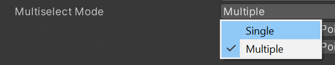

# Object Manipulator

ObjectManipulator enables intuitive manipulation of objects in 3D space with any input device or modality. It performs a similar task to the XRI `XRGrabInteractable`, but offers additional features and Mixed Reality-specific interactions. While the `XRGrabInteractable` is fully compatible with our interactors (and vice versa), we still recommend using our implementation for the best experience.

> [!NOTE]
> ObjectManipulator is specifically designed for manipulating 3D objects directly and intuitively. If you're looking for common UI interactions like sliders or buttons, look [here](../../../mrtk3-uxcomponents/packages/uxcomponents/slider.md) and [here](../../../mrtk3-uxcomponents/packages/uxcomponents/button.md) instead. Avoid using ObjectManipulator to write micro-interactions.

## Architecture

In MRTK v2, most of the complex logic and math for the different types of input were handled by ObjectManipulator itself. A separate codepath had to be maintained for each type of interaction, resulting in less flexibility when introducing new types of interactions. In MRTK3, the _interactor_ is responsible for the specifics of how a particular type of input is translated into a manipulation. ObjectManipulator simply listens to these interactors and applies the relevant transformation to the object. As a result, ObjectManipulator in MRTK3 is significantly simpler and smaller in scope. See the [Interactor architecture](../../../mrtk3-overview/architecture/interactors.md) for descriptions of how interactors communicate through their attach transforms.

## `n`-handed manipulations

ObjectManipulator supports any number of participating interactors, allowing for generalizable interaction behavior across one, two, and even `n`-handed manipulations. Generally, the geometric centroid of all participating interactors' attachTransforms is used for multi-handed interactions. As an XRI interactable, it is compatible with any type of interactor that submits a well-behaved attach transform.

If you would not like to allow multi-handed manipulations, set the XRI `Selection Mode` to `Single`. We alias this property in the inspector to the more specific name `Multiselect Mode`, to avoid confusion with our MRTK `Selection Mode`, used to specify whether an interactable is toggleable (see the [Button](../../../mrtk3-uxcomponents/packages/uxcomponents/button.md) documentation for further clarification.)

## Constraints

ObjectManipulator uses the Constraints API to constrain manipulations. See the [Constraints documentation](constraint-manager.md) for more information.

## Manipulation logic injection

Developers can customize the manipulation behavior of ObjectManipulator without needing to subclass or otherwise modify the script itself. Simply write a new `ManipulationLogic<T>`, and specify the type in the inspector.

> [!IMPORTANT]
> If you find yourself writing new manipulation logic types for a new kind of interaction or input device, you're probably going down the wrong path. The existing manipulation logic should work for arbitrary input types, as long as the attach transform is well-behaved. Consider adjusting or writing a new interactor instead. Read the [Interactor architecture documentation](../../../mrtk3-overview/architecture/interactors.md) and the [Interactable architecture documentation](../../../mrtk3-overview/architecture/interactables.md) for more information on how to write well-behaved interaction logic.
