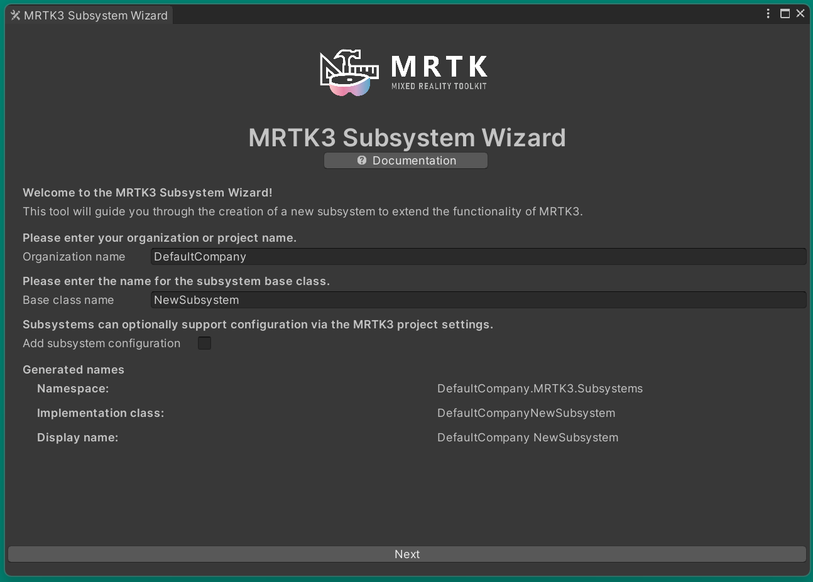
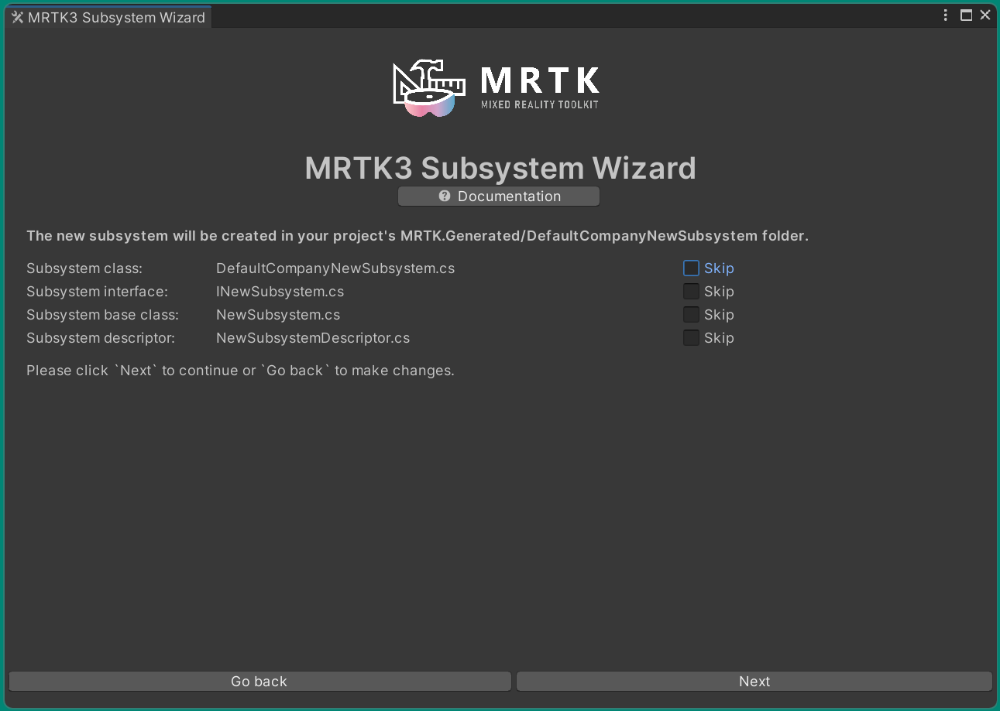
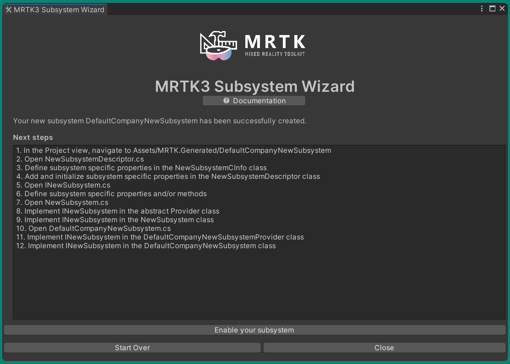
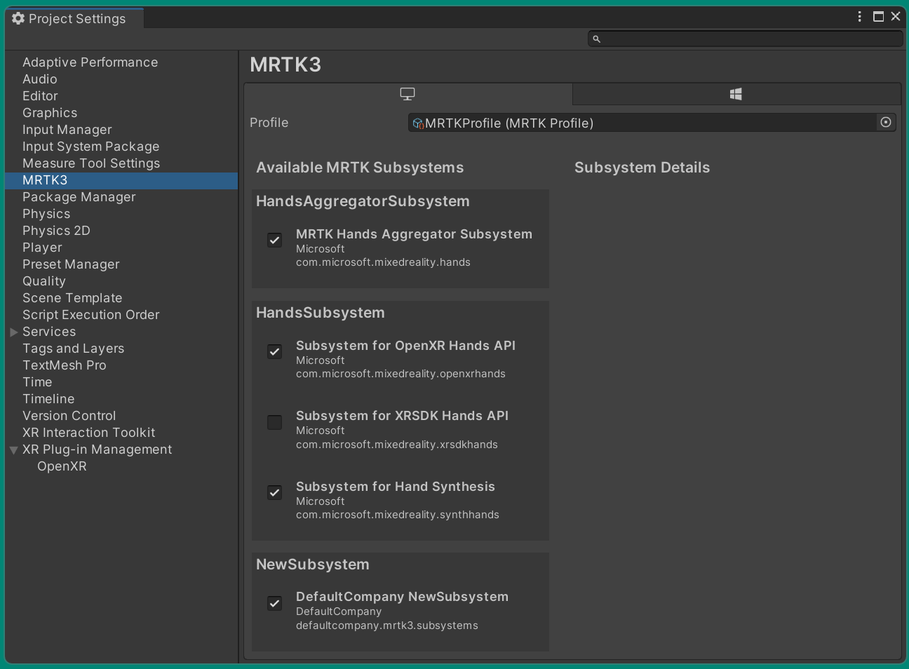

# Subsystem Wizard &#8212; MRTK3

Welcome to the Mixed Reality Toolkit Subsystem Wizard. This tool is used to extend the functionality of MRTK3 via a custom Unity XR Subsystem. This document describes the Subsystem Wizard, its UI and how to add your custom feature to MRTK3.

> [!NOTE]
> As a general rule, it is recommended to use subsystems to implement platform or provider abstractions.

To use the Subsystem Wizard, you must first import the MRTK3 Tools package using the [Mixed Reality Feature Tool](todo link).

## Getting Started

To get started creating a new subsystem, please select the `Subsystem Wizard` item from the **MRTK3** > **Utilities** menu.

todo

todo 

### Organization name

todo

### Base class name

todo

### Adding a subsystem configuration

todo

## Preparing to generate

> [!NOTE]
> The Subststem Wizard will not overwrite existing files. If you have previously generated and need to add a file, you can selectively disable one or more files. This can also be used to regenerate a previously deleted file.

### Skip subsystem class

todo

### Skip subsystem interface

todo

### Skip subsystem base class

todo

### Skip subsystem descriptor

todo

## Next steps

todo

### Add your code

todo

### Enable the subsystem

todo

