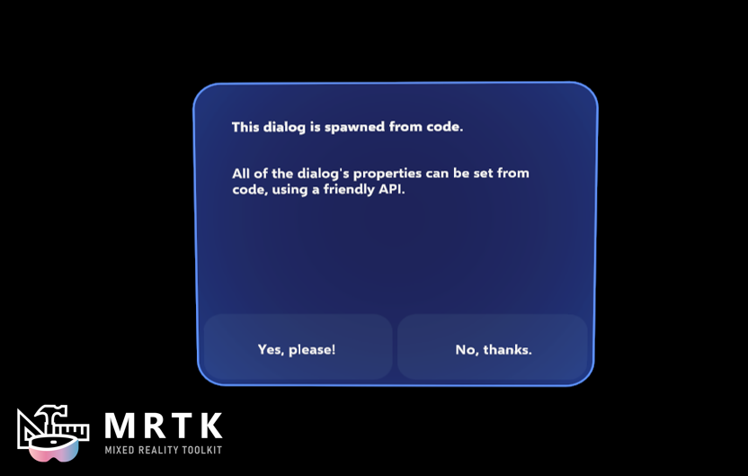
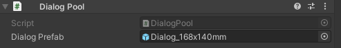

# Dialog (Non-Canvas) &#8212; MRTK3

Dialogs are short-lived UI views that provide contextual app information. For general information about dialogs, refer to the [Canvas-based Dialog documentation here](../../../mrtk3-uxcomponents/packages/uxcomponents/dialog.md). If you're looking for the Dialog API documentation and usage examples, [see the UXCore documentation here](../../../mrtk3-uxcore/packages/uxcore/dialog-api.md). 

[!INCLUDE]

## Prefabs (Non-Canvas)

Non-canvas buttons aren't resizable; as a result, several dialog prefabs are provided in different permutations of size,

* **Dialog_168x88mm**
* **Dialog_168x108mm**
* **Dialog_168x140mm**

## Example scenes

See `DialogExample.unity` for examples of how to spawn dialogs. You can set the  `DialogPrefab` in the `DialogPool` component to the Non-Canvas prefab of your choice. 

