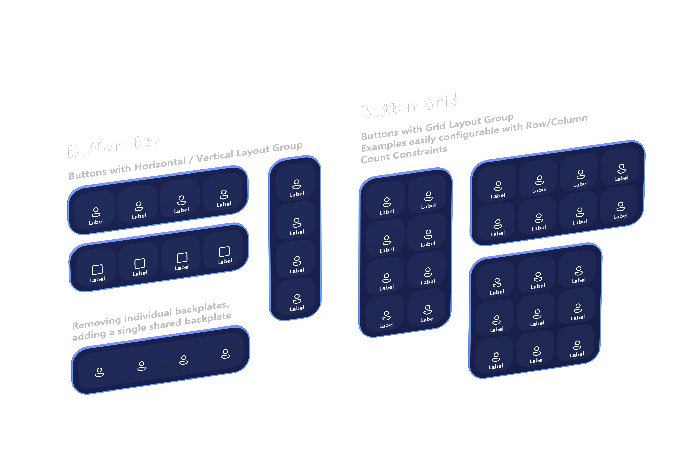
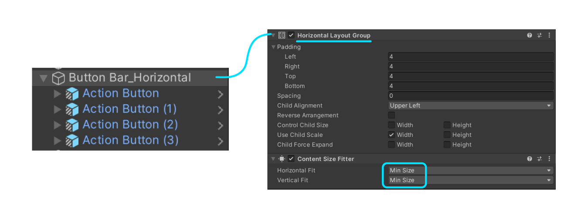
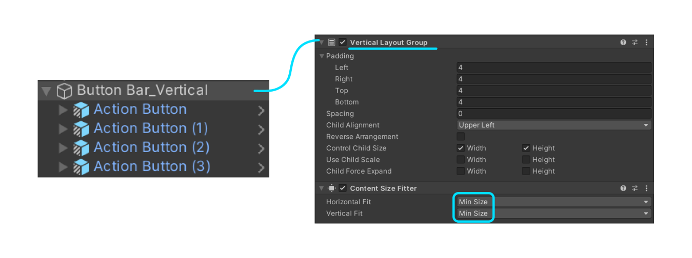
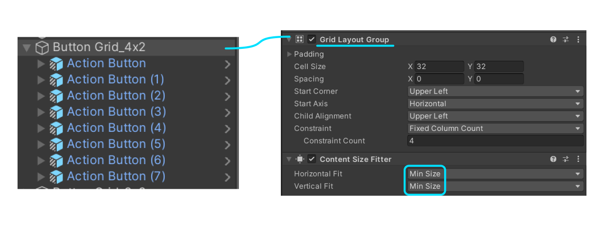

# Button Group -- MRTK3

Flexible and responsive button groups are easy to build using the new Canvas-based layout system. Previously, users had to use the `ObjectBar` script to lay out a collection of children along a single axis, and each child had to be manually added to the `ObjectBar`'s list of managed children.

With [Canvas-based UX](../../../mrtk3-uxcore/packages/uxcore/canvas-ui.md), you can take advantage of the built-in RectTransform-based layout system to easily build and manage rows, columns, and grids of UI components. Button bars and grids can be built using the `HorizontalLayoutGroup`, `VerticalLayoutGroup`, and `GridLayoutGroup` UnityUI components. The children will be automatically laid out according the constraints, padding, and options configured in the layout group.

## Button Bar

To build a horizontal or vertical "bar" of buttons (or other UI controls!) you can build a simple layout using either `HorizontalLayoutGroup`, `VerticalLayoutGroup`, or  `ContentSizeFitter`.

Note that children of these auto-layout components should have a `LayoutElement` component to inform the layout engine of the minimum and preferred sizes for each child. Our Button prefabs come pre-installed with these components, but you may need to add them to your own custom controls or customize the minimum and preferred sizing to fit your needs.

## Button Grid

To build a flexible grid of buttons, the same layout and design from the button bar applies, but a `GridLayoutGroup` is used instead.

To adjust the number of rows or columns, select which constraint type you'd like.

- **Fixed Column Count** specifies the number of columns. The number of rows will reflow depending on the number of items in the collection.
- **Fixed Row Count** specifies the number of columns. The number of rows will reflow depending on the number of items in the collection.
- **Flexible** results in a flexible number of rows or columns, depending on the fit types selected in the `ContentSizeFitter`. Selecting `Preferred size` for both fit types in the `ContentSizeFitter`, along with a `Flexible` grid constraint, will result in a grid layout that attempts to be mostly square/even, but will add rows or columns accordingly when necessary.

For more information on using the UnityUI layout system, [you can view the documentation here.](https://docs.unity3d.com/Packages/com.unity.ugui@1.0/manual/comp-UIAutoLayout.html)
