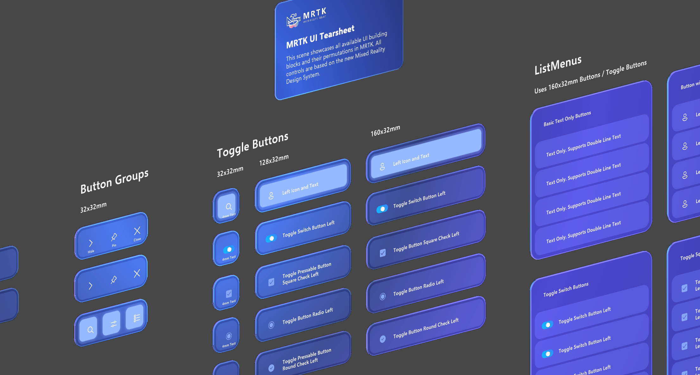
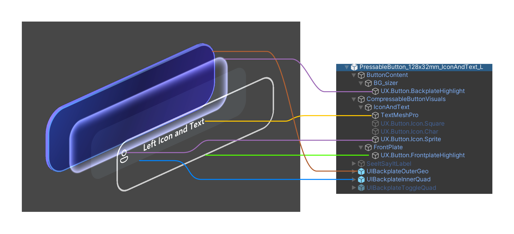

# Buttons

A button gives the user a way to trigger an immediate action. It's one of the most foundational components in mixed reality, and providing satisfying MRTK provides two categories of button prefabs: canvas-based and non-canvas-based under MRTK UX Components package/Buttons. For more information on canvas vs non-canvas, please see. Both types are using the `PressableButton` script, which is a subclass of [`StatefulInteractable`](../../architecture/interactables.md) extended to include behaviors specific to buttons. For each category you can find various prefabs with different contents (e.g. with ot without an icon) or sizes.

## Example scene and prefabs

If you're using the development template project, several example scenes are available that demonstrate the available button prefabs.

**CanvasUITearSheet.unity** shows all available canvas-based button prefab variants in MRTK.

**CanvasExample.unity** shows some examples of building larger layouts using the Canvas-based components.

**UITearSheet.unity** shows all available non-canvas-based button prefab variants in MRTK.

Non-canvas button prefabs are named in the format: **PressableButton_SIZE_STYLE**. For example,

- **PressableButton_32x32mm_IconAndText**: 32x32mm size button with icon and text
- **PressableButton_128x32mm_SinglelineTextWithSubtitle**: 128x32mm size wide button with single line text + subtitle text

Canvas buttons are under the MRTK UX Components package/Buttons/Canvas folder.

## Structure

The follow screenshot shows the structure of a non-canvas-based button.

## `PressableButton` class

The `PressableButton` class is derived from `StatefulInteractable` with new and overridden functions specific to buttons. In the inspector you can configure settings related to the volumetric press besides all other configurable settings from `StatefulInteractable`.

