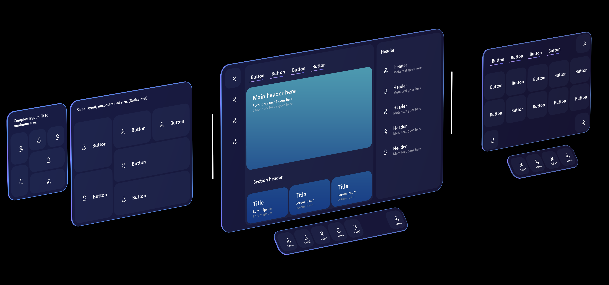
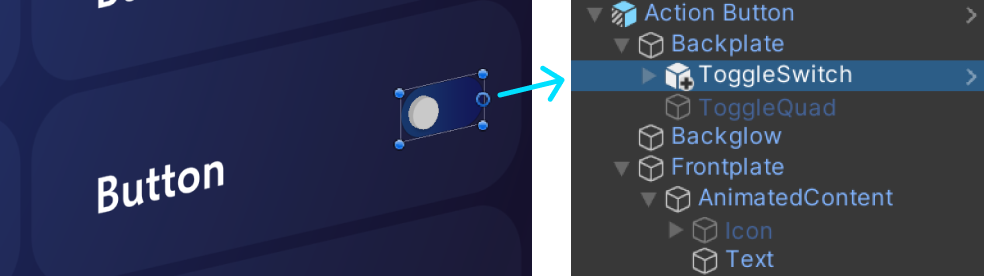
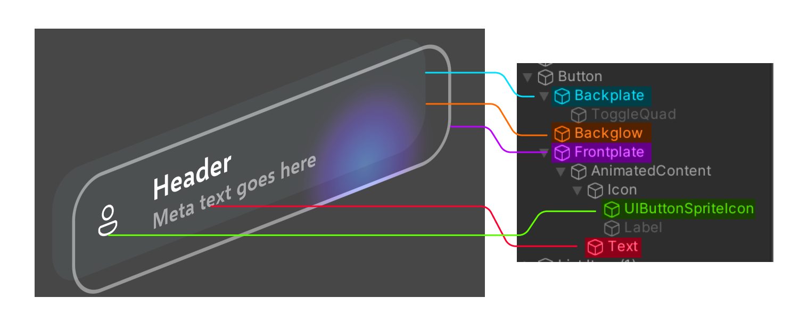
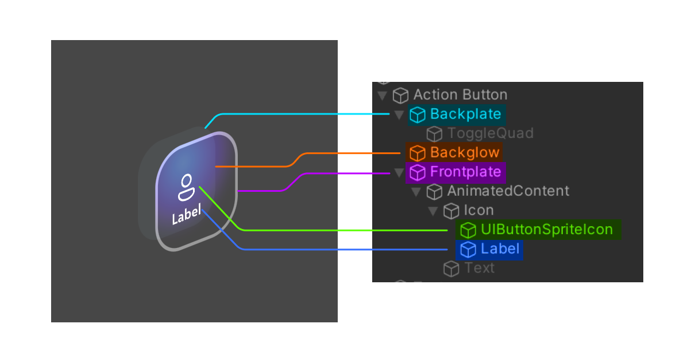
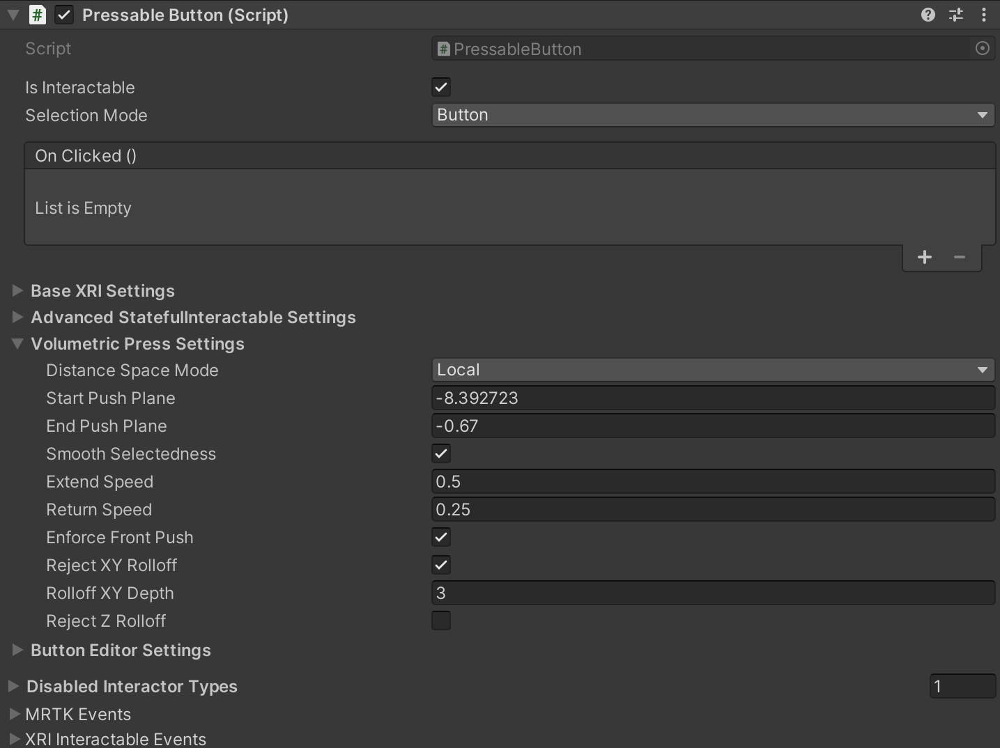
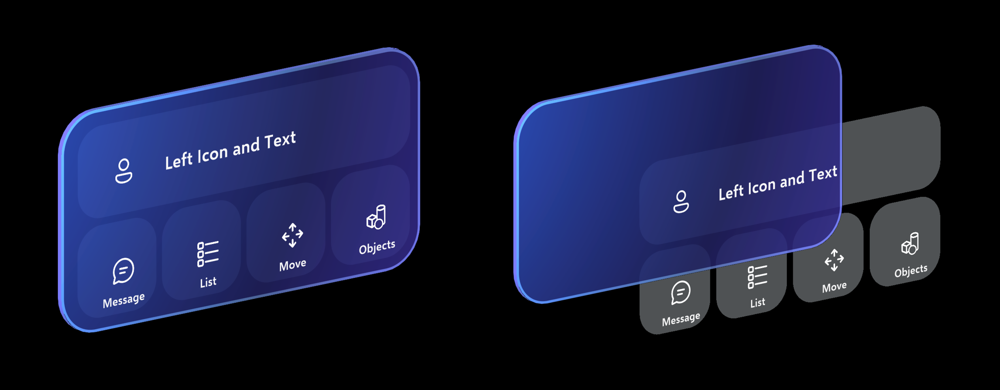
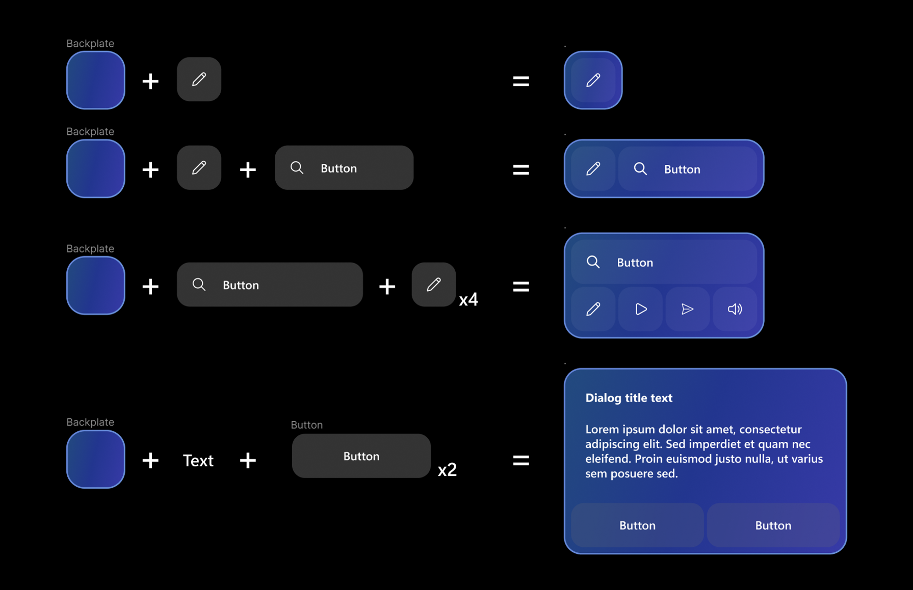
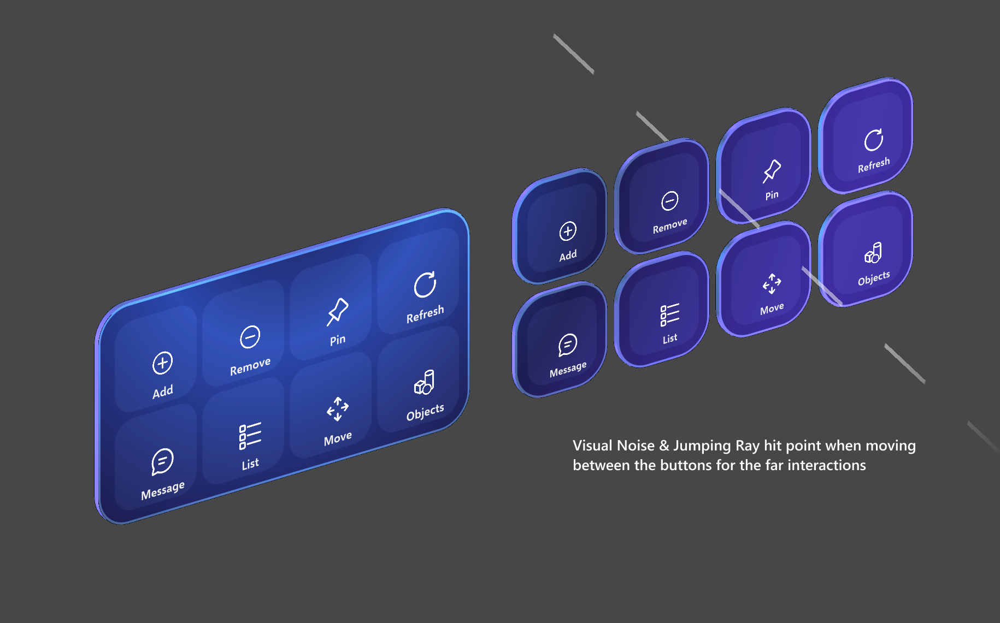

# Button &#8212; MRTK3

A button gives the user a way to trigger an immediate action. It's one of the most foundational components in mixed reality, and providing satisfying and reliable button interactions is essential to a quality mixed reality experience. MRTK provides two categories of button prefabs: Canvas-based and non-Canvas-based. Both configurations use the `PressableButton` script, a subclass of [`StatefulInteractable`](../../../mrtk3-overview/architecture/interactables.md) extended to include behaviors specific to buttons.

[Learn more about how the hybrid Canvas UI system works.](../../../mrtk3-uxcore/packages/uxcore/canvas-ui.md).

## Example scenes

If you're using the development template project, several example scenes are available that demonstrate the available button prefabs.

**CanvasUITearSheet.unity** shows all available Canvas-based button prefab variants in MRTK.

**CanvasExample.unity** shows some examples of building larger layouts using the Canvas-based components.

## Prefabs

[Canvas-based](../../../mrtk3-uxcore/packages/uxcore/canvas-ui.md) buttons are flexible and configurable, and can be resized to any dimension or proportion. As such, only a few button prefabs are provided.

- **EmptyButton** provides the pressable surface/frontplate, holographic backplate, and glow effect. There's no text, icon, label, or other content. This is so more abstract button-like controls can be built as a variant of this prefab without interfering with the text or icon content.
- **ActionButton** is a simple button that includes an icon, text, and a label. These individual components can be enabled or disabled, and the layout system will adapt accordingly.

Other enhancements can be added to the button, such as the toggle switch indicator. Features that aren't intended to move with the frontplate should be attached to the backplate component.

## Structure

The different parts of an **ActionButton** can be turned on/off to customize how the button looks and behaves. We've dissected two different possible configurations to show the different parts of the button prefab. The "backglow" isn't visible in these screenshots since the button isn't actively being pressed.

First, a larger configuration where the main Text object is active and uses inline styles to display both a header and subtext.

Second, a smaller configuration where the is active to show a description of the action below the icon. The main Text object is disabled.

## `PressableButton` class

The `PressableButton` class is derived from `StatefulInteractable` with new and overridden functions specific to buttons. In the **Inspector**, you can configure settings related to the volumetric press besides all other configurable settings from `StatefulInteractable`.

## Constructing UI with buttons
When creating menu or UI panels with multiple buttons, it's recommended to use a shared backplate geometry. By using a shared backplate, we can reduce the visual noise and improve usability. Here are some of the examples of laying out buttons on top of the shared backplate.

## Notable Components

For reference, here are some additional components responsible for handling aspects of button visuals and functionlity:
* The visual front plate pulse observed when the button is selected is handled by an `InteractablePulse` component.
* The button icon may be set to an MRTK icon using `FontIconSelector`.
* A `RectTransformColliderFitter` may optionally be used on Canvas buttons to fit its `BoxCollider` to its `RectTransform`. This is component is disabled by default for performance.
