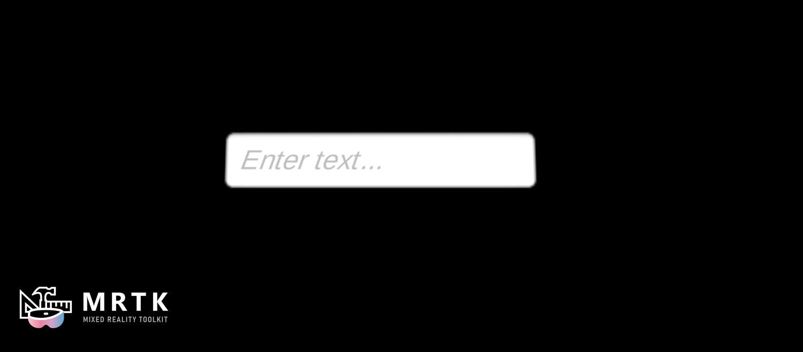

# Input Field

There are two Canvas UX prefabs for input fields: `MRTKUGUIInputField` and `MRTKTMPInputField`. Each uses a different input field component. The `MRTKUGUIInputField` component is subclassed from the [Unity UI InputField](https://docs.unity3d.com/2021.3/Documentation/Manual/script-InputField.html), while the `MRTKTMPInputField` is subclassed from the [TextMeshPro TMP_InputField.](https://docs.unity3d.com/Packages/com.unity.textmeshpro@3.0/api/TMPro.TMP_InputField.html) The purpose of this subclassing is to add some logic to account for XR interactions and to prevent multiple input fields from being selected at once.  

An example using these prefabs can be found in the `InputFieldExamples` scene.