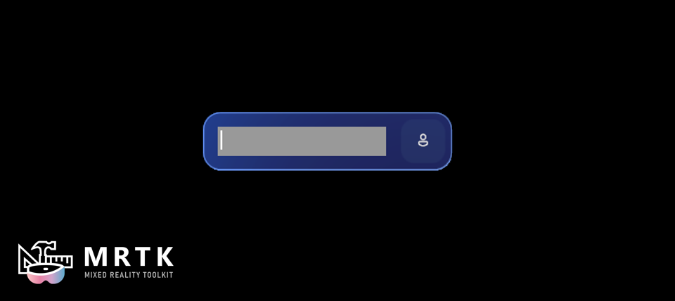

# Keyboard Preview

There is a Canvas UX prefab, `Keyboard Preview`, which provides a visual for the text that a user inputs with the [System Keyboard](/windows/mixed-reality/mrtk-unity/mrtk3-input/packages/input/system-keyboard).

This visual uses a [Follow Solver](/windows/mixed-reality/mrtk-unity/mrtk3-spatialmanipulation/packages/spatialmanipulation/solvers/solver#follow) to position itself in front of the user. It can be connected to the System Keyboard using a script like `SystemKeyboardExample.cs`. An example can be found in the `HandInteractionExamples` scene.