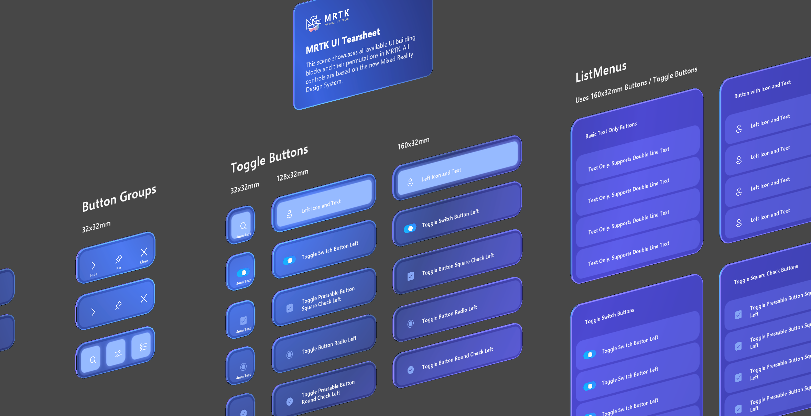
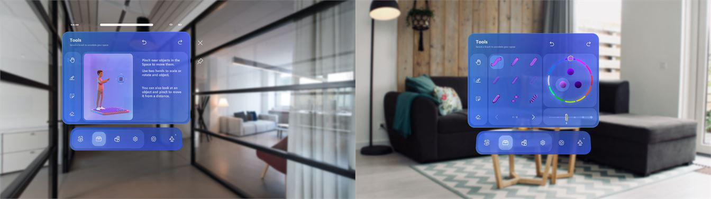

# Mixed Reality Design Language | MRTK3

Over the last several years, Mixed Reality Design Team has been evolving the design language across the products. We have been learning and developing best practices of Design for Mixed Reality through many projects, including HoloLens 1st gen, Windows Mixed Reality, HoloLens 2, and industrial partner collaborations. We're now excited to bring the latest Mixed Reality Design Language - introduced in the Mesh app - to the public through MRTK's building blocks.

Using these building blocks can use the result from many design iterations and user research our designers, developers, and researchers have conducted. All detailed elements of the new Mixed Reality Design Language, such as visual feedback, shaders, transitions, animations, typography, and iconography, will help you build fluent Mixed Reality experiences.

## Improvements
- Improved visual feedback for enhanced multi-modal input: Button's detailed visual feedback elements such as glowing back plate, front plate, moving per amount of pinch gesture, etc.
- Enhanced Bounding Box visual states for fast/fluent interactions
- Dynamic layout with RectTransform and Canvas

## Key elements

**Geometry**

Geometry describes the shape, size, and position of UI elements. These fundamental design elements help experiences feel coherent across the entire design system. Mixed Reality Design Language introduces geometry with rounded corners that create a more approachable, engaging, and modern experience.

**Color**

Color helps users focus on their tasks by indicating a visual hierarchy and structure between user interface elements. Mixed Reality Design Language uses a dark color scheme to minimize eye fatigue and improve the confidence in direct hand interactions.

**Light and Materials**

Light and Materials play an essential role in providing visual feedback in spatial interactions. It helps the user perceive depth and interaction state better. For example, in hand interactions, light appears on the surfaces of the buttons when the finger hovers to communicate the proximity.

**Layers**

Layering is the concept of overlapping one surface with another. Mixed Reality Design Language uses layering and elevation to create a volumetric UI that enhances interaction quality and usability in spatial interactions.

**Iconography**

Iconography is a set of visual images and symbols that help users understand and navigate your app. Mixed Reality Design Language uses Windows 11's iconography. Every glyph in our system icon font has been redesigned to embrace a softer geometry and more modern metaphors.  

**Typography**

As the visual representation of language, typography's main task is to communicate information. Mixed Reality Design Language's type ramp helps you create structure and hierarchy in your content to maximize legibility and readability in your UI.

## Mixed Reality Design Language in MRTK3

 

## Examples of using Mixed Reality Design Language
Explore and learn about the Mixed Reality Design Language examples in action.

[Microsoft Mesh app for HoloLens 2](https://techcommunity.microsoft.com/t5/mixed-reality-blog/microsoft-mesh-app-august-2021-update-new-features/ba-p/2746856)

 

