# Mixed Reality Design Language &#8212; MRTK3

Over the last several years, we've shipped many different devices and form factors with different display types, resolutions, and user experiences. We've developed a set of best practices for designing great experiences in mixed reality, but these best practices continue to evolve as we test and evaluate designs across different products and devices.

We're excited to introduce the latest Mixed Reality Design Language--first showcased in the Mesh app for HoloLens--to the public through MRTK's building blocks. The new design changes aim to empower developers to build production-ready applications that are more beautiful, usable, and portable.

## Improvements

:::row:::
    :::column:::
    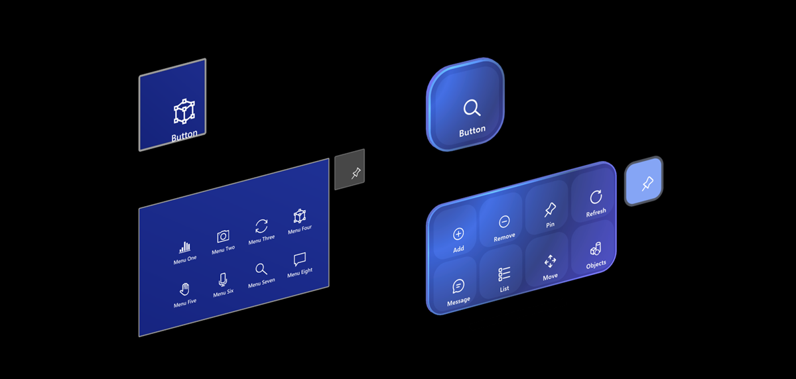
    Updated geometry with rounded corners for more approachable and friendly experiences
    :::column-end:::
    :::column:::
    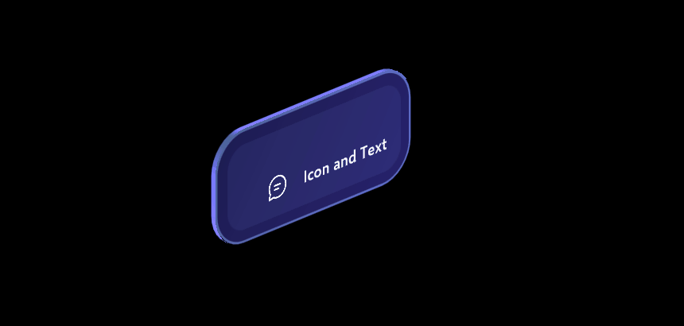
    Improved visual feedback for enhanced multi-modal input such as eye-gaze combined with pinch gesture
    :::column-end:::
:::row-end:::
:::row:::
    :::column:::
    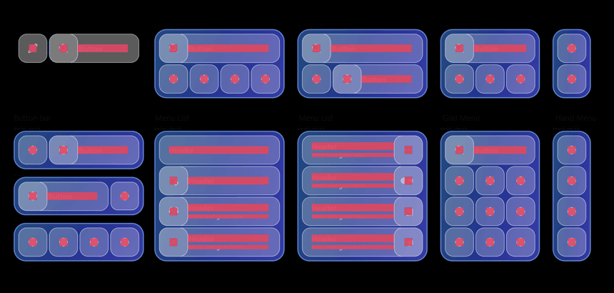
    Improved modular units that support various UI scenarios with permutations
    :::column-end:::
    :::column:::
    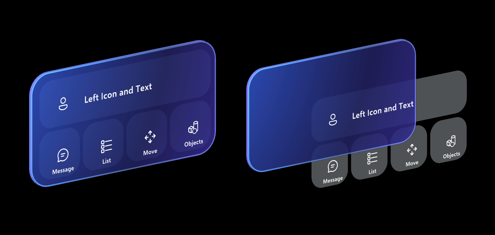
    Modular backplate system for building complex layouts that remain clear and usable
    :::column-end:::
:::row-end:::
:::row:::
    :::column:::
    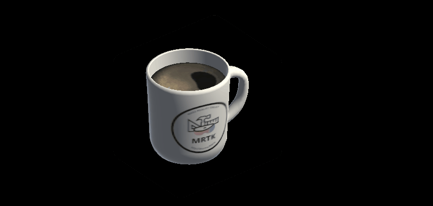
    Redesigned bounding box visuals to reduce visual noise and enable fluid gaze-powered interactions
    :::column-end:::
    :::column:::
    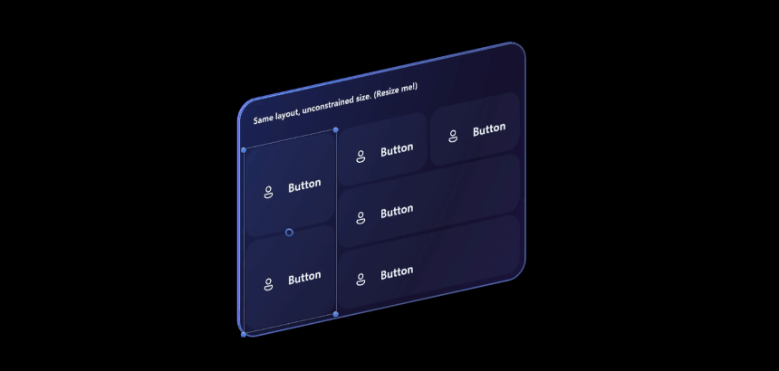
    Integration with RectTransform and Unity Canvas that supports dynamic and flexible layout
    :::column-end:::
:::row-end:::

## Key elements

:::row:::
    :::column:::
        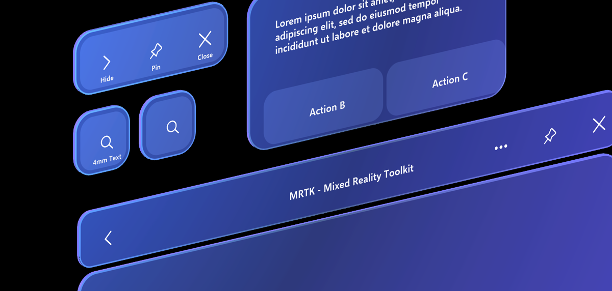  
        **Geometry** 
        The new design language introduces geometry with rounded corners that create a more approachable, engaging, and modern experience. The geometry is also fully three-dimensional, with a tangible thickness that helps ground the designs in reality. It also reminds the user that these elements are real, physical objects that exist within their 3D space, and can be attached to objects and grabbed, moved, or manipulated.
    :::column-end:::
    :::column:::
        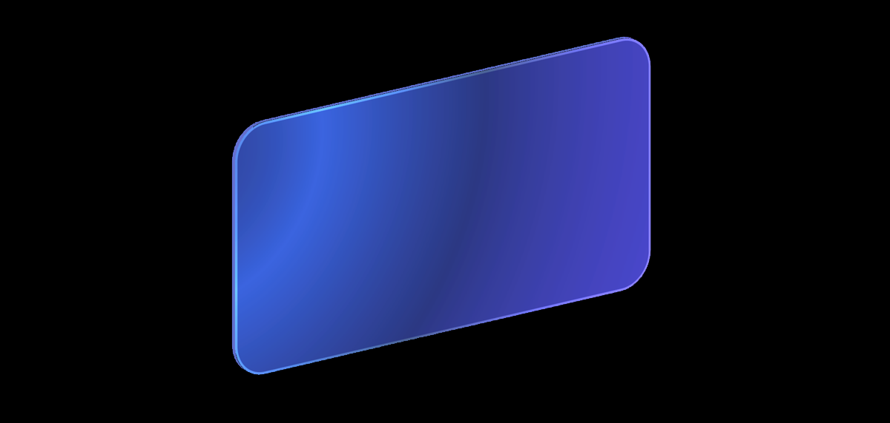  
        **Color** 
        Color helps users focus on their tasks by indicating a visual hierarchy and structure between user interface elements. The new design language's color scheme minimizes eye fatigue while remaining bright and opaque enough on additive displays to strengthen user confidence when they make direct hand interactions. Detailed elements such as iridescent effects are the result of design and user research iterations to provide best experience in HoloLens' additive display and other Mixed Reality devices.
    :::column-end:::
:::row-end:::
:::row:::
    :::column:::
        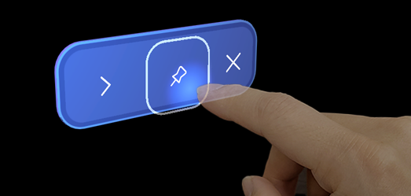  
        **Light and materials** 
        Light and materials play an essential role in providing visual feedback in spatial interactions. Using contextual 3D illumination helps the user perceive depth and interaction state, especially when the device's additive displays can cause depth confusion. For example, the user's fingertips cast a subtle glow on the pressable surfaces of buttons, improving the user's perception of the distance of their finger from the hologram.
    :::column-end:::
    :::column:::
        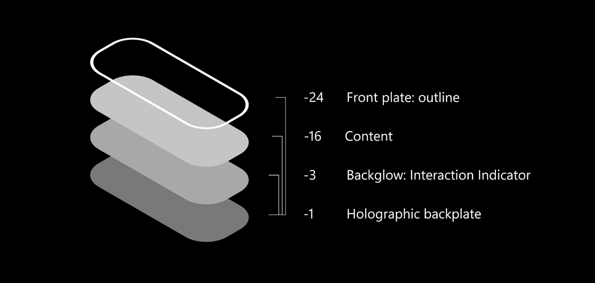  
        **Layers** 
        Layering is the concept of overlapping one surface with another. The Mixed Reality Design Language uses layering and elevation to create volumetric UI that enhances interaction quality and usability in spatial interactions, and delights users with a beautiful and intuitive response to their input.
    :::column-end:::
:::row-end:::
:::row:::
    :::column:::
        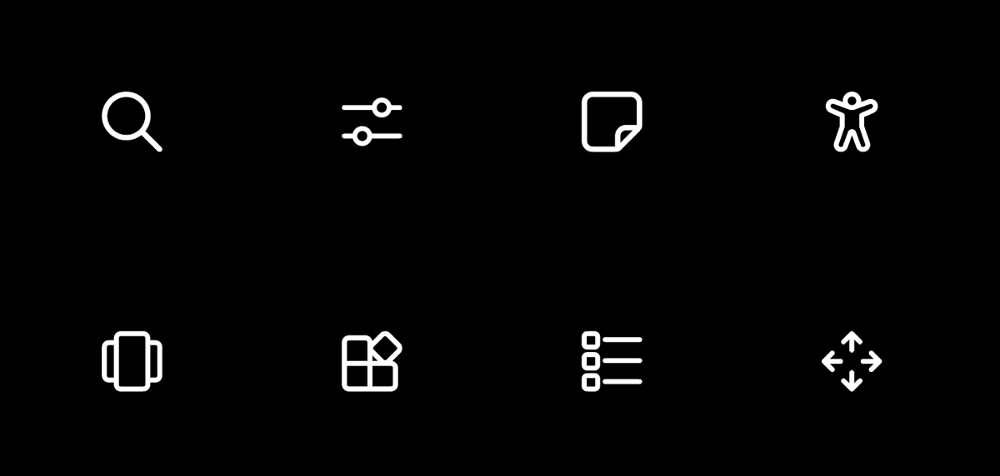  
        **Iconography** 
        Iconography is a set of visual images and symbols that help users understand and navigate your app. The Mixed Reality Design Language uses Microsoft's [Fluent System Icons](https://github.com/microsoft/fluentui-system-icons). Every glyph in our system icon font has been redesigned to embrace a softer geometry and more modern metaphors.  
    :::column-end:::
    :::column:::
        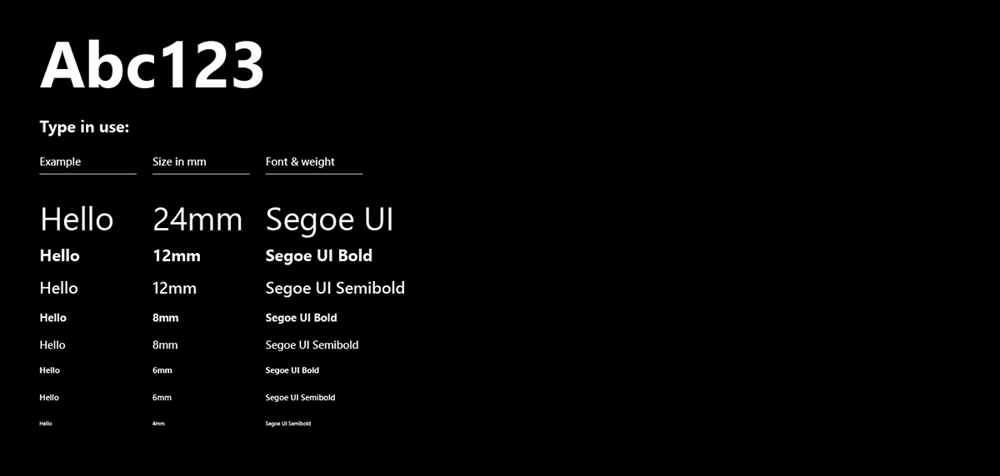  
        **Typography** 
        As the visual representation of language, typography's main task is to communicate information. The Design Language's type ramp helps you create structure and hierarchy in your content to maximize legibility and readability in your UI.
    :::column-end:::
:::row-end:::

## Mixed Reality Design Language in MRTK3

You can check out these example scenes for various UI elements with Mixed Reality Design Language.

- **CanvasUITearSheet.unity**: Shows all available Canvas-based button prefab variants in MRTK.
- **CanvasExample.unity**: Examples of building larger layouts using the Canvas-based components.
- **UITearSheet.unity**: Shows all available non-Canvas-based button prefab variants in MRTK.

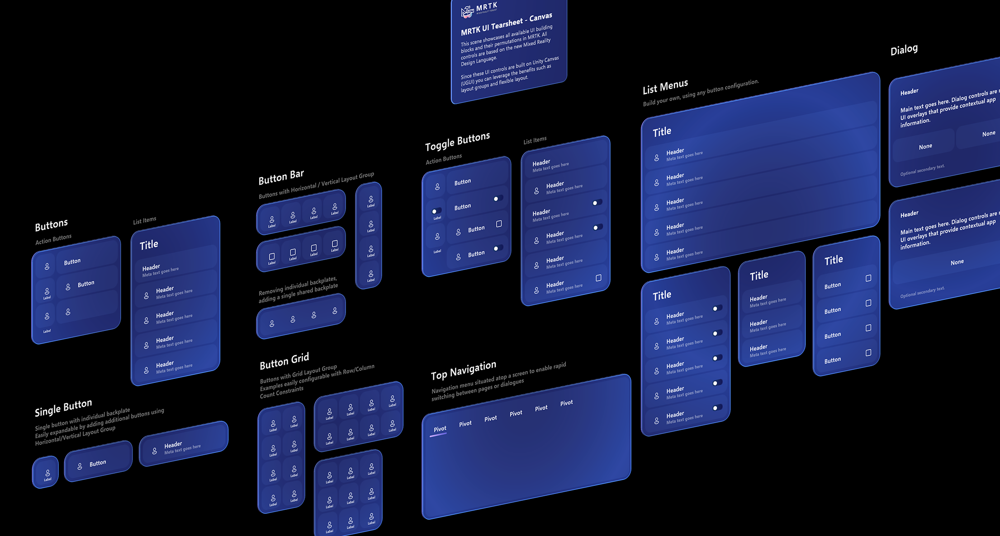  

## Examples of using Mixed Reality Design Language

Explore and learn about the Mixed Reality Design Language examples in action.

[MRTK3 GitHub samples](https://github.com/MixedRealityToolkit/MixedRealityToolkit-Unity/tree/main/UnityProjects/MRTKDevTemplate)
