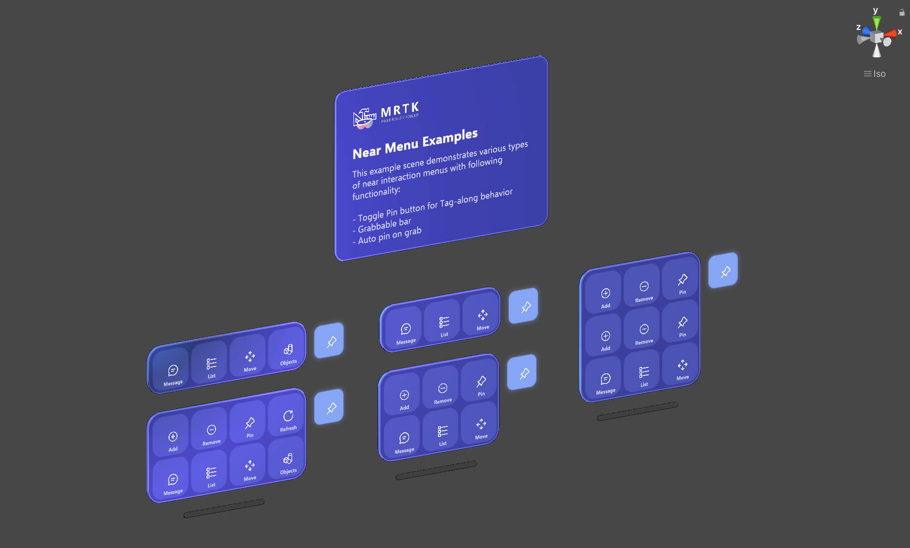
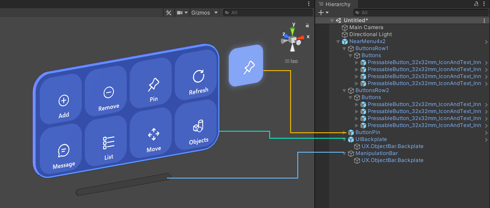
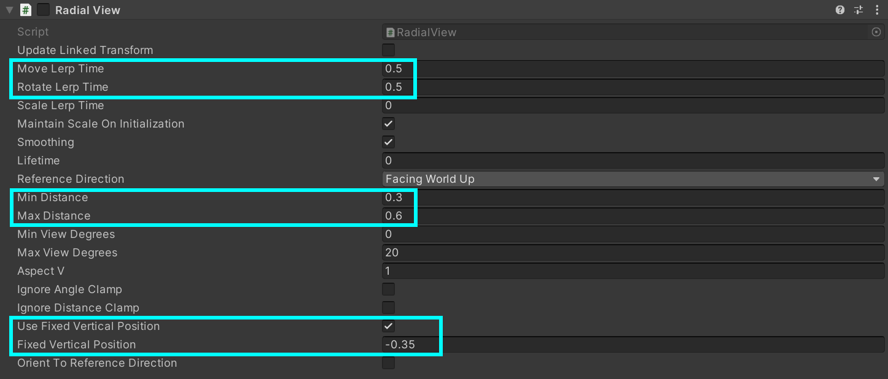
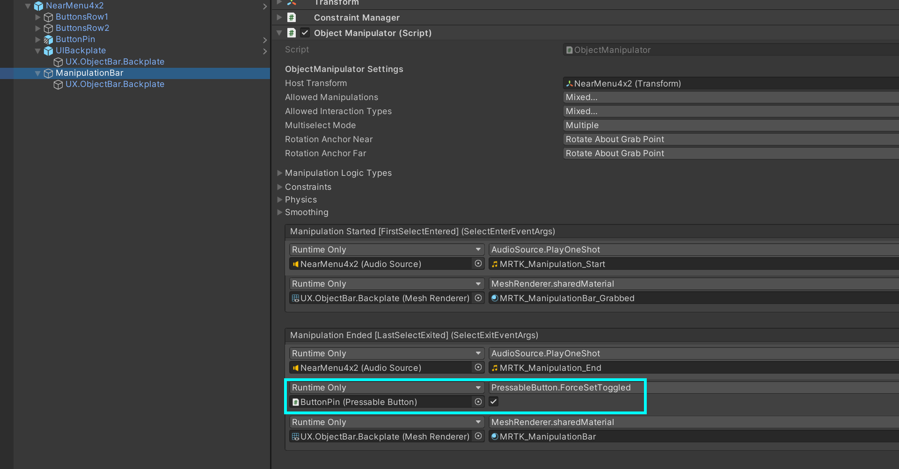
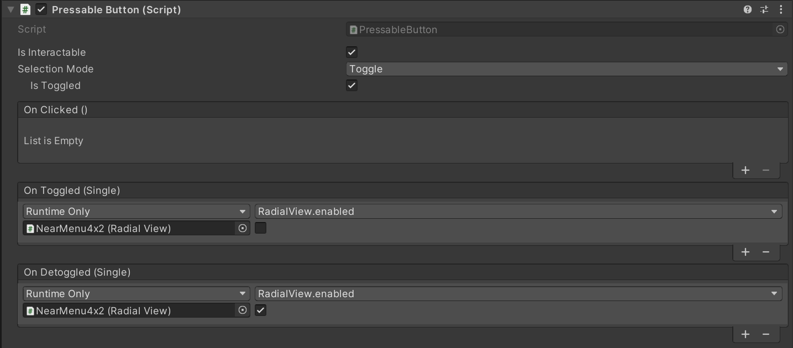

# Near Menu -- MRTK3

Near Menu is a common pattern for a group of UI elements that can be manipulated and moved and can follow the user. Since it's loosely coupled with the user, it doesn't disturb the user's interaction with the target content. The user can use the 'Pin' button to world-lock/unlock the menu. The menu can be grabbed and placed at a specific position in the world.

For the most commonly used actions, consider using a [hand menu](hand-menu.md). Near menus are better for less commonly used actions, as it can host larger content and bigger buttons and can passively follow the user out-of-view.

> [!NOTE]
> The hand menu prefabs are currently built using the non-Canvas controls. They will soon be rebuilt using the [Canvas components](../../../mrtk3-uxcore/packages/uxcore/canvas-ui.md) and auto-layout system as detailed in the [Button Group](button-group.md) documentation.

## Interaction behavior

- **Tag-along**: The menu follows you and stays within 30-60 cm range from the user for the near interactions.
- **Pin**: Using the 'Pin' button, the menu can be world-locked and released.
- **Grab and move**: The menu is always grabbable and movable. The menu will be pinned (world-locked) when grabbed and released regardless of the previous state.

## Example scene and Prefabs

**NearMenuExamples.unity** scene demonstrates various sizes of near menu configuration examples. You can find the menu examples as prefabs.

- **NearMenu3x1.prefab**
- **NearMenu3x2.prefab**
- **NearMenu3x3.prefab**
- **NearMenu4x1.prefab**
- **NearMenu4x2.prefab**

## Structure

Near Menu prefabs are made with the following MRTK components.

- [**PressableButton_32x32mm**](button.md) prefab
- **Object Bar**: Multiple button layout in grid
- [**Object Manipulator**](../../../mrtk3-spatialmanipulation/packages/spatialmanipulation/object-manipulator.md): Grab and move the menu
- [**Radial View Solver**](../../../mrtk3-spatialmanipulation/packages/spatialmanipulation/solvers/solver.md): Follow Me(tag-along) behavior

## Scripts

Tag-along behavior is achieved with RadialView solver script.

- **Move and Rotate Lerp Time** are set to 0.5 for delayed smooth movement, which creates comfortable leashing experience.
- **Use Fixed Vertical Position** places the menu 35 cm below the user's headset, which allows the user to focus on target content. 
- **Min and Max Distances** places the menu between 30-60 cm from the user for comfortable near-range interactions.

When the user grabs the manipulation bar, it triggers Pin Button's **ForceSetToggled**, which toggles RadialView. This makes the menu's following behavior start/stop.

