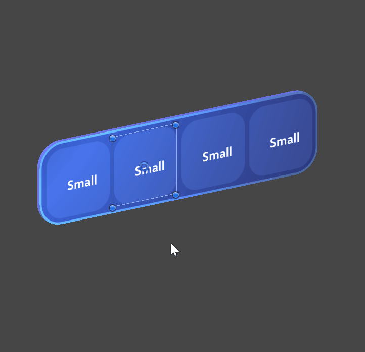
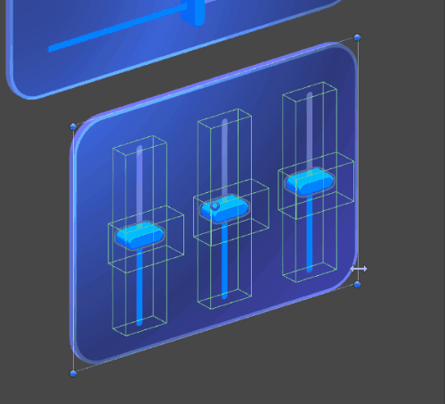
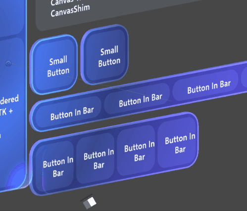
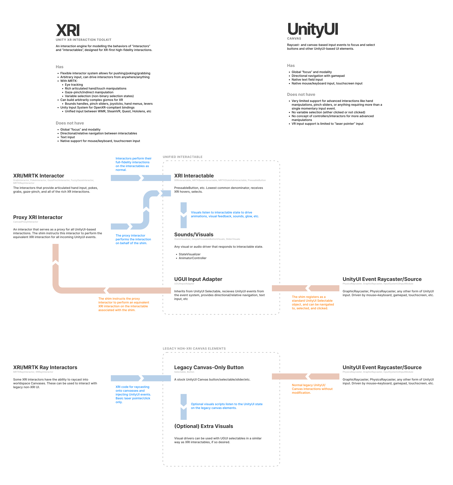

# Volumetric UI with Canvas

:::row:::
    :::column:::
    
    :::column-end:::
    :::column:::
    
    :::column-end:::
    :::column:::
    
    :::column-end:::
:::row-end:::

> [!NOTE]
> This is a conceptual overview of how the hybrid Canvas-based UI is built. For documentation on the individual UX prefabs, see the [UX Components documentation.](../../../mrtk3-uxcomponents/packages/uxcomponents/overview.md)

MRTK3 introduces volumetric UI that's integrated with Unity's RectTransform and Canvas system. While this system has historically been primarily used for 2D flat UI, it's capable of rendering and laying out volumetric 3D UI. This can accelerate design iteration and increase the fidelity of the designs that can be created with volumetric UI.

> [!NOTE]
> The Canvas-based component library is under active development and will change rapidly with new features, look-and-feel, layout, and architecture.

MRTK 2.x's non-Canvas UI systems were very hard to design for because they lacked many of the basic features expected from an interface design system.

- ✘ Lack of non-physical design units
- ✘ No alignment
- ✘ No margin/padding
- ✘ No flexible or responsive layouts
- ✘ Distinct prefabs for every single permutation of layout, size, and configuration
- ✘ Very limited support for collection layout (horizontal/vertical composable layouts)
- ✘ Lack of basic design features like absolutely-sized rounded corner radii or stroke widths
- ✘ Need to use **scale** to adjust UI element sizes, destructively altering children
- ✘ Limited support for mouse and keyboard
- ✘ No support for gamepad

As a result of these limitations, volumetric UI has historically been more primitive in its design and required a great deal of manual labor from technical designers to create beautiful layouts.

MRTK3 introduces a unified approach. Beautiful volumetric UI controls that support all XR interactions (like articulated hand tracking presses and gaze-pinch) can be authored in a Canvas-RectTransform context. Controls can be automatically laid out with proper margin, padding, responsive flex, and all of the features that designers expect. In addition, we can route UGUI events down into XRI so that the exact same UI prefabs work equally well across 2D contexts as well as 3D, including accessible inputs like gamepad.

The benefits include:

- ✔ Flexible design units that map to a variety of physical contexts (3D reality, 2D screens, TV/Desktop/Mobile/Web)
- ✔ Full RectTransform alignment support for responsive layout with cohesive parent/child relationships
- ✔ Full RectTransform margin and padding support  through [UnityUI AutoLayout groups](https://docs.unity3d.com/Packages/com.unity.ugui@1.0/manual/comp-UIAutoLayout.html)
- ✔ Support for flex layouts with priority and margins through [UnityUI AutoLayout groups](https://docs.unity3d.com/Packages/com.unity.ugui@1.0/manual/comp-UIAutoLayout.html)
- ✔ A single prefab for each type of control, which can be resized and adjusted to fit any content or context
- ✔ Horizontal, vertical, and grid layouts from [UnityUI AutoLayout groups](https://docs.unity3d.com/Packages/com.unity.ugui@1.0/manual/comp-UIAutoLayout.html). Custom layouts are possible through extension of Unity layout interfaces.
- ✔ Wide variety of advanced design features like absolutely-sized rounded corner radii, stroke widths, and margins, enabled by the advanced UI shader features in the [Mixed Reality Graphics Tools package.](../Mixed-Reality-Graphics-Tools.md)
- ✔ No scaling: all sizing and layout is achieved through RectTransform size and offset metrics. Parents do not scale children.
- ✔ Full support for mouse + keyboard, natively through UGUI events and the `UGUIInputAdapter` and `CanvasProxyInteractor` (see the [Interactable architecture documentation for more information](../../architecture/interactables.md))
- ✔ Support for gamepad and directional/relative navigation

This power and flexibility can come at a cost, and Canvas-based UI requires careful management to avoid common performance pitfalls.

- Each "moving part" of your UI should be a distinct Canvas node. There are `O(tree_height)` costs associated with the mutation of Canvas hierarchies; using multiple canvases for multiple moving parts/reusable components is strongly recommended.
- **Avoid using a single global canvas for your entire scene.**
- Moving and rotating Canvases and RectTransforms can have performance implications. We strongly recommend nesting your Canvas underneath a non-RectTransform "holster" transform that will be moved, instead of moving the Canvas directly.
- Our story for masking and clipping collider-based UIs is still under development. Consider avoiding scroll-views that contain clickable content.
- The default Unity directional navigation system can, in some 3D contexts, behave strangely. We're investigating custom navigation systems that will behave more robustly in unusual 3D layouts.

We'll release more specific guidance for optimizing your Canvas-based layouts as we perform more detailed performance testing across a range of devices.

## Setup

Our components are authored with a 1 design unit : 1mm ratio for physical contexts. When you set up a Canvas for use with volumetric UI intended for display in immersive 3D applications:

- Ensure your Canvas is worldspace
- Ensure the scale of the Canvas is globally 0.001 on all axes

For applications rendering to a 2D display, the scale can be adjusted freely to match your specified usability metrics and minimum touch target sizes.

When using interactables with `UGUIInputAdapter` (like our Canvas-based UX), ensure you have a `CanvasProxyInteractor` on a (preferably empty) GameObject in your scene. This will forward UGUI events through XRI, ensuring that your interactables work properly.

If you'd like to experiment with UGUI input on non-UX components, add `UGUIInputAdapter` to your XRI interactable. UGUI input on non-UX-related interactables is experimental and is subject several open bugs.

## Ongoing development

We're still shaping the development story for building beautiful UI across our variety of supported platforms. Currently, we still ship two versions of most UX components: one that doesn't use Canvas, with static, unresponsive layout (as we've historically provided in MRTK 2.x), and another version that's built with our unified Canvas-based approach. As we build more components and flesh out our design library implementation, we're expecting that we'll deprecate the non-Canvas components in the interest of consistency and maintenance.

## Unified state management

Due to the strict separation of state/interaction and visuals, you'll notice that the same state and interaction scripts are shared across Canvas and non-Canvas contexts. This is by design; the same interaction scripts can be reused across any visual or layout contexts, reducing the API surface and enhancing the consistency of our interactions. For example, `Slider` is the slider interaction component for both Canvas and non-Canvas sliders, and `PressableButton` is the same script across Canvas and non-Canvas buttons. In the future, if a new layout or presentation framework is adopted, we can carry over the same interaction logic and systems to ensure consistency and maintainability.

The architecture diagram below details how the different input events and types of interactables work together to provide a unified interaction state. Click the diagram to see a larger version.

:::image type="content" source="../../../mrtk3-overview/images/UXBuildingBlocks/CanvasUI/unification_diagram-small.png" alt-text="An architectural diagram that shows how different input events and types of interactables work together." lightbox="../../../mrtk3-overview/images/UXBuildingBlocks/CanvasUI/unification_diagram-large.png":::