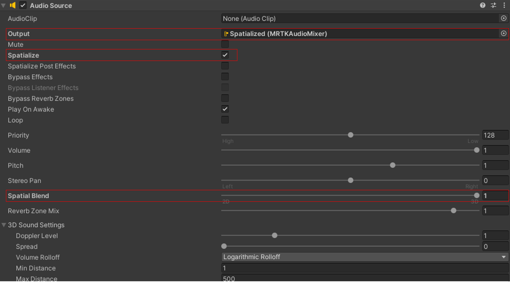

# Spatial Audio

For some UX components, you may want an `AudioSource` to play sound, like a button click. In order to spatialize this sound, you need to use a spatializer. For new applications, the `Microsoft Spatializer` is recommended. Documentation on how to set up the Microsoft Spatializer can be found [here](/windows/mixed-reality/develop/unity/spatial-sound-in-unity). 

 

### Configuring AudioSource 

In order to enable spatial audio for an AudioSource with Microsoft Spatializer, the `Spatialize` checkbox should be enabled, `Spatial Blend` set to `1`, and `Output` set to the spatialized audio mixer. For an example of using spatial audio with a UX component, check out the buttons in the MRTK3 sample scenes.

> [!IMPORTANT]
> When using Microsoft Spatializer, be sure to set the `Output` to the audio mixer. If `Spatialize` is enabled, and no mixer is set, no sound will play. 