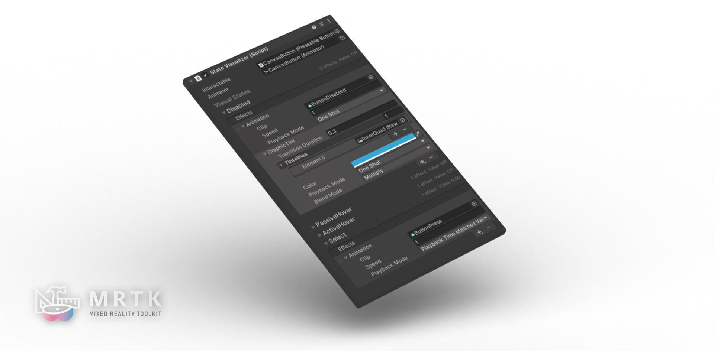
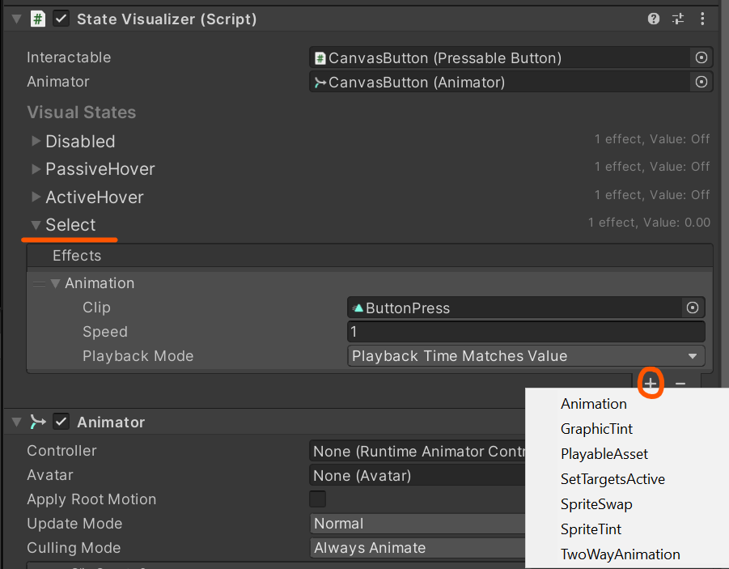
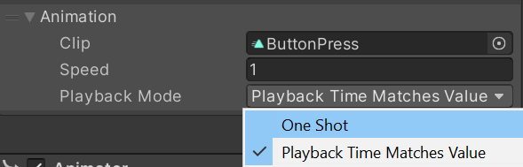
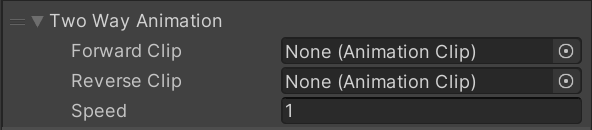
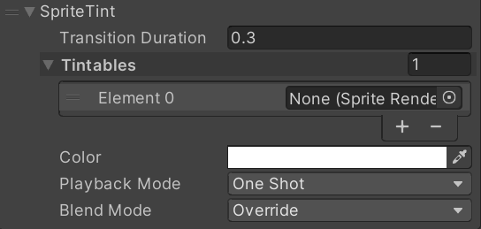
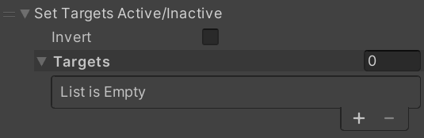
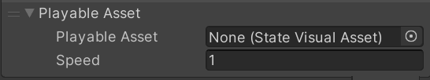

# State Visualizer | MRTK3

StateVisualizer is a low-code designer-friendly interface for authoring visual feedback in response to interaction states. It allows for both complex animation-based effects as well as common pre-made effects. 

## Philosophy

In MRTK3, we enforce separation of state and visuals. Interactables are responsible for their interaction logic and state, but are designed not to render their own visuals or effects based on their state. The motivation for this separation is that state and interaction logic can be reused across multiple visual contexts, and that the visual feedback and art direction of an interaction can be customized without touching the underlying state or interaction. In addition, mixing state into visuals can result in unmaintainable code with complex, hard-to-understand relationships between visual effects and the interactions they represent.

StateVisualizer, as a result, is largely stateless. It listens to an associated [StatefulInteractable](../../architecture/interactables.md) and executes a graph of `IEffect`s based on the current interaction state. Complex state like `Selectedness` and passive/active hover intent is exposed for use in StateVisualizer. Some effects can respond to the fractional selection value to drive delightful "analog" effects that respond to the user's motion, pinch, or press.

StateVisualizer is partially built on the [Unity Playables API.](https://docs.unity3d.com/Manual/Playables.html)

## How to use

Add StateVisualizer to your interactable, along with an Animator. Choose a state, and add your desired effects. Ensure that the `Interactable` property is set if the StateVisualizer cannot find your interactable at runtime.

> [!IMPORTANT]
> You do **_NOT_** need an Animator Controller on the Animator, except when authoring effects. StateVisualizer drives the Animator directly through the Playables API. StateVisualizer avoids AnimatorControllers for performance and maintainability.

## Authoring animations with StateVisualizer

As StateVisualizer doesn't use an AnimatorController, animations can't be previewed at edit time by default. To resolve this, create a temporary AnimatorController that contains the relevant animations you're working on, and reference it in the Animator. Remember, though, that they are not required at runtime, and may have an unwanted performance impact if not removed. 

MRTK ships example "AuthoringControllers" that we use to author our animation effects on our components. Feel free to duplicate our example for your own needs.

## Performance

StateVisualizer is built for optimal performance, despite its use of Animators and Unity animations, which in other contexts can be costly at scale. To solve these problems, StateVisualizer intelligently culls the Animator and aggressively minimizes the amount of time that the Animator is running. In addition, the Playables API has significantly better performance than AnimatorController state machines. The lack of AnimatorControllers contributes significantly to both the simplicity of the StateVisualizer system and its performance at scale.

Currently, StateVisualizer polls the interactable state, instead of relying on event listeners to only react when necessary. This part of StateVisualizer is under active development, and may be refactored to event listeners in the interest of even more performance.

## Effects

| Effect | Description|
|--------|------------|
| `AnimationEffect`    | In `OneShot` mode, this plays a single animation forwards when the state is activated, and the same animation backwards when the state is deactivated. In `PlaybackTimeMatchesValue` mode, the animation's playback time is directly controlled by the fractional value of the state (For example, Selectedness for the Select state).
|`TwoWayAnimationEffect`    | Similar to `OneShot` mode from `AnimationEffect`, but uses two separate animations, one for each "direction".
|`GraphicTintEffect`   | Tints a list of `Graphic` components to a particular color. This effect offers the same `PlaybackMode` options as `AnimationEffect`, with similar results (`OneShot` performs a full transition on state change, `PlaybackTimeMatchesValue` will match the transition progress to the state's fractional value.)   <li> <b>Override</b> will tint the targets to the the specific color itself. <li> <b>Additive</b> will additively blend the color onto the existing color. <li> <b>Multiply</b> will multiply the new color onto the existing color.   These blend operations will also blend on top of any other tints or animations currently executing on the StateVisualizer graph. Note, if the Tintables have different initial colors, this tint effect may blend incorrectly. Use separate Tint effects for elements with different base colors.
| `SpriteTintEffect`   | Performs the exact same operation as `GraphicTintEffect` but for `SpriteRenderer`s.
| `SpriteSwapEffect`   | Sets the target `Image` to either the `ActiveSprite` or `InactiveSprite` depending on whether the state is currently active or inactive. Useful for toggles!
| `SetTargetsActiveEffect`   | Enables or disables the list of GameObjects depending on whether the state is active or inactive. `Invert` will cause the opposite behavior.
| `PlayableAssetEffect`   | `StateVisualAsset` is a ScriptableObject that contains a reusable Playable asset. This effect will connect that playable asset to the StateVisualizer graph. (This feature is still experimental and subject to change.)

## Custom effects

Most effects that aren't covered by one of the bespoke effect types above can usually be authored as an `AnimationEffect`. However, if you'd like to create a new bespoke, non-animation-based effect, you can implement the `IEffect` interface or subclass one of our existing effects. See the `IEffect` API reference for more details.

## Custom states

StateVisualizer is planned to support custom states in the future. Stay tuned.
