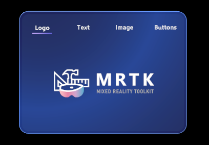
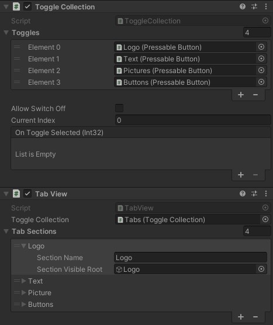

# Tab View

`TabView` is a helper component that allows the user to switch between views at a click. It accomplishes this by enabling and disabling sub-objects based on the currently toggled index of a `ToggleCollection`.

To set up a `TabView`, you'll have to create a target `ToggleCollection` containing all of the tab toggles. In the example above, this would be the buttons labeled "Logo", "Text", "Image", and "Buttons". You can then map each item in the `Toggle Collection` to a `TabSection`. Each `TabSection` you add to the list should specify a GameObject with the content to show and hide when the user switches views.

An example can be found in the `TopNavigationExample` scene.
